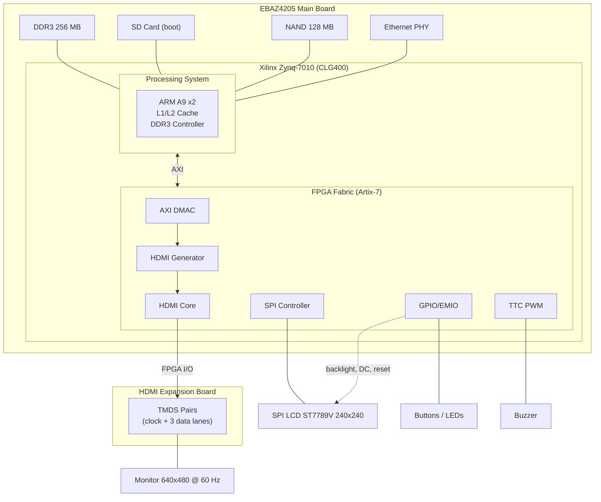
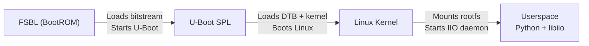
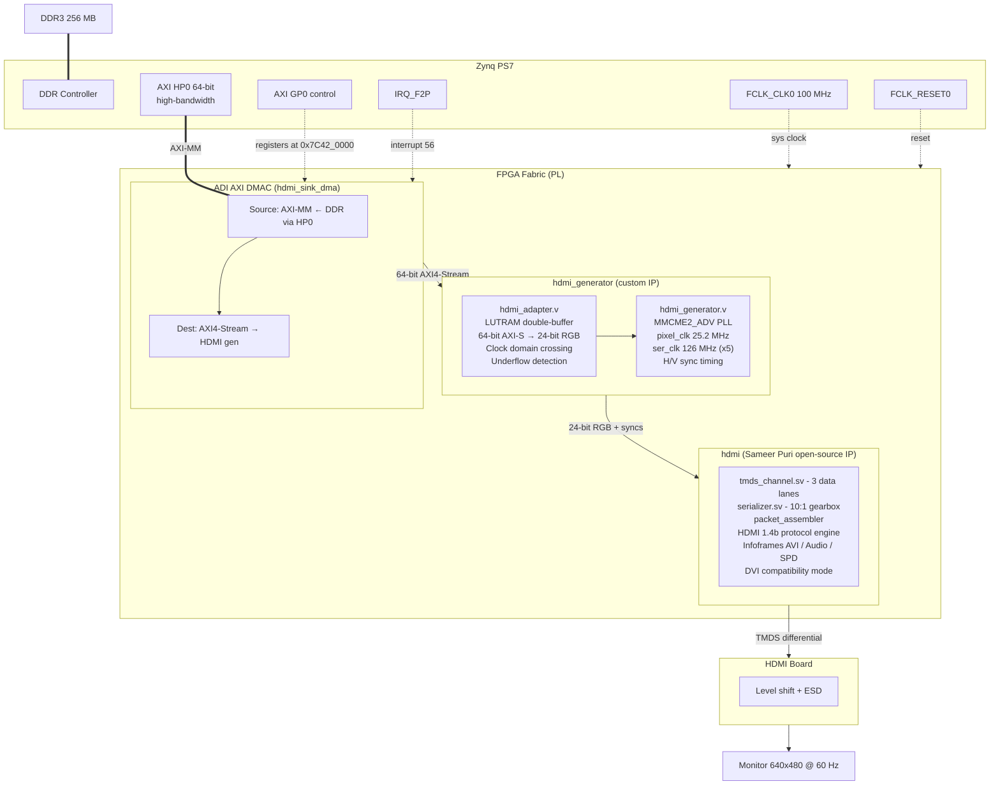
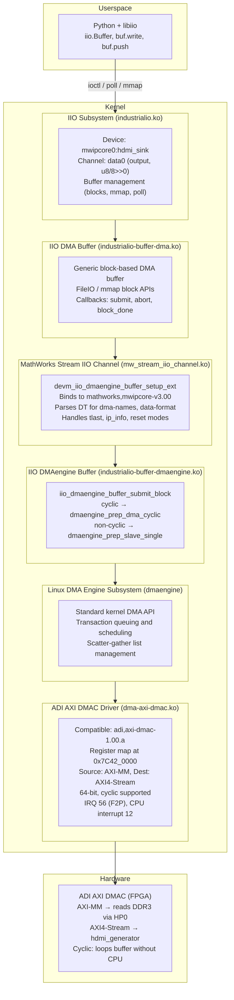
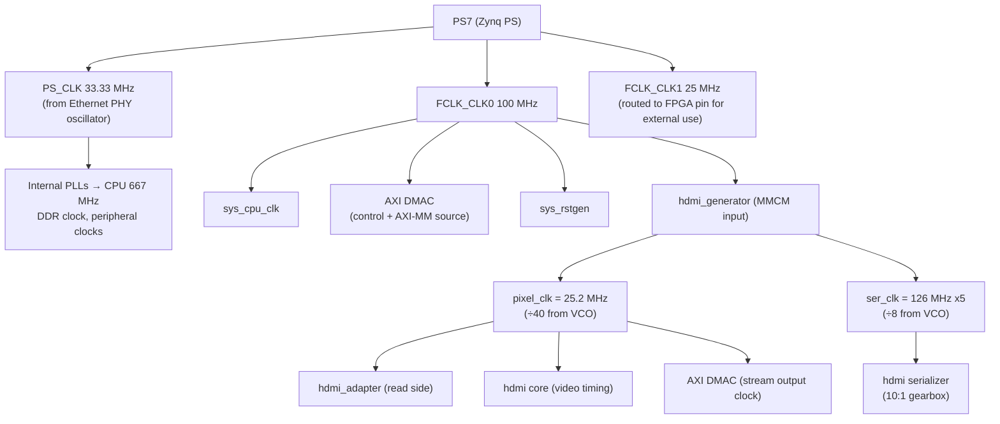
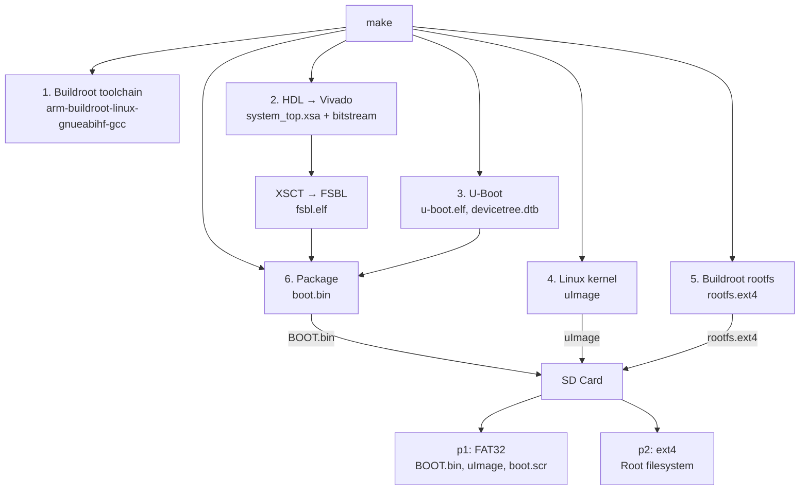
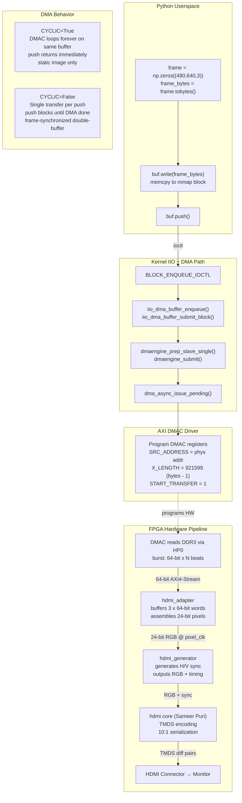
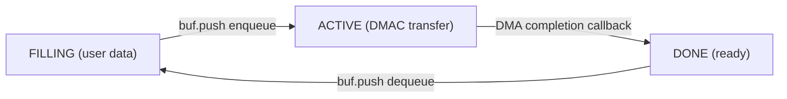
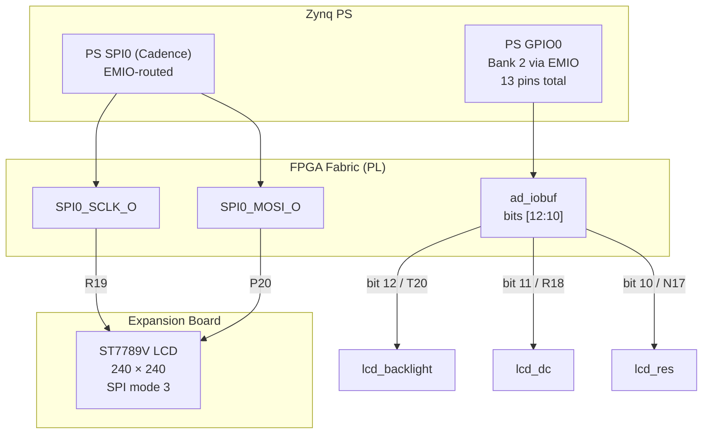
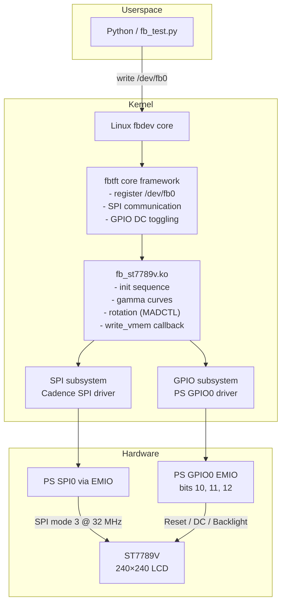

# EBAZ4205 HDMI Demo — Architecture Document

## Overview

This project implements a **DMA-driven HDMI video output** on the EBAZ4205 board — a repurposed Bitcoin miner featuring a Xilinx Zynq-7010 SoC (dual ARM Cortex-A9 + Artix-7 FPGA fabric). An off-the-shelf HDMI expansion board connects to the FPGA I/O, and the entire system is controlled from **Python userspace via libiio** (the Industrial I/O library). Frames are transferred from DDR3 memory straight to the HDMI connector through a high-bandwidth DMA pipeline with zero CPU involvement after the initial buffer submission.

### Key numbers

| Parameter | Value |
|---|---|
| SoC | Xilinx Zynq-7010 (CLG400) |
| FPGA fabric | Artix-7 equivalent, ~28K logic cells |
| CPU | Dual ARM Cortex-A9 @ 667 MHz |
| RAM | 256 MB DDR3 (16-bit bus) |
| Video resolution | 640×480 @ 60 Hz (VIC 1) |
| Pixel clock | 25.2 MHz |
| Frame bandwidth | ~442 Mbps |
| DMA bus width | 64-bit AXI-Stream |
| Software interface | Python + libiio IIO bindings |

---

## Hardware Architecture

### The boards



The EBAZ4205 was originally a control board for an Ebit E9+ Bitcoin miner. It was mass-produced and can be found inexpensively on the secondary market. It contains a full Zynq-7010 SoC with 256 MB of DDR3, SD card slot, NAND flash, and Ethernet. The stock configuration uses the Ethernet PHY's crystal as the PS clock source (33.33 MHz).

The HDMI expansion board plugs into the FPGA I/O headers and provides a standard HDMI connector, level-shifting, and ESD protection.

### Pin mapping (FPGA → HDMI board)

| Signal | FPGA Pin | HDMI Function |
|---|---|---|
| `hdmi_clk` | TMDS clock pair | HDMI clock channel |
| `hdmi_d0` | TMDS data pair | HDMI data channel 0 (Blue + sync) |
| `hdmi_d1` | TMDS data pair | HDMI data channel 1 (Green) |
| `hdmi_d2` | TMDS data pair | HDMI data channel 2 (Red) |

### Peripherals mapped in the design

| Peripheral | Hardware | Software interface |
|---|---|---|
| HDMI video | TMDS via FPGA I/O | libiio DMA buffer |
| SPI LCD | ST7789V 240×240 | `/dev/fb0` (fbtft) |
| Buzzer | TTC0 PWM | `beep -e /dev/input/by-path/platform-axi:beeper-event -f 2400` |
| Buttons | GPIO EMIO | gpio-keys (input subsystem) |
| LEDs (green* blinks by default) | GPIO EMIO 54-58 (PL-routed via `ad_iobuf`) | gpio-leds, `heartbeat` trigger on led0:green |
| Ethernet | RGMII via EMIO | Standard kernel netdev |
| NAND flash | SMCC controller | MTD subsystem |
| UART | UART0 (EMIO header), UART1 (MIO 24-25 USB) | Serial console |

> **Blinking LED**: The green expansion-board LED (`gpio_led_green`, GPIO0 pin 54 / EMIO bit 0, ball W13) blinks with the kernel's `heartbeat` trigger by default. It is the **only LED that blinks autonomously** — the kernel `gpio-leds` driver (with `CONFIG_LEDS_GPIO=y` and `CONFIG_LEDS_TRIGGER_HEARTBEAT=y`) picks up the `linux,default-trigger = "heartbeat"` from the device tree at boot. No HDL logic or userspace code is involved. The remaining LEDs (`gpio_led_red`, `gpio_led_aux_0/1/2` on GPIO 55-58) have `linux,default-state = "off"` and stay dark until explicitly controlled via `/sys/class/leds/`.

> **Beeper** (`buzzer`, FPGA pin D18): The buzzer is driven by the **PS TTC0 PWM** (not GPIO), exposed through the PL as `ttc0_wave0_out`. The device tree declares a `pwm-beeper` at `pwms = <&ttc0 0 370370 0>` (2.7 kHz). The kernel driver stack is: `pwm-cadence.ko` (TTC PWM chip) → `pwm-beeper.ko` (input subsystem, `EV_SND`/`SND_TONE` events). **The working invocation** is `beep -e /dev/input/by-path/platform-axi:beeper-event -f 2400`. The `/dev/input/eventX` number is not stable across overlay removal/re-application, so the `by-path` symlink should always be used. For convenience, `alias beep='beep -e /dev/input/by-path/platform-axi:beeper-event'`.
>
> **⚠ Known issues** (see `doc/BEEPER_ANALYSIS.md` for full investigation):
> - **Multi-tone unreliability**: Rapid sequences of `beep` commands fail because `pwm-beeper` handles EV_SND events via a deferred workqueue (`schedule_work()`); close-then-reopen cycles can cancel pending work, dropping tones.
> - **Severe frequency quantization**: The `pwm-cadence` driver drives a 16‑bit TTC counter fed by a ~111 MHz clock. At audio frequencies the prescaler calculation produces only a handful of distinct output frequencies — e.g. both 1568 Hz and 988 Hz requests produce ~1695 Hz.
> - **Register anomalies**: Observed CLK_CTRL PSV values (14‑15) don't match values the driver's own math should produce (0), suggesting a read‑modify‑write or register‑layout compatibility issue between the AMD-written driver and the Zynq‑7000's TTC variant.

---

## Boot Flow



### Stage 1: FSBL (First Stage Bootloader)

Generated by Xilinx Vitis/XSCT from the Vivado hardware design. The FSBL:
1. Initializes the PS7 (clocks, DDR3, MIO)
2. Loads the FPGA bitstream (`system_top.bit`) into the PL fabric
3. Loads U-Boot from the boot partition
4. Jumps to U-Boot

### Stage 2: U-Boot

Based on Xilinx U-Boot (`xlnx_rebase_v2025.01`), configured for the EBAZ4205 board.
Key config: `CONFIG_OF_SEPARATE=y` (U-Boot uses its own appended DTB, ignoring
the one baked into BOOT.bin by FSBL).
Key responsibilities:
- Loads the **base** flattened device tree (`devicetree.dtb`, PS peripherals only)
- Loads the Linux kernel image (`uImage`)
- Sets kernel command line (`console=ttyPS0,115200 root=/dev/mmcblk0p2 ...`)
- **Serial0** (MIO 24-25, USB connector on expansion board): Linux console
- **Serial1** (EMIO, pin header on main board): U-Boot console

PL device nodes are **not** in the base DTB at boot. They are added by
`/etc/init.d/S20fpgaregion` at userspace init via configfs DT overlay.

### Stage 3: Linux Kernel

Custom kernel built from the Analog Devices Linux fork (`adi-6.12.0` branch), rebased on Xilinx's `xlnx_rebase_v6.12_LTS` tag (kernel 6.12.x LTS). The kernel was chosen specifically for:

- **Native ADI IIO subsystem support** — required for libiio
- **ADI AXI DMAC driver** — the DMA engine driver
- **MathWorks stream IIO driver** — bridges IIO userspace to the dmaengine API
- **Zynq-7000 platform support** — from the upstream Xilinx kernel

### Stage 4: Userspace

The root filesystem is built with Buildroot and includes:
- **libiio** with Python bindings — the IIO userspace library
- **Python 3** with numpy and PIL — frame generation
- **IIO daemon** (`iiod`) — for remote IIO access
- Board-specific init scripts, including:
  - `S20fpgaregion` — applies PL device tree overlay (`pl-ebaz4205.dtbo`)
    via configfs (`/sys/kernel/config/device-tree/overlays/`), adding all
    PL peripheral nodes (LEDs, keys, beeper, LCD, HDMI DMA, mwipcore) at boot.
    The FPGA is already programmed by BOOT.bin (FSBL stage), so this only
    adds Linux device nodes for driver binding.

---

## FPGA Hardware Design (HDL)

The FPGA fabric (Artix-7) hosts the entire data path from system memory to the HDMI connector. The design is built in Vivado 2023.2 using mainly TCL scripts.

### Block diagram



### Project files in `hdl/projects/ebaz4205/`

| File | Size | Purpose |
|---|---|---|
| `system_bd.tcl` | 278 lines | Full Vivado block design — instantiates PS7, AXI DMAC, HDMI IP, HDMI generator, reset controller, interrupt concat, and all interconnects. |
| `system_top.v` | 261 lines | Top-level Verilog wrapper connecting block design ports to physical FPGA pins. |
| `system_constr.xdc` | 254 lines | Pin constraints mapping FPGA balls to HDMI TMDS outputs, SPI display, buttons, buzzer, Ethernet, UART EMIO. |
| `system_constr_impl.xdc` | 21 lines | Implementation constraints for timing closure. |
| `system_project.tcl` | 20 lines | Vivado project generation script. |
| `Makefile` | 16 lines | Build target using ADI's HDL make infrastructure. |

### Custom IP cores

#### `hdmi_generator` (written for this project)

This is the only custom hardware IP in the design. It serves two roles:

**1. Clock generation** (`hdmi_generator.v`)
```verilog
MMCME2_ADV #(
    .CLKIN1_PERIOD(10.000),       // 100 MHz from PS7 FCLK_CLK0
    .DIVCLK_DIVIDE(5),            // Pre-divider = ÷5
    .CLKFBOUT_MULT_F(50.500),     // VCO = 100 MHz × 50.5 / 5 = 1010 MHz
    .CLKOUT0_DIVIDE_F(40.000),    // pixel_clk = 1010 / 40 = 25.2 MHz
    .CLKOUT1_DIVIDE(8)            // ser_clk   = 1010 / 8  = 126 MHz (×5)
) mmcm_adv_inst;
```

The PLL is tuned specifically for 640×480@60Hz (VIC 1), producing exactly 25.175 MHz → rounds to 25.2 MHz with a VCO frequency of 1010 MHz.

**2. AXI-Stream to RGB bridge** (`hdmi_adapter.v`)

The DMAC delivers 64-bit words on the pixel clock domain. Since each pixel is 24 bits, a 64-bit word contains **2⅔ pixels** — this misalignment requires buffering:

```
64-bit AXI-S word layout:
┌──────────┬──────────┬──────────┬──────┐
│ Pixel N  │ Pixel N+1│ Pixel N+2│ ...  │
│ 24 bits  │ 24 bits  │ 16 bits  │      │
└──────────┴──────────┴──────────┴──────┘

Eight 64-bit words = 512 bits = 21⅓ pixels
```

The `hdmi_adapter` uses a **LUTRAM double-buffer** (3 × 64-bit entries) to reassemble full pixels from the misaligned 64-bit stream. One buffer is written by the AXI-Stream side (100 MHz domain), the other is read on the pixel clock side (25.2 MHz). They swap roles after each full buffer, achieving continuous throughput with zero cycle waste.

**Underflow detection**:
```verilog
assign underflow = (addra < addrb + 3) ^ directiona ^ directionb;
```
When the DMAC stops feeding data (end of non-cyclic transfer), the read pointer catches up to the write pointer and `underflow` triggers. The adapter outputs **black pixels** (`rgb = 24'd0`) until new data arrives, preventing visual garbage.

#### `hdmi` (imported from hdl-util/hdmi)

This is [Sameer Puri's open-source HDMI 1.4b transmitter](https://github.com/hdl-util/hdmi), dual-licensed MIT/Apache 2.0. It implements:

| Module | Function |
|---|---|
| `hdmi.v` | Top-level, timing tables for all CEA-861 VICs |
| `serializer.sv` | 10:1 parallel-to-serial gearbox for TMDS |
| `serializer_3ch.sv` | 3-channel variant for RGB lanes |
| `tmds_channel.sv` | Single TMDS differential channel |
| `packet_assembler.sv` | Mixes video data with control/island packets |
| `packet_picker.sv` | Selects correct packet type per blanking interval |
| `audio_clock_regeneration_packet.sv` | ACR packet for audio clock recovery |
| `audio_info_frame.sv` | Audio InfoFrame generation |
| `audio_sample_packet.sv` | L-PCM audio sample packing |
| `auxiliary_video_information_info_frame.sv` | AVI InfoFrame (colorimetry, aspect ratio) |
| `source_product_description_info_frame.sv` | SPD InfoFrame (source name) |

**Modifications for this project**: The original module `hdmi.sv` was written in SystemVerilog. Vivado's IP packager handles SystemVerilog for sub-modules but not for the top-level module during packaging. The top was **converted from SystemVerilog to Verilog** (`hdmi.v`) and wrapped with a Vivado IP TCL script (`hdmi_ip.tcl`). All sub-modules remain in their original SystemVerilog.

**Audio**: Both audio sample word inputs are tied to constant zero — no audio output. The design could be extended to support L-PCM audio over HDMI.

#### Third-party IP used as-is

| IP Core | Origin | Role |
|---|---|---|
| `axi_dmac` | Analog Devices HDL library | DMA controller — the engine that reads DDR3 and streams to HDMI |
| `processing_system7` | Xilinx IP catalog | Zynq-7000 PS7 configuration (clocks, DDR, MIO, interrupts) |
| `proc_sys_reset` | Xilinx IP catalog | Reset synchronization |
| `xlconcat` | Xilinx IP catalog | Interrupt concatenation (16-input) |
| `xlconstant` | Xilinx IP catalog | Tie-off to GND for unused audio inputs |

---

## Linux Kernel & Driver Stack

### Kernel source

The kernel is a **three-way merge** of:

```
Xilinx Linux 6.12 LTS (zynq-7000 platform, device drivers)
    +
Analog Devices ADI 6.12 (IIO framework enhancements, AXI DMAC, libiio support)
    +
MathWorks (MATLAB) stream IIO drivers (mw_stream_iio_channel.c, etc.)
```

The board-specific contribution is a single file: `arch/arm/configs/zynq_ebaz4205_defconfig` (238 lines), enabling all required drivers.

### Driver stack for HDMI DMA



### Device Tree (excerpt for the HDMI DMA path)

These nodes live in the PL device tree overlay (`pl-ebaz4205.dtso`),
applied at boot via configfs. The base DTB (`zynq-ebaz4205.dts`) contains
only PS hard IP and the `fpga-region` container.

```dts
// The DMA controller hardware
hdmi_sink_dma: dma@7c420000 {
    compatible = "adi,axi-dmac-1.00.a";
    reg = <0x7c420000 0x10000>;
    interrupts = <0 56 IRQ_TYPE_LEVEL_HIGH>;
    clocks = <&clkc 15>;
    #dma-cells = <1>;

    adi,channels {
        dma-channel@0 {
            reg = <0>;
            adi,source-bus-width = <64>;       // 64-bit read from DDR
            adi,source-bus-type = <0>;          // AXI-MM (memory)
            adi,destination-bus-width = <64>;   // 64-bit stream out
            adi,destination-bus-type = <1>;     // AXI4-Stream (peripheral)
        };
    };
};

// The MathWorks IIO wrapper (logical device, no memory registers)
mwipcore0: mwipcore@0 {
    compatible = "mathworks,mwipcore-v3.00";

    stream-channel@0 {
        compatible = "mathworks,axi4stream-mm2s-channel-v1.00";
        dmas = <&hdmi_sink_dma 0>;              // bind to DMAC channel 0
        dma-names = "hdmi_sink";
        mathworks,dev-name = "hdmi_sink";       // IIO device name

        data-channel@0 {
            compatible = "mathworks,iio-data-channel-v1.00";
            mathworks,data-format = "u8/8>>0";  // unsigned 8-bit, 8 storage bits, no shift
        };
    };
};
```

Key detail: `mwipcore@0` has **no `reg` property** — this was a deliberate design choice. The MathWorks driver normally expects a register bank for IP control, but this design uses the ADI AXI DMAC directly as a pure streaming engine. A kernel patch (by the project author) was applied to allow the `mathworks,mwipcore` driver to work with no memory-mapped registers, making the info and TLAST channels conditional on `reg` being present.

### Kernel configuration highlights

```
CONFIG_IIO=y                        # Industrial I/O subsystem
CONFIG_DMA_ENGINE=y                 # Linux DMA engine
CONFIG_DMA_AXI_DMAC=y               # ADI AXI DMAC driver
CONFIG_STAGING=y                    # For MathWorks drivers
CONFIG_FB_TFT=y                     # SPI LCD framebuffer
CONFIG_FB_TFT_ST7789V=y             # ST7789V driver
CONFIG_INPUT_PWM_BEEPER=y           # Buzzer via TTC PWM
CONFIG_OVERLAY_FS=y                 # For development
```

### Clock tree



The clock architecture uses two separate domains:
- **100 MHz system domain**: CPU, AXI buses, DMAC control interface, AXI-MM memory reads
- **25.2 MHz pixel domain**: HDMI timing, RGB pixel data, DMAC AXI-Stream output

The `hdmi_adapter` handles the clock domain crossing between these two domains using LUTRAM double-buffering.

### Ethernet clocks (separate from the PS clock tree)

The Ethernet PHY provides its own 25 MHz clocks, independent of the PS PLLs:

| Signal | Direction | Rate | Source |
|---|---|---|---|
| `GMII_rx_clk` | Input to Zynq | 25 MHz | PHY (recovered from RGMII link partner) |
| `GMII_tx_clk` | Input to Zynq | 25 MHz | PHY (generated from its 25 MHz crystal) |
| `clk_25m` (FCLK_CLK1) | Output from Zynq | 25 MHz | PS PLL → FPGA pin U18 (not used by Ethernet) |

The PS GEM is configured with `PCW_ENET0_PERIPHERAL_CLKSRC = External`, so it expects both RX and TX clocks from the PHY rather than deriving them internally. The PHY operates in RGMII mode (`phy-mode = "rgmii-id"` in the device tree) at 100 Mbps, which means both `GMII_rx_clk` and `GMII_tx_clk` run at 25 MHz (period 40 ns, as declared in `system_constr.xdc`).

The PS also generates a separate 25 MHz output on `FCLK_CLK1` (FPGA ball U18, port `clk_25m`), but this is a general-purpose reference, not connected to the Ethernet PHY.

---

## Build System

The build system is structured after Analog Devices' [plutosdr-fw](https://github.com/analogdevicesinc/plutosdr-fw) repository pattern — a top-level Makefile orchestrating cross-compilation of all components using a single Buildroot toolchain.

### Repository structure

```
ebaz4205-hdmi-demo/            ← main orchestration repo (by project author)
├── Makefile                    ← top-level build: bitstream → FSBL → Linux → rootfs
├── scripts/                    ← build helpers
│   ├── ebaz4205.mk             ←   board-specific constants
│   ├── boot.cmd                ←   U-Boot boot script (load kernel, set bootargs)
│   ├── create_fsbl_project.tcl ←   XSCT script to build FSBL
│   ├── ebaz4205.its            ←   FIT image template
│   ├── run.tcl / run-xsdb.tcl  ←   JTAG bootstrap scripts
│   └── get_default_envs.sh     ←   extract U-Boot default env
├── doc/                        ← schematics and photos
│
├── hdl/            [submodule: m1nl/analogdevicesinc-hdl, branch ebaz4205]
│   ├── projects/ebaz4205/      ← board-specific Vivado project
│   ├── library/hdmi/           ← HDMI core (from hdl-util/hdmi)
│   ├── library/hdmi_generator/ ← custom IP (hdmi_generator + hdmi_adapter)
│   └── library/                ← ADI HDL framework (reused as-is)
│
├── linux/          [submodule: m1nl/analogdevicesinc-linux, branch ebaz4205]
│   └── arch/arm/configs/zynq_ebaz4205_defconfig
│
├── buildroot/      [submodule: m1nl/buildroot, branch ebaz4205]
│   ├── configs/zynq_ebaz4205_defconfig
│   └── board/ebaz4205/         ← init scripts, network config, Python examples
│
└── u-boot-xlnx/    [submodule: m1nl/u-boot-xlnx, branch ebaz4205]
    ├── arch/arm/dts/zynq-ebaz4205.dts    ← base DTS (PS peripherals only)
    ├── arch/arm/dts/pl-ebaz4205.dtso      ← PL device tree overlay
    └── configs/zynq_ebaz4205_defconfig    ← CONFIG_OF_SEPARATE=y
```

### Build flow



### SD card layout

| Partition | Type | Content |
|---|---|---|
| p1 | FAT32 | `BOOT.bin` (FSBL + bitstream + U-Boot + DTB), `uImage`, `boot.scr`, `devicetree.dtb` (base, PS-only), `pl-ebaz4205.dtbo` (PL overlay), `system_top.bit.bin` (for runtime reconfig) |
| p2 | ext4 | Root filesystem (contents of `rootfs.ext4`) |

---

## Data Flow: Python → HDMI (End-to-End)

### The complete path



### Frame timing

**640×480@60Hz (VIC 1)**:
| Parameter | Value |
|---|---|
| Pixel clock | 25.2 MHz |
| Pixels per line | 800 (640 active + 160 blanking) |
| Lines per frame | 525 (480 active + 45 blanking) |
| Frame time | 800 × 525 / 25.2 MHz = **16.67 ms** |
| Active pixels per frame | 640 × 480 = **307,200** |
| Bytes per frame (24-bit RGB) | 307,200 × 3 = **921,600** |
| DMA transfer time at 25.2 MHz (64-bit) | 921,600 / 8 bytes = 115,200 beats → **~4.57 ms** |

The DMA transfer completes well within one frame time (~4.6 ms out of 16.7 ms), leaving plenty of headroom. The DMAC then idles during the blanking interval until the next frame.

### Bandwidth analysis

| Interface | Clock | Width | Peak bandwidth |
|---|---|---|---|
| DDR3 (PS7) | 533 MHz DDR | 16-bit | ~8.5 Gbps |
| AXI HP0 (PS↔PL) | 100 MHz | 64-bit | 6.4 Gbps |
| AXI DMAC stream | 25.2 MHz | 64-bit | ~1.6 Gbps |
| TMDS per lane | 126 MHz DDR | 10-bit serial | 1.26 Gbps |
| Required for 640×480 | — | — | ~0.44 Gbps |

The system has ample bandwidth at every stage — the DMAC at 1.6 Gbps is over 3× the required 442 Mbps.

---

## Userspace Interface

### IIO device discovery

```python
import iio
ctx = iio.Context()                          # scans /sys/bus/iio
dev = ctx.find_device("mwipcore0:hdmi_sink") # MathWorks IIO device
chan = dev.find_channel("data0", True)        # output channel
chan.enabled = True
```

### Static image (cyclic mode)

```python
# Allocates 1 kernel block, DMA loops forever
buf = iio.Buffer(dev, 640 * 480 * 3, cyclic=True)
buf.write(frame_bytes)      # copy frame to mmap'd block
buf.push()                  # submit with CYCLIC flag, returns immediately
time.sleep(10)              # image stays on screen
buf.cancel()                # stop DMA
```

### Animated frames (non-cyclic, double-buffered)

```python
# Allocates 4 kernel blocks for pipeline depth
buf = iio.Buffer(dev, 640 * 480 * 3, cyclic=False)

while True:
    frame_data = generate_next_frame()
    buf.write(frame_data)   # memcpy to current mmap block
    buf.push()              # BLOCKS until previous DMA transfer completes
                            # (naturally synchronized to ~60 FPS)
```

### Buffer block management

libiio internally allocates **4 blocks** (default) via the kernel's `BLOCK_ALLOC_IOCTL`. Each block is mmap'd and managed as a pipeline:



With 4 blocks, the user can be up to 3 frames ahead of the DMAC, absorbing CPU jitter. With 2 blocks, every push blocks waiting — the user runs at exactly the DMAC rate.

### Available Python APIs

| Method | Description |
|---|---|
| `iio.Buffer(dev, size, cyclic)` | Create DMA buffer |
| `buf.write(bytearray)` | Copy frame data to current block |
| `buf.push()` | Submit block to DMA, wait for next free block |
| `buf.push_partial(samples)` | Submit partial buffer |
| `buf.cancel()` | Stop DMA and free blocks |
| `buf.poll_fd` | File descriptor for `select()`/`poll()` (POLLOUT = space available) |
| `buf.set_blocking_mode(bool)` | Set blocking/non-blocking mode |

---

## SPI LCD Display (ST7789V)

In addition to the HDMI DMA pipeline, the expansion board also carries a **240×240 pixel SPI LCD** driven by a **Sitronix ST7789V** controller. It is completely independent of the HDMI path — driven by a different kernel subsystem (fbdev/fbtft vs. IIO/DMA) and usable simultaneously.

### Hardware Connection

The ST7789V controller connects through a **4-wire SPI** bus (SCLK, MOSI, no MISO — the display is write-only). The Zynq PS SPI0 controller is routed through **EMIO** (Extended MIO) to reach the PL pins, alongside three additional GPIO control signals via the same EMIO interface.



#### Pin mapping

| FPGA Ball | Top-Level Port | Signal | PS Connection | Device Tree GPIO |
|---|---|---|---|---|
| R19 | `lcd_scl` | SPI clock | PS SPI0 SCLK via EMIO | — (SPI bus) |
| P20 | `lcd_sda` | SPI MOSI (data out) | PS SPI0 MOSI via EMIO | — (SPI bus) |
| N17 | `lcd_res` | Reset (active low) | PS GPIO0 EMIO, bank 2 bit 10 | `gpio0 64` |
| R18 | `lcd_dc` | Data / Command select | PS GPIO0 EMIO, bank 2 bit 11 | `gpio0 65` |
| T20 | `lcd_backlight` | Backlight enable | PS GPIO0 EMIO, bank 2 bit 12 | `gpio0 66` |

The GPIO numbers in the device tree (64, 65, 66) refer to Zynq PS GPIO0's second bank: GPIO0 has 54 MIO pins (banks 0–1), and EMIO pins start at offset 54. So bank 2 pin 10 = 54 + 10 = 64, etc.

### Block Design Configuration

In `hdl/projects/ebaz4205/system_bd.tcl`, the PS7 is configured to expose both SPI0 and 13 GPIO EMIO pins:

```tcl
# SPI0 via EMIO — routed to PL pins R19, P20
ad_ip_parameter sys_ps7 CONFIG.PCW_SPI0_PERIPHERAL_ENABLE 1
ad_ip_parameter sys_ps7 CONFIG.PCW_SPI0_SPI0_IO {EMIO}

# GPIO EMIO — 13 wide; bits [10:12] used for LCD control
ad_ip_parameter sys_ps7 CONFIG.PCW_GPIO_EMIO_GPIO_ENABLE 1
ad_ip_parameter sys_ps7 CONFIG.PCW_GPIO_EMIO_GPIO_IO 13

# Wire SPI outputs to top-level ports
ad_connect lcd_scl sys_ps7/SPI0_SCLK_O
ad_connect lcd_sda sys_ps7/SPI0_MOSI_O
```

In `system_top.v`, the three LCD control GPIOs are connected through `ad_iobuf` (bits 12, 11, 10):

```verilog
ad_iobuf #(
    .DATA_WIDTH(13)
) i_iobuf (
    .dio_p({ lcd_backlight,   // 12:12
             lcd_dc,          // 11:11
             lcd_res,         // 10:10
             ... })
);
```

The SPI-only mode uses **MOSI without MISO** — the ST7789V is a receive-only device that never sends data back over the SPI bus.

### Device Tree

The LCD node lives in the PL device tree overlay (`pl-ebaz4205.dtso`), applied at boot via configfs. It targets `&spi0` from the base DTB:

```dts
&spi0 {
    status = "okay";

    st7789v@0 {
        compatible = "sitronix,st7789v";
        reg = <0>;
        buswidth = <8>;
        spi-max-frequency = <32000000>;
        spi-cpol;
        spi-cpha;
        /* control pins */
        reset-gpios = <&gpio0 64 GPIO_ACTIVE_LOW>;
        dc-gpios = <&gpio0 65 GPIO_ACTIVE_HIGH>;
        led-gpios = <&gpio0 66 GPIO_ACTIVE_HIGH>;
        /* display geometry */
        width = <240>;
        height = <240>;
        rotation = <180>;   /* panel is mounted upside-down */
    };
};
```

| Property | Value | Meaning |
|---|---|---|
| `compatible` | `"sitronix,st7789v"` | Matches the fbtft staging driver |
| `reg = <0>` | Chip select 0 | `spi0` is the only device on this bus |
| `buswidth = <8>` | 8-bit transfers | Each SPI byte carries one byte of pixel data |
| `spi-max-frequency` | 32 MHz | SPI clock at maximum allowed for the controller |
| `spi-cpol`, `spi-cpha` | SPI mode 3 | Clock idle high, data sampled on rising edge |
| `reset-gpios` | GPIO2[10] = pin 64 | Active-low hardware reset |
| `dc-gpios` | GPIO2[11] = pin 65 | Data/Command select (high = data, low = command) |
| `led-gpios` | GPIO2[12] = pin 66 | Backlight power (active high) |
| `width`, `height` | 240 × 240 | Visible pixel area |
| `rotation` | 180° | MADCTL register sets MX+MY bits to flip both axes |

### Kernel Driver

Two drivers exist in the kernel tree for the ST7789V:

| Driver | Location | Type | Used? |
|---|---|---|---|
| `fb_st7789v` | `drivers/staging/fbtft/fb_st7789v.c` | Staging fbdev | **Yes** |
| `panel-sitronix-st7789v` | `drivers/gpu/drm/panel/panel-sitronix-st7789v.c` | DRM panel | No (not enabled) |

The **fbtft staging driver** is used because `zynq_ebaz4205_defconfig` enables the staging `FB_TFT` framework and its `FB_TFT_ST7789V` driver specifically. Both drivers share the same `compatible = "sitronix,st7789v"` string, but only the fbtft one is compiled in.

The relevant kernel configuration:

```config
CONFIG_FB=y                        # Framebuffer subsystem
CONFIG_FB_DEVICE=y                 # /dev/fb* device nodes
CONFIG_FB_TFT=y                    # FBTFT staging framework
CONFIG_FB_TFT_ST7789V=y            # ST7789V-specific driver
```

#### Driver internals (`fb_st7789v.c`)

The driver implements the fbtft ops interface to drive the panel:

- **`init_display()`**: Initialization sequence — exit sleep mode, set pixel format to RGB-565, configure porch widths, gate voltages, gamma curves, and turn on the display. Optionally enables the tearing effect (TE) line if a `te-gpios` property is present (not used in this design).
- **`write_vmem()`**: Transfers the framebuffer contents to the display via SPI. Uses `fbtft_write_vmem16_bus8()` for 8-bit bus width — sends each RGB565 pixel as two bytes (high byte first). If a TE interrupt was configured, it waits for the vertical sync signal before each transfer to prevent tearing.
- **`set_var()`**: Applies rotation (MADCTL register). For 180° rotation, sets both MX and MY bits. Also handles BGR vs. RGB order.
- **`set_gamma()`**: Programs the positive and negative voltage gamma curves using bitmasks from the datasheet.
- **`blank()`**: Sends `MIPI_DCS_SET_DISPLAY_ON` / `MIPI_DCS_SET_DISPLAY_OFF` commands.

The fbtft core framework handles:
- Creating and registering the framebuffer device (`/dev/fb0`)
- SPI bus communication (sending command bytes followed by data bytes, toggling the DC GPIO as needed)
- Backlight GPIO control

### Userspace Interface

The LCD presents itself as a standard Linux framebuffer device:

```
$ ls -l /dev/fb0
crw-rw---- 1 root video 29, 0 Jan  1 00:00 /dev/fb0

$ fbset -i
mode "240x240-0"
    geometry 240 240 240 240 16
    timings 0 0 0 0 0 0 0
    accel false
    rgba 5/11,6/5,5/0,0/0
endmode

Frame buffer device information:
    Name        : fb_st7789v
    Address     : 0x00000000
    Size        : 115200
    Type        : PACKED PIXELS
    Visual      : TRUECOLOR
    BufType     : NOT OVERLAY
```

**Key parameters**:
- Resolution: 240 × 240
- Color format: **RGB565** (16-bit), 5 bits red, 6 bits green, 5 bits blue
- Frame size: 240 × 240 × 2 = **115,200 bytes**
- Pixel format string: `rgba 5/11,6/5,5/0,0/0` (MSB positions for each component)

#### Test script (`fb_test.py`)

The project includes a Python script that generates a plasma-effect animation:

```python
import struct
import numpy as np

WIDTH = 240
HEIGHT = 240

# Create coordinate grids
y = np.arange(HEIGHT).reshape(-1, 1)
x = np.arange(WIDTH).reshape(1, -1)

# Plasma effect
v = (128 + 128 * np.sin(x / 16.0) +
     128 + 128 * np.sin(y / 8.0) +
     128 + 128 * np.sin(np.sqrt(x**2 + y**2) / 8.0)) / 3.0

# Convert to RGB565
r = ((np.sin(v * 0.1) + 1) * 127).astype(np.uint16)
g = ((np.sin(v * 0.13) + 1) * 127).astype(np.uint16)
b = ((np.sin(v * 0.17) + 1) * 127).astype(np.uint16)
frame565 = ((r & 0xF8) << 8) | ((g & 0xFC) << 3) | (b >> 3)

# Write to framebuffer
with open("/dev/fb0", "wb") as fb:
    fb.write(frame565.astype(np.uint16).tobytes())
```

The script writes directly to `/dev/fb0` as a raw file. No ioctl calls are needed because writing pixel data to the framebuffer node is sufficient to trigger the display update. The fbtft driver maps the framebuffer memory directly to screen refresh: each `write()` eventually triggers a full-screen SPI transfer through the `write_vmem` callback.

### Data Flow



### Bandwidth & Timing

| Parameter | Value |
|---|---|
| Active pixels | 240 × 240 = **57,600** |
| Frame size (RGB565) | 57,600 × 2 = **115,200 bytes** |
| SPI clock | **32 MHz** |
| Bit time | 31.25 ns |
| Bus width | 8-bit |
| Raw SPI transfer time | 115,200 × 8 / 32 MHz = **28.8 ms** |
| Typical refresh rate achieved | ~30 FPS (bottlenecked by SPI bus) |

At 32 MHz SPI clock, a full frame transfer takes ~28.8 ms. With overhead for command writes, the practical refresh rate is around **25–30 FPS**. This is sufficient for static status information, simple animations, or a secondary console.

### Key Design Decisions

1. **SPI over parallel RGB** — The ST7789V supports both SPI and parallel RGB interfaces. SPI was chosen to minimize FPGA pin usage (only 2 data pins vs. 18+ for parallel RGB), leaving I/O available for the HDMI TMDS lanes and Ethernet.

2. **EMIO over PL SPI** — Using the PS's built-in Cadence SPI controller (routed through EMIO) instead of a PL-based SPI core saves FPGA LUTs while still achieving 32 MHz SPI clock. The trade-off is that the SPI clock is limited by the PS-to-EMIO routing delay rather than by what a dedicated PL core could achieve.

3. **fbtft over DRM** — The staging fbtft framework was chosen for simplicity: it provides a standard `/dev/fb0` device that any program can write to without specialized libraries. The DRM panel driver (`panel-sitronix-st7789v`) exists in the same kernel tree but would require a DRM ecosystem (modesetting, KMS, a display controller) that is overkill for a small secondary SPI display.

4. **SPI-only (no MISO)** — The ST7789V is connected in 4-wire SPI mode without a MISO line, which is sufficient since the panel never needs to send data back (no register or framebuffer read-back). This saves one FPGA pin.

5. **Simultaneous operation with HDMI** — The LCD and HDMI paths are completely independent and can be driven simultaneously: HDMI via the IIO/DMA pipeline and the LCD via the fbdev/fbtft path.

---

## FPGA Runtime Reconfiguration

The FPGA Manager + Device Tree Overlay stack is fully enabled and tested:

- `/sys/kernel/config/device-tree/overlays/` — dynamic DT overlay interface
- `of-fpga-region` driver probed on the `fpga-region` DT node (`region0`)
- ConfigFS mount persisted in `/etc/fstab`
- `system_top.bit.bin` on boot partition for `fpgautil` runtime programming

### Resolved limitations

1. **PHY crystal installed** (hardware mod) — the Ethernet PHY has a dedicated
   25 MHz oscillator, making it completely independent of PL state. Ethernet
   and SSH survive full PL reconfiguration without any workarounds.
2. **PL nodes in overlay** — all PL peripheral nodes (LEDs, keys, beeper, LCD,
   HDMI DMA, mwipcore) live in `pl-ebaz4205.dtso` overlay, **not** in the
   base device tree. The overlay is applied at boot by `S20fpgaregion` via
   configfs, and can be removed/re-applied at runtime.

### Hot-reload flow

```bash
# Remove current PL overlay (unbinds drivers, removes DT nodes)
rmdir /sys/kernel/config/device-tree/overlays/pl

# Program new bitstream
fpgautil -b /mnt/new_design.bit.bin -f Full

# Apply new overlay
mkdir -p /sys/kernel/config/device-tree/overlays/pl
cat /mnt/new_overlay.dtbo > /sys/kernel/config/device-tree/overlays/pl/dtbo
```

> **See [doc/FPGA_RECONFIGURATION.md](FPGA_RECONFIGURATION.md)** for full details:
> kernel config verification, PHY clock analysis, DT overlay flow, PR concepts,
> learning resources, and a prioritized improvement plan.

---

## Relevant Licenses

| Component | License | Origin |
|---|---|---|
| Project build system & custom IP | MIT | Project author (Mateusz Nalewajski) |
| HDMI core (hdl-util/hdmi) | MIT OR Apache 2.0 | Sameer Puri |
| HDL framework | ADIBSD | Analog Devices |
| Linux kernel | GPL v2 | Xilinx, ADI, MathWorks, Linux community |
| U-Boot | GPL v2 | Xilinx, U-Boot community |
| Buildroot | GPL v2 | Buildroot community |
| libiio | LGPL v2.1+ | Analog Devices |
| MathWorks stream drivers | GPL v2 | MathWorks |

---

## References

- [EBAZ4205 schematic](doc/ebaz4205_schematic.pdf) — main board
- [Expansion board schematic](doc/ebaz4205_expansion_board.pdf) — HDMI + peripherals
- [Block design diagram](doc/ebaz4205_bd.pdf) — Vivado block design
- [hdl-util/hdmi](https://github.com/hdl-util/hdmi) — Open-source HDMI 1.4b transmitter
- [Analog Devices HDL Reference Designs](https://github.com/analogdevicesinc/hdl) — ADI FPGA IP library
- [plutosdr-fw](https://github.com/analogdevicesinc/plutosdr-fw) — Build system inspiration
- [libiio](https://github.com/analogdevicesinc/libiio) — Industrial I/O userspace library
- [Zynq-7000 TRM (UG585)](https://www.xilinx.com/support/documentation/user_guides/ug585-Zynq-7000-SoC-TRM.pdf)
- [HDMI 1.4b Specification](https://www.hdmi.org/spec/hdmi1_4b)