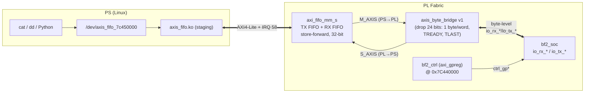

# PS↔PL Byte-Stream Bridge over AXI-Stream FIFO — Implementation Plan

## Overview

Add a **register/FIFO bridge** alongside the existing bf2_soc/uartlite path: the
Xilinx **AXI-Stream FIFO IP (`axi_fifo_mm_s`, PG080)** in the block design,
driven from Linux by the in-tree **`axis_fifo` staging driver**, and a small PL
**byte adapter** between the 32-bit stream interface and an 8-bit parallel byte
handshake.

Result: a single bidirectional Linux char device (`/dev/axis_fifo_*`) that PS can
`read()`/`write()` **at the same time** (full duplex), with **end-to-end backpressure
in both directions** — nothing is silently dropped when the PL consumer cannot keep
up, and `write()` blocks instead of losing bytes.

### Bring-up staging

| Phase | PL consumer on bridge | bf2_soc path | Purpose |
|---|---|---|---|
| **Phase 1** (completed) | `case_toggle` (XOR 0x20) | **Kept** on uartlite | Validated fifo+bridge+simple-module chain on hardware without touching bf2 |
| **Phase 2 (current)** | `bf2_soc` | Removed; uartlite/uart_phy/case_toggle dropped | Full replacement: bf2-soc → bridge → fifo → char device |

**The adapter ships in two variants** — same IP, same driver, same DT, same
addresses; only the adapter internals differ:

| Variant | Words per byte | Logic | When |
|---|---|---|---|
| **v1 — `axis_byte_bridge` drop-24** (this plan) | 1 byte per 32-bit word, upper 24 bits dropped | Trivial: combinational RX pass-through + 1-deep TX staging register. **First milestone.** | Now |
| **v2 — byte-packer** (deferred) | 4 bytes per 32-bit word (`TLAST` per word) | `fifo_sync`-based pack/unpack with a small wrapper | Later, only if v1 bandwidth is ever a bottleneck (it isn't for a byte stream) |



## Background — why the bridge replaced uartlite

The original `bf2_soc` path used:

```
PS /dev/ttyUL1 (uartlite) ──AXI4-Lite @0x7C430000, IRQ 57──▶ axi_uartlite_0
axi_uartlite_0/tx ──serial wire──▶ uart_phy_0/uart_rx_i ──parallel──▶ bf2_soc_0/io_rx_*
bf2_soc_0/io_tx_* ──parallel──▶ uart_phy_0 ──serial wire──▶ axi_uartlite_0/rx
```

Gap (documented in `UART_PHY.md` §7): when `bf2_soc` stops draining (compute-bound
program with no `,`), `uart_phy`'s 16-byte RX FIFO fills in ~1.4 ms and incoming
bytes are **dropped silently** — the PS cannot detect it because AXI UART Lite has
no flow control and the wire carries no status.

This path has been replaced by the AXI-Stream FIFO bridge (Phase 2).
`axi_uartlite_0`, `uart_phy_0`, and the `case_toggle` test module no longer appear
in the block design. The PS console stays on UART1 (`ttyPS0`, MIO 24-25).

## Solution architecture

| Piece | Role |
|---|---|
| **`axi_fifo_mm_s`** (Xilinx IP, PG080) | Dual FIFO (TX = PS→PL, RX = PL→PS) with AXI4-Lite slave + interrupt on the PS side and AXI4-Stream master/slave on the PL side. Store-forward mode, 32-bit data, both data FIFOs enabled. |
| **`axis_fifo` driver** (`linux/drivers/staging/axis-fifo/axis-fifo.c`, Kconfig `XIL_AXIS_FIFO`) | Registers one misc char device (`axis_fifo_%pa`), `.read` = RX FIFO, `.write` = TX FIFO, full duplex (separate mutexes), blocking via interrupt-driven wait queues. Already present in this repo's ADI-fork kernel (6.12). |
| **`axis_byte_bridge` v1** (new PL module, drop-24) | Each 32-bit stream word carries **one byte in bits [7:0]**; the upper 24 bits are dropped on RX and driven to 0 on TX. No pack/unpack logic: PS→PL is a combinational pass-through of the low byte; PL→PS uses a 1-deep staging register to catch `io_tx_valid` strobes that land on a blocked `S_AXIS`. Honors `TREADY` in both directions; asserts `TLAST` per word on `S_AXIS`. |
| DT node | `xlnx,axi-fifo-mm-s-4.1` at `0x7C45_0000`, IRQ SPI 58, all required `xlnx,*` properties. |

### Data-path semantics (why backpressure works both ways)

| Direction | Path | Backpressure mechanism |
|---|---|---|
| **PS→PL** (`write()`) | AXI4-Lite → TX FIFO → `M_AXIS` → adapter → `bf2_soc io_rx_*` | ① driver waits on `write_queue` until TX FIFO vacancy ≥ packet length (`XLLF_TDFV`); ② if the adapter/`bf2_soc` is slow, `M_AXIS TREADY` deasserts → TX FIFO stays full → PS keeps blocking. |
| **PL→PS** (`read()`) | `bf2_soc io_tx_*` → adapter → `S_AXIS` → RX FIFO → AXI4-Lite | `S_AXIS TREADY` deasserts when the RX FIFO fills → adapter stops `io_tx_ready` → `bf2_soc` stalls (it already stalls on `!io_tx_ready`). The PS reads whenever it wants; data waits in the FIFO. |

Both directions are loss-free **provided the stream producer honors `TREADY`** — the
adapter must, and `bf2_soc` does (`io_stall = ... io_wr_pending && (!io_tx_ready || ...)`).

### Packet/word model (store-forward constraints, v1 drop-24)

- **Every `write()` = one packet.** The driver writes data words, then writes the
  **TLR** (Transmit Length Register, `0x14`); the IP only starts transmitting on
  `M_AXIS` once the length is registered (store-forward). Writes must be **4-byte
  multiples** (non-aligned → error). `write()` returns once data + TLR are accepted —
  it does *not* wait for the PL to consume.
- **1 byte per word.** With v1, each 32-bit word on the wire carries one byte in
  `[7:0]`; the adapter drops `[31:8]` on the PS→PL path. So a `write()` of `4N` bytes
  produces `4N` stream words and `bf2_soc` receives exactly `4N` bytes. The driver's
  4-byte write granularity maps to *one byte per word*, not four.
- **Every packet on RX ends with `TLAST`.** The adapter asserts `TLAST` on **every
  word** (packet = one 32-bit word = one byte). The IP writes the **RLR** (Receive
  Length Register, `0x24`) per completed packet; the driver's `read()` returns one
  whole packet — with v1 that is one 32-bit word (4 bytes to userspace, byte 0 = data,
  bytes 1–3 = 0). A `read()` loop that wants exactly *N* bytes takes the low byte of
  each returned word.
- Blocking waits use `wait_event_interruptible_timeout`; on timeout both `read()` and
  `write()` return `-EAGAIN` (a retry loop or `O_NONBLOCK` + poll is acceptable).

## Design decisions

1. **Replaced** `axi_uartlite_0` + `uart_phy_0` in the `bf2_soc` path — both are
   removed from the block design. The PS console stays on UART1 (`ttyPS0`, MIO 24-25).
   `uart_phy` remains in `hdl/library/` as a reusable IP (echo_char/bf1_soc sims
   still use it).
2. **Packet = one 32-bit word = one byte (v1).** `TLAST` per word on `S_AXIS`, and on
   `M_AXIS` the packet length (TLR) simply equals the byte count. Gives byte-stream
   semantics at the cost of 3 wasted bits per byte — the simplest correct adapter.
3. **v1 needs no FIFO at all.** PS→PL is a combinational pass-through
   (`io_rx_data = m_axis_tdata[7:0]`, `m_axis_tready = io_rx_ready`); PL→PS is a
   1-deep staging register. The repo's `fifo_sync.sv` stays unused until the v2
   byte-packer. Milestones: get the whole chain working with v1, then optionally
   move to v2 (4 bytes/word) purely as a bandwidth optimization.
4. **Single clock domain**: `s_axi_aclk`, `axi_str_txd_aclk`, `axi_str_rxd_aclk`,
   adapter, and `bf2_soc` all on `sys_cpu_clk` (100 MHz). The IP's async capability
   stays available for a future different-PL-clock design.
5. **Store-forward, 32-bit AXI4-Lite only** — the driver's documented limitation.
6. **`bf2_soc` handshake contract** (must match exactly):
   - RX (to `bf2_soc`): present a byte on `io_rx_data` with `io_rx_valid=1`, hold it
     until `io_rx_ready && io_rx_valid` for one cycle (same as `uart_phy`'s
     `rx_valid`/`rx_accept_i`). `io_rx_ready` is a *level* that drains one byte per
     cycle while high.
   - TX (from `bf2_soc`): `io_tx_valid` is a single-cycle strobe; deassert
     `io_tx_ready` only when blocked (word pending and `S_AXIS TREADY=0`). Because
     `io_tx_valid` is a strobe, the adapter must **capture it even when `S_AXIS` is
     blocked** (staging register) — a pure combinational `s_axis_tvalid = tx_valid`
     would lose the byte if `s_axis_tready` drops exactly when the strobe fires.

## Work breakdown

### 1. HDL — new `hdl/library/axis_byte_bridge/`

`axis_byte_bridge.sv` (repo conventions: MIT header, `default_nettype none`, typed
enums, `input wire`/`output reg` ports, PascalCase params, `// vim:` modeline):

```
module axis_byte_bridge (
  input  wire        clk,        // sys_cpu_clk
  input  wire        reset,      // active high
  // M_AXIS slave (PS→PL, from axi_fifo_mm_s)
  input  wire        m_axis_tvalid,
  output wire        m_axis_tready,
  input  wire [31:0] m_axis_tdata,
  input  wire        m_axis_tlast, // ignored in v1
  // S_AXIS master (PL→PS, to axi_fifo_mm_s)
  output wire        s_axis_tvalid,
  input  wire        s_axis_tready,
  output wire [31:0] s_axis_tdata,
  output wire        s_axis_tlast,
  // bf2_soc parallel byte side
  output wire [7:0]  rx_data,    // → io_rx_data
  output wire        rx_valid,   // → io_rx_valid
  input  wire        rx_accept,  // ← io_rx_ready (drain level)
  input  wire [7:0]  tx_data,    // ← io_tx_data
  input  wire        tx_valid,   // ← io_tx_valid (single-cycle strobe)
  output wire        tx_ready    // → io_tx_ready
);

  // ── PS→PL: pure pass-through of the low byte; upper 24 bits dropped. ──
  // Transfer completes only when m_axis_tvalid && m_axis_tready (== rx_accept)
  // coincide, so io_rx_ready dropping mid-word just defers the transfer —
  // loss-free. No FIFO, no state.
  assign rx_data       = m_axis_tdata[7:0];
  assign rx_valid      = m_axis_tvalid;
  assign m_axis_tready = rx_accept;

  // ── PL→PS: 1-deep staging register. io_tx_valid is a single-cycle strobe
  // and s_axis_tready may be low exactly when it fires (RX FIFO just filled),
  // so capture every strobe and hold it on S_AXIS until tready. tx_ready
  // mirrors s_axis_tready; bf2_soc stalls while io_wr_pending && !io_tx_ready,
  // so while the stage is blocked no new byte can arrive.
  reg        tx_stage_valid;
  reg [7:0]  tx_stage_data;

  assign s_axis_tdata  = {24'd0, tx_stage_data};
  assign s_axis_tvalid = tx_stage_valid;
  assign s_axis_tlast  = 1'b1;   // one word = one packet (RLR per byte)
  assign tx_ready      = s_axis_tready;

  always @(posedge clk) begin
    if (reset) begin
      tx_stage_valid <= 1'b0;
    end else begin
      if (tx_valid) begin
        tx_stage_data  <= tx_data;
        tx_stage_valid <= 1'b1;          // overwrite: strobe always wins
      end else if (s_axis_tready) begin
        tx_stage_valid <= 1'b0;          // drained
      end
    end
  end

endmodule
```

- **PS→PL path**: accept a stream word when `m_axis_tvalid && m_axis_tready`; the
  byte `m_axis_tdata[7:0]` is presented to `bf2_soc` in the same cycle (data/valid
  both come from the FIFO's registered output, so they stay aligned).
  `m_axis_tready = io_rx_ready` directly. Upper 24 bits are never used.
- **PL→PS path**: capture every `tx_valid` strobe into the staging register; while
  `tx_stage_valid`, drive `s_axis_tvalid`/`s_axis_tdata = {24'd0, byte}` with
  `s_axis_tlast=1` until `s_axis_tready` pops it. `tx_ready = s_axis_tready`.
- v1 uses **no `fifo_sync`**; the v2 byte-packer will be built on
  `hdl/library/uart_phy/fifo_sync.sv` (16-deep, already verified) for both
  directions plus a tiny pack/unpack wrapper.

Deliverables: module + `Makefile` (ADI library style) + `tb_axis_byte_bridge.sv`
(stream model + `bf2_soc`-semantics byte side) + `axis_byte_bridge_ip.tcl`
(IP packaging with `adi_add_bus` for AXI-Stream interfaces).

### 2. Block design — `hdl/projects/ebaz4205/system_bd.tcl`

The original `bf2_soc`/`uartlite`/`uart_phy` path and the Phase-1 `case_toggle`
test are removed. `bf2_soc` connects directly to the bridge. `bf2_ctrl` is kept.

- Add `axi_fifo_mm_s` (`axi_fifo_mm_s_0`):
  - Data interface **AXI4-Lite** (store-forward), `C_USE_TX_DATA=1`,
    `C_USE_RX_DATA=1`, `C_USE_TX_CTRL=0`, cut-through disabled, TX/RX depth **1024**
    words, 32-bit TDATA, all `C_HAS_AXIS_*` (TKEEP,TSTRB,TID,TDEST,TUSER) = 0.
  - `ad_cpu_interconnect 0x7C450000 axi_fifo_mm_s_0` (next free slot after
    `bf2_ctrl` at `0x7C440000`).
  - `ad_cpu_interrupt ps-14 mb-14 axi_fifo_mm_s_0/interrupt` → concat `In14` →
    IRQ_F2P[14] → GIC SPI 58.
  - Clocks: `s_axi_aclk`/`axi_str_txd_aclk`/`axi_str_rxd_aclk` → `sys_cpu_clk`;
    `s_axi_aresetn`/`axi_str_txd_aresetn`/`axi_str_rxd_aresetn` → `sys_cpu_resetn`.
- Add `axis_byte_bridge_0` (clk/reset on `sys_cpu_clk`/`sys_cpu_reset`):
  - `axi_fifo_mm_s_0/AXI_STR_TXD` → `axis_byte_bridge_0/m_axis`
  - `axis_byte_bridge_0/s_axis` → `axi_fifo_mm_s_0/AXI_STR_RXD`
  - Bridge byte side → `bf2_soc_0`:
    - `rx_data`/`rx_valid` → `io_rx_data`/`io_rx_valid`
    - `io_rx_ready` → `rx_accept`
    - `io_tx_data`/`io_tx_valid` → `tx_data`/`tx_valid`
    - `tx_ready` → `io_tx_ready`
- Add `LIB_DEPS += axis_byte_bridge` in `hdl/projects/ebaz4205/Makefile`
  (ADI library-mk builds `component.xml`). `uart_phy` and `case_toggle` are
  removed from `LIB_DEPS`.

### 3. Device tree — `u-boot-xlnx/arch/arm/dts/pl-ebaz4205.dtso`

```dts
axi_fifo_0: axi-fifo@7c450000 {
    compatible = "xlnx,axi-fifo-mm-s-4.1";
    reg = <0x7c450000 0x10000>;
    interrupt-parent = <&intc>;
    interrupt-names = "interrupt";
    interrupts = <0 58 IRQ_TYPE_LEVEL_HIGH>;
    xlnx,axi-str-rxd-protocol = "XIL_AXI_STREAM_ETH_DATA";
    xlnx,axi-str-rxd-tdata-width = <0x20>;
    xlnx,axi-str-txc-protocol = "XIL_AXI_STREAM_ETH_CTRL";
    xlnx,axi-str-txc-tdata-width = <0x20>;
    xlnx,axi-str-txd-protocol = "XIL_AXI_STREAM_ETH_DATA";
    xlnx,axi-str-txd-tdata-width = <0x20>;
    xlnx,axis-tdest-width = <0x0>;
    xlnx,axis-tid-width = <0x0>;
    xlnx,axis-tuser-width = <0x0>;
    xlnx,data-interface-type = <0x0>;
    xlnx,has-axis-tdest = <0x0>;
    xlnx,has-axis-tid = <0x0>;
    xlnx,has-axis-tkeep = <0x0>;
    xlnx,has-axis-tstrb = <0x0>;
    xlnx,has-axis-tuser = <0x0>;
    xlnx,rx-fifo-depth = <1024>;
    xlnx,rx-fifo-pe-threshold = <2>;
    xlnx,rx-fifo-pf-threshold = <2>;
    xlnx,s-axi-id-width = <0x4>;
    xlnx,s-axi4-data-width = <0x20>;
    xlnx,select-xpm = <0x0>;
    xlnx,tx-fifo-depth = <1024>;
    xlnx,tx-fifo-pe-threshold = <2>;
    xlnx,tx-fifo-pf-threshold = <2>;
    xlnx,use-rx-cut-through = <0x0>;
    xlnx,use-rx-data = <0x1>;
    xlnx,use-tx-ctrl = <0x0>;
    xlnx,use-tx-cut-through = <0x0>;
    xlnx,use-tx-data = <0x1>;
};
```

The `xlnx,*` properties must mirror the Vivado IP configuration exactly (depths,
widths, protocols). The driver ignores thresholds/widths marked "(ignored)" but the
binding requires them.

### 4. Kernel — `linux/arch/arm/configs/zynq_ebaz4205_defconfig`

```
CONFIG_STAGING=y           # (already set)
CONFIG_XIL_AXIS_FIFO=m     # loadable module — built by `make sdimg` (linux-modules
                           # target runs `make modules`), installed into the rootfs by
                           # buildroot/board/ebaz4205/post-build.sh (modules_install +
                           # depmod) under /lib/modules/$(uname -r)/; modalias
                           # of:N*T*Cxlnx,axi-fifo-mm-s-4.1 → auto-loads when the DT
                           # overlay node appears
```

The driver source already ships in this kernel tree (`drivers/staging/axis-fifo/`).
First action item: confirm it builds cleanly against the 6.12 tree before any HDL
work (staging-driver API churn is the top risk).

### 5. Userspace

- Device node: `axis_fifo_%pa` name pattern — expect `/dev/axis_fifo_7c450000`
  (confirm with `ls /dev/axis_fifo*`; `%pa` width/format must be checked on boot).
- Byte-stream rules (v1): every `write()` a **multiple of 4 bytes**; each `read()`
  returns one whole 4-byte packet whose **low byte is the data** (upper bytes 0).
  `cat`/`dd` with 4-byte multiples works but wastes 3 bytes per read; odd-length
  transfers need a small shim.
- Deliverable: a tiny Python module `scripts/axis_fifo.py` — `write_bytes()`
  (chunks of 4, packs one byte per word's low byte), `read_bytes()` (loops `read()`
  until N bytes, taking `word[0]` from each returned word), used by the on-board
  tests. (Under v2 this becomes pack/unpack 4 bytes per word — the shim is the
  only userspace change between variants.)

## Verification plan

| Stage | Check | Gate |
|---|---|---|
| Driver build | `make sdimg` (linux-modules → buildroot post-build modules_install) | `axis_fifo` compiles; `axis-fifo.ko` + `modules.dep` present in `buildroot/output/target/lib/modules/…` and in `build_sdimg/rootfs.ext4` (`debugfs -R "ls -l /lib/modules/…"`) |
| On-board — module presence | `./scripts/ebaz_deploy.sh` (live update: boot files + `lib/modules` tree over ssh, no rootfs dd) then `modprobe axis_fifo` | `axis-fifo.ko` lands in `/lib/modules/$(uname -r)/`; `modprobe axis_fifo` binds the DT node (modalias autoload), `/dev/axis_fifo_7c450000` appears |
| RTL sim — bridge | `make -C hdl/library/axis_byte_bridge sim` | one byte per word (upper 24 dropped/zeroed), TLAST per word on S_AXIS, TREADY stall both directions, `io_tx_valid` strobe landing on blocked `S_AXIS` (v1 staging-register case), back-to-back bytes both directions |
| RTL sim — case_toggle (Phase 1, retained in library) | `make -C hdl/library/case_toggle sim` | known letters toggle (A↔a, Z↔z), TX blocked → io_rx_ready backpressure, strobe is single-cycle |
| Integration sim | `bf2_soc` + bridge + stream model TB (like `tb_bf1_soc_uart.sv`) | full-duplex echo, backpressure stall, zero-loss under slow drain |
| Lint | verilator `--lint-only -Wall` exit 0 (no warnings), verible exit 0 | clean |
| BD build — Phase 2 wiring | ADI make (bitstream); verify `axi_uartlite_0`/`uart_phy_0`/`case_toggle_0` absent from `report_utilization` | place/route, timing; no stale IP in netlist |
| On-board — PS→PL | `dd if=bigfile of=/dev/axis_fifo_7c450000 bs=4`; bf2 program echoes back | byte count matches, zero loss |
| On-board — backpressure | bf2 runs compute-only (no `,`) for T seconds while PS streams | PS `write()` blocks (rate ≈ 0 during stall); after resume, all bytes arrive intact |
| On-board — full duplex | simultaneous read + write streams (Python shim) | no cross-talk, no loss either way |
| Regression | rerun `make sim` uart_phy/echo_char (library untouched) + boot sanity | no regressions |

## Risks & mitigations

| Risk | Mitigation |
|---|---|
| Staging driver breaks on 6.12 (API churn) | Build the driver **first**; if broken, patch locally or fall back to UIO (`uio_pdrv_genirq`, already enabled in defconfig) |
| Non-word-aligned `write()`/`read()` errors | Userspace shim enforces 4-byte granularity |
| Store-forward/TLAST semantics misconfigured (adapter must assert TLAST per word; TLR per write) | Covered by RTL sim cases; document in adapter header |
| IP params vs DT mismatch (depths, widths) | Single source of truth: generate DT properties from Vivado IP config; sim checks depths |
| IRQ collision / `In14` GND tie | `ad_cpu_interrupt ps-14` replaces the GND; verify in BD schematic + `cat /proc/interrupts` |
| `bf2_soc` handshake mismatch (level vs strobe) | Adapter contract mirrors `uart_phy` semantics; integration sim covers it; v1's staging register is mandatory because `io_tx_valid` is a strobe |
| `-EAGAIN` on wait timeouts | Userspace retry loop or `O_NONBLOCK` + `poll()` |
| v1 wastes 3/4 of stream bandwidth (1 byte/word) | ~100 MB/s class at 100 MHz, still ~10⁴× the uartlite wire rate — irrelevant for a byte stream; if it ever matters, swap the adapter for v2 (4 bytes/word), no IP/driver/DT change |

## Open questions

1. FIFO depth 1024 words each — enough? With v1 a word holds 1 byte, so the FIFOs
   hold 1024 bytes/direction (v2 would quadruple that). (TX FIFO absorbs PS bursts;
   RX FIFO absorbs PL bursts.)
2. Should the adapter be IP-packaged (`axis_byte_bridge_ip.tcl`) or instantiated as
   plain RTL in the BD? (Plain RTL first; package if reused.)
3. v1 `read()` granularity is one word (4 bytes) per call with 3 zero bytes — is the
   shim compacting to 1 byte per read acceptable, or should v2 (4 bytes/word) land
   sooner to make `read()`/`write()` byte-for-byte? (Recommend: v1 first, measure,
   then decide.)

## References

- Xilinx PG080 — AXI4-Stream FIFO product guide (store-forward, TLR/RLR, ports)
- `linux/drivers/staging/axis-fifo/axis-fifo.c` + `axis-fifo.txt` (driver semantics,
  DT binding, limitations)
- `doc/PL_TTY_DEVICE.md` — the AXI UART Lite path that was replaced (retained as reference)
- `doc/UART_PHY.md` — `uart_phy` parallel contract (`rx_valid`/`rx_accept_i`/`rx_ready`)
  that `axis_byte_bridge` reuses on the `bf2_soc` side
