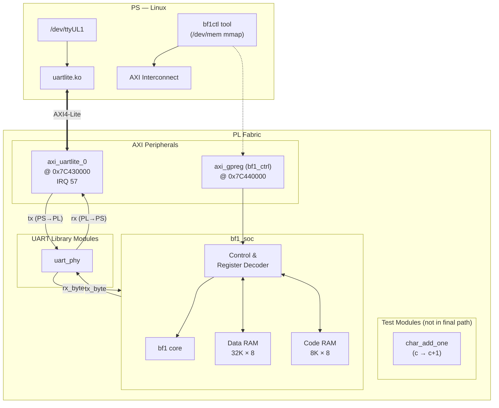
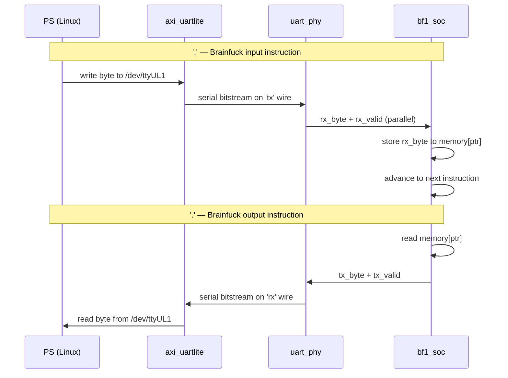
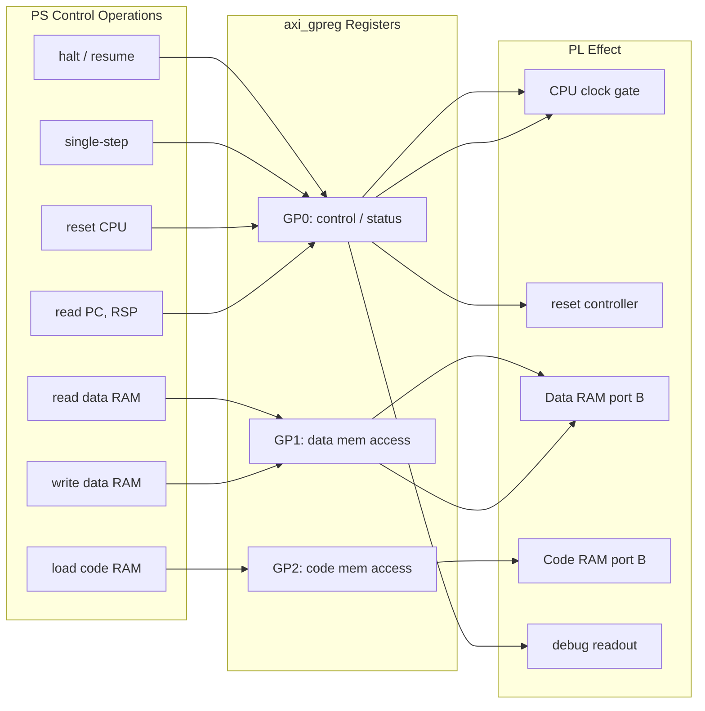
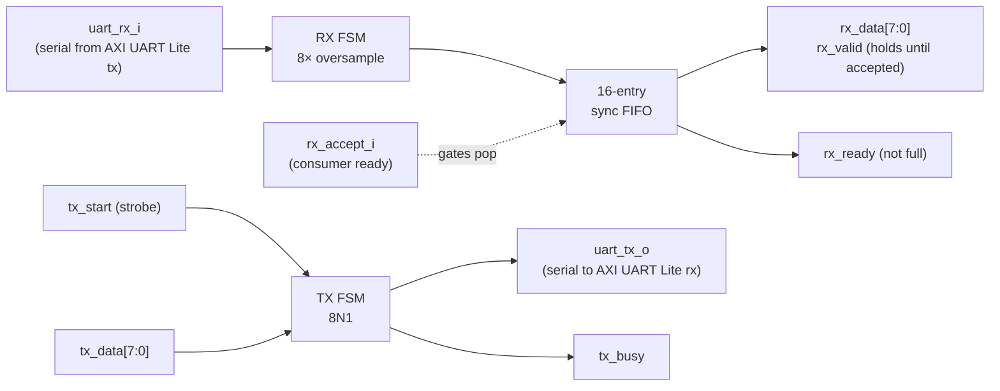
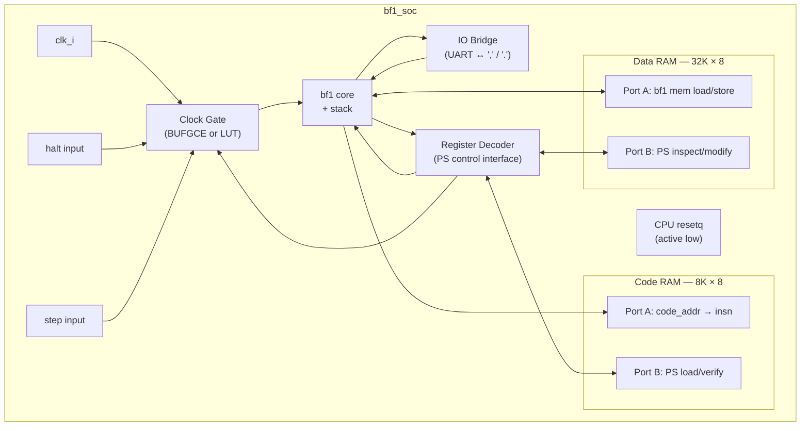
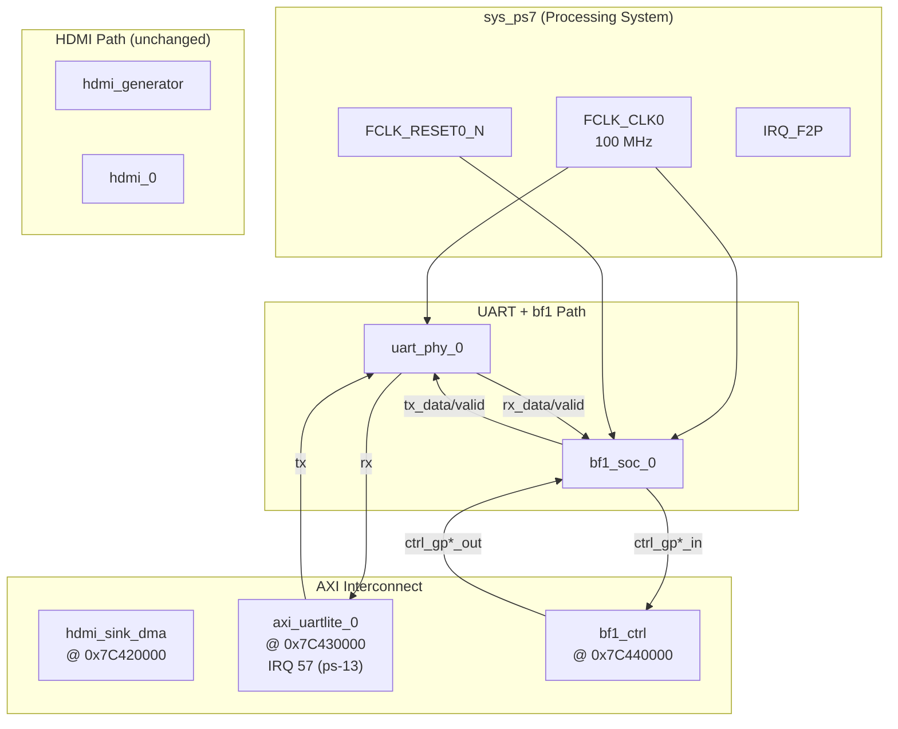
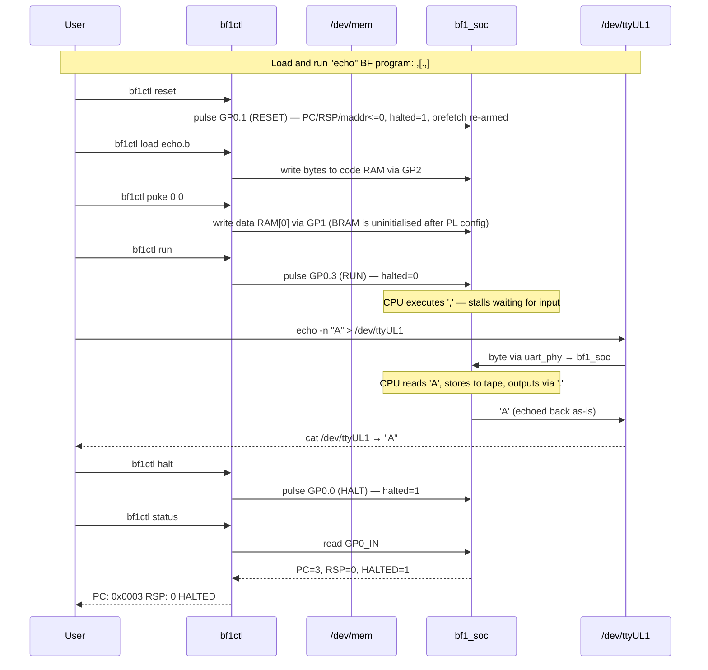
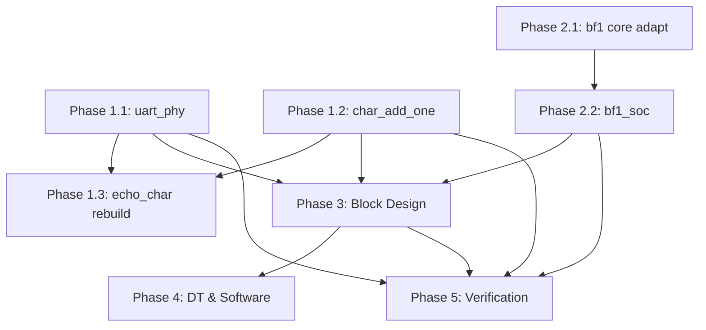

# bf1 Brainfuck CPU in PL — Implementation Plan

## Goal

Run the `bf1` Brainfuck CPU in the PL fabric of the EBAZ4205 (Zynq-7010), controlled from Linux on the PS. The UART character device (`/dev/ttyUL1`) that currently does `c → c+1` loopback will instead serve as bf1's I/O for the `,` (input) and `.` (output) Brainfuck instructions. The PS can halt/resume/step the CPU, inspect and modify data memory, load code memory, and reset the CPU — all via AXI4-Lite mapped registers.

## Progress Summary

| Phase | Status | Notes |
|-------|--------|-------|
| **1.1 UART Library (uart_phy)** | ✅ Complete | Extracted from echo_char, sim & hardware verified (266/266 tests); `tx_ready` output added in bring-up (§A.9) |
| **1.2 char_add_one** | ✅ Complete | Reusable test module, sim verified |
| **1.3 echo_char rebuild** | ✅ Complete | Uses uart_phy + char_add_one, hardware verified |
| **2.1 bf1 core adapt** | ✅ Complete | Added io_rd, pc_debug, cpu_active, ctrl_reset_i ports |
| **2.2 bf1_soc wrapper** | ✅ Complete | Dual-port BRAMs, IO bridge, register decoder; 6/6 unit + 8/8 integration sim tests (§A.9) |
| **3 Block Design** | ✅ Complete | system_bd.tcl updated, bitstream builds. Timing: WNS = +2.38 ns (see §A.8) |
| **4 bf1ctl tool** | ❌ Not started | See §4.2 for design (HW tests so far used devmem/python scripts instead) |
| **5 Hardware test** | ✅ Complete | Boot-image deployment; 7/7 tests ×3 runs — see §5.5 and doc/BF1_HW_TEST_FAILURE_HYPOTHESIS.md |

## Architecture

### End state



### Signal flow for `,` (input) and `.` (output)



### PS control paths



---

## Phase 1: UART Library Extraction

**Goal:** Refactor `echo_char.v` into reusable library modules without changing its external behavior. All new modules get testbenches and Vivado IP packaging.

### 1.1 Extract `uart_phy`

**New module:** `hdl/library/uart_phy/uart_phy.v`

Pulled from `echo_char.v`: the baud-rate generator, UART RX (8× oversampling FSM), 16-entry sync FIFO, and UART TX FSM — exposed as a clean parallel byte-stream interface with no transformation logic.



**Ports:**

| Port | Dir | Width | Description |
|------|-----|-------|-------------|
| `clk` | in | 1 | System clock |
| `reset` | in | 1 | Synchronous reset (active high) |
| `uart_rx_i` | in | 1 | Serial input from AXI UART Lite `tx` |
| `uart_tx_o` | out | 1 | Serial output to AXI UART Lite `rx` |
| `rx_data` | out | 8 | Received byte |
| `rx_valid` | out | 1 | High while a byte is presented; holds until `rx_accept_i = 1` |
| `rx_ready` | out | 1 | Write-side flow control: high when FIFO can accept (≡ `!fifo_full`) |
| `rx_accept_i` | in | 1 | Consumer is ready — gates FIFO pop (backpressure from downstream) |
| `tx_data` | in | 8 | Byte to transmit |
| `tx_start` | in | 1 | Single-cycle strobe to start transmission |
| `tx_busy` | out | 1 | High while transmitting (backpressure) |
| `tx_ready` | out | 1 | ≡ `!tx_busy` (added in bring-up for bf1_soc's ready-when-high `io_tx_ready`, §A.9) |

Parameters: `CLK_FREQ = 100_000_000`, `BAUD = 115200`, `FIFO_DEPTH = 16`.

The FIFO is placed between RX and the `rx_data` port so:
- **RX path:** Received bytes are buffered in the FIFO. The consumer reads via `rx_data`/`rx_valid`. No data is lost as long as the consumer drains the FIFO before it fills.
- **TX path:** Consumer presents `tx_data` + `tx_start` when `tx_busy = 0`. The TX FSM serializes and outputs `uart_tx_o`.

**Files:**

| File | Action |
|------|--------|
| `hdl/library/uart_phy/uart_phy.v` | Create — extracted from echo_char |
| `hdl/library/uart_phy/uart_phy_ip.tcl` | Create |
| `hdl/library/uart_phy/Makefile` | Create (with sim targets) |
| `hdl/library/uart_phy/tb_uart_phy.v` | Create — self-checking testbench |

**Simulation tests** (same scope as existing `tb_echo_char.v`):
- Known values, wraparound, back-to-back bytes, idle recovery, exhaustive 0x00–0xFF sweep, repeated 0x41 × 100, burst 8/32/64/17

### 1.2 Extract `char_add_one` (test / verification module)

**New module:** `hdl/library/char_add_one/char_add_one.v`

A simple reusable module that adds 1 to each byte. **Not part of the final bf1 data path** — used only for testing the `uart_phy` integration and as a smoke-test stand-in for any byte-stream processor. The `c → c+1` transform extracted from `echo_char` as a standalone registered pipeline stage.

**Ports:**

| Port | Dir | Width | Description |
|------|-----|-------|-------------|
| `clk` | in | 1 | Clock |
| `reset` | in | 1 | Sync reset |
| `data_in` | in | 8 | Input byte |
| `data_in_valid` | in | 1 | Input strobe |
| `data_out` | out | 8 | `data_in + 1` (wrapping, one cycle later) |
| `data_out_valid` | out | 1 | Output strobe (same cycle as data_out) |

Registered (1-cycle latency) to avoid adding combinational paths between modules.

**Files:**

| File | Action |
|------|--------|
| `hdl/library/char_add_one/char_add_one.v` | Create |
| `hdl/library/char_add_one/char_add_one_ip.tcl` | Create |
| `hdl/library/char_add_one/Makefile` | Create |
| `hdl/library/char_add_one/tb_char_add_one.v` | Create |

### 1.3 Rebuild `echo_char` from library modules

Edit `hdl/library/echo_char/echo_char.v` to instantiate `uart_phy` and `char_add_one`:

```
uart_phy (RX path) → char_add_one → uart_phy (TX path)
                                      ↑
                   tx_start strobe ───┘ (when !tx_busy && rx_valid)
```

External ports and behavior unchanged. All 10 existing simulation tests must still pass.

---

## Phase 2: bf1_soc — CPU System Wrapper

**Goal:** Wrap `bf1` with dual-port BRAMs for code and data, an IO bridge for UART, and a register-driven control interface for the PS.

**New directory:** `hdl/library/bf1_soc/`

### 2.1 Copy and adapt bf1 core

Copy from `~/repos/verilog/brainfuck_machine/verilog/`:

| Source | Destination | Notes |
|--------|-------------|-------|
| `bf1.v` | `bf1_soc/bf1.v` | Add `io_rd` output port |
| `stack.v` | `bf1_soc/stack.v` | Unchanged |
| `common.h` | `bf1_soc/common.h` | Unchanged |

**Modification to bf1.v — new ports:**

Add a `cpu_active` clock-enable port and an `io_rd` output port:

```diff
+ input  wire cpu_active,      // clock enable: 0 = stall (all registers hold)
+ output reg  io_rd,           // high during ',' instruction

  // Register update guarded by cpu_active:
  always @(negedge resetq or posedge clk)
  begin
    if (!resetq) begin
      {pc, rsp, maddr, lj, lj_offset} <= 0;
-   end else begin
+   end else if (cpu_active) begin
      {pc, rsp, maddr, lj, lj_offset}
      <= {pcN, rspN, maddrN, ljN, lj_offsetN};
    end
  end

  // In the "after ALU" always block:
  4'b0_110: begin
    mem_wr = 1;
+   io_rd  = 1;              // ','
  end
```

`cpu_active` is driven by the clock-gating logic in `bf1_soc`. When low,
all bf1 registers hold their current value. `io_rd` lets the IO bridge
know when the CPU is executing `,` so it can drive `io_din` from UART.

### 2.2 bf1_soc module



**Ports:**

| Port | Dir | Width | Description |
|------|-----|-------|-------------|
| `clk_i` | in | 1 | System clock (100 MHz) |
| `resetq` | in | 1 | CPU reset (active low, async) |
| `io_rx_data` | in | 8 | Byte from UART RX (for `,`) |
| `io_rx_valid` | in | 1 | `io_rx_data` is valid (sticky — holds until accepted) |
| `io_rx_ready` | out | 1 | Drives `uart_phy.rx_accept_i`: `io_rd && !halted && (!io_rx_valid \|\| cpu_active)` (§A.9) |
| `io_tx_data` | out | 8 | Byte for UART TX (from `.`) |
| `io_tx_valid` | out | 1 | Strobe: `io_tx_data` is valid |
| `io_tx_ready` | in | 1 | UART TX can accept — connect to `uart_phy.tx_ready` (≡ `!tx_busy`) |
| `debug_pc` | out | 13 | Current program counter |
| `debug_rsp` | out | 4 | Current return stack pointer |
| `ctrl_gp0_out` | in | 32 | `up_gp_out_0` from axi_gpreg — control register |
| `ctrl_gp1_out` | in | 32 | `up_gp_out_1` — data RAM command |
| `ctrl_gp2_out` | in | 32 | `up_gp_out_2` — code RAM command |
| `ctrl_gp0_in` | out | 32 | `up_gp_in_0` to axi_gpreg — status |
| `ctrl_gp1_in` | out | 32 | `up_gp_in_1` — data RAM result |
| `ctrl_gp2_in` | out | 32 | `up_gp_in_2` — code RAM result |

**Internal design:**

**Clock gate and IO stall:** A register-based clock enable — no BUFGCE needed.
The bf1 core advances only when `cpu_active = cpu_active_raw && !prefetch && bf1_ce`
(`bf1_ce` toggles every cycle — half-speed enable, see §A.8).
Both IO stalls are **combinational** — they must drop `cpu_active` in the same
cycle the CPU asserts `io_rd`/`io_wr`, otherwise the PC advances past the
instruction before the stall takes hold.

```verilog
reg halted;         // PS-commanded halt
reg step_pending;   // single-step in progress

// Combinational stalls: block PC advance in the SAME cycle io_rd/io_wr go high
wire io_stall_rx = io_rd && !io_rx_valid;
wire io_stall_tx = io_wr && !io_tx_ready;

wire cpu_active_raw = !halted && !io_stall_rx && !io_stall_tx;
wire cpu_active     = cpu_active_raw && !prefetch && bf1_ce;
```

**Why combinational for BOTH stalls (lesson from HW bring-up, §A.9):**
an earlier revision used a *registered* one-shot for `io_stall_tx`, which
engaged one cycle AFTER the `.` execute edge — the `io_tx_valid` strobe had
already fired into a busy uart_phy (ignored) and the PC had already advanced,
silently dropping any `.` that executes while TX is busy (back-to-back
output, e.g. `+..`). A registered `io_stall_rx` has the same one-cycle-late
problem for input. With combinational stalls the strobe can only fire into
an idle uart_phy, and `,` cannot be skipped.

```verilog
reg halted;         // PS-commanded halt
reg step_pending;   // single-step in progress

always @(posedge clk_i or negedge resetq) begin
    if (!resetq) begin
        halted       <= 1;    // start halted after reset
        step_pending <= 0;
    end else begin
        if (ctrl_reset)
            halted <= 1;
        else if (ctrl_halt)
            halted <= 1;
        else if (ctrl_run)
            halted <= 0;

        // Step: clear halted for one instruction, then re-halt
        if (ctrl_step && halted) begin
            halted       <= 0;
            step_pending <= 1;
        end else if (step_pending && cpu_active) begin
            halted       <= 1;
            step_pending <= 0;
        end
    end
end
```

Tracing a step:
- **Cycle N:** PS writes STEP → `halted <= 0`, `step_pending <= 1`.
- **Cycle N+1:** `cpu_active = 1`. CPU executes one instruction. Same cycle,
  `step_pending && cpu_active` → `halted <= 1`, `step_pending <= 0`.
- **Cycle N+2:** CPU halted again.

The bf1 ALU is purely combinational — every instruction (`>`, `<`, `+`, `-`, `,`, `.`, `[`, `]`) completes in a single `cpu_active` cycle. The ALU computes the next PC, memory address, and data in one clock period, and the sequential block captures all results on the rising edge. Therefore, each step command advances exactly one source-level Brainfuck instruction. No `instruction_done` detector is needed.

**Step tracing (corrected):**
- **Cycle N:** PS writes STEP → `halted <= 0`, `step_pending <= 1`.
- **Cycle N+1:** `cpu_active = 1`. CPU executes one complete instruction.
  Same cycle: `step_pending && cpu_active` → `halted <= 1`, `step_pending <= 0`.
- **Cycle N+2:** CPU halted, exactly one instruction executed.

An `instruction_done` signal (GP0_IN bit 1, see §2.3) is still provided for
PS polling and performance counting, but the step mechanism does not depend on it.

The bf1 sequential block is guarded by `cpu_active`:
```verilog
always @(posedge clk_i or negedge resetq) begin
    if (!resetq) begin
        {pc, rsp, maddr, lj, lj_offset} <= 0;
    end else if (cpu_active) begin
        {pc, rsp, maddr, lj, lj_offset}
        <= {pcN, rspN, maddrN, ljN, lj_offsetN};
    end
end
```

**IO stall (input — `,`):** When bf1 executes `,` (signaled by
`io_rd && cpu_active`) but no UART data is available (`io_rx_valid = 0`),
`cpu_active` drops **immediately** (same cycle) because `io_stall_rx` is
combinational. The bf1 registers do not update — the PC stays at the `,`
instruction. When `io_rx_valid` asserts, `io_stall_rx` deasserts, `cpu_active`
rises, and the CPU consumes the byte on the next posedge.

`io_rx_ready` drives `uart_phy.rx_accept_i` and uses a **three-term gate**
(final version, see §A.9 for the two failure modes it avoids):

```verilog
assign io_rx_ready = io_rd && !halted && (!io_rx_valid || cpu_active);
```

- `io_rd && !halted` — only accept while the CPU is at `,` and not halted
  (byte held, not discarded, if the PS halts the CPU mid-instruction).
- `!io_rx_valid` — while no byte is presented yet, keep `rx_accept_i` high
  so uart_phy's holding register CAN present (its `rx_valid` only asserts
  while `rx_accept_i=1`); without this term the handshake deadlocks.
- `cpu_active` — once a byte IS presented, assert accept only at the
  posedge where the CPU actually captures `io_din` (every other cycle due
  to `bf1_ce`); without this term uart_phy consumes the byte on a
  `bf1_ce=0` cycle and the CPU never sees it.

When `io_rd = 0`, `rx_accept_i` stays low, the FIFO holds, and no data is
popped until bf1 reaches the next `,` instruction.  (The uart_phy
FIFO buffers up to 16 bytes between `,` instructions; beyond that,
incoming bytes are dropped.)

**IO stall (output — `.`):** When bf1 executes `.` (`io_wr`) but the TX path
is busy (`io_tx_ready = 0`), the combinational `io_stall_tx` freezes the PC
at the `.` instruction. When `io_tx_ready` asserts (uart_phy idle), the CPU
executes `.` at the next `cpu_active` edge and the single-cycle `io_tx_valid`
strobe fires into an idle uart_phy. The strobe can therefore never be lost —
back-to-back `.` instructions (e.g. `+..`) transmit correctly, spaced by the
TX byte time. (An earlier registered one-shot version engaged one cycle too
late and dropped such bytes — see §A.9.)

**IO Bridge:**
- **Input path (`io_din`):** Straight wire `assign io_din = io_rx_data`. The
  combinational `io_stall_rx` ensures `io_rx_data` is valid in the same cycle
  bf1 samples it.
- **Output path:** On the cycle `io_wr && cpu_active` (guaranteed to be a
  cycle where uart_phy is idle, thanks to combinational `io_stall_tx`),
  `io_dout` is captured and `io_tx_valid` pulses for exactly one cycle —
  a strobe, like echo_char's `tx_start`. A level-based `io_tx_valid` that
  persists until `io_tx_ready` must NOT be used: it re-arms uart_phy's
  `tx_start` when the previous transmission completes, sending every byte
  twice.
- **RX accept:** `assign io_rx_ready = io_rd && !halted && (!io_rx_valid || cpu_active)`
  (see the three-term gate above).

**Dual-port BRAMs:** Use `(* ram_style = "block" *)` inferred BRAM.

**Code RAM** — port A uses registered BRAM output (`code_ra_dout`). bf1 was
originally designed for zero-latency instruction fetch (`assign insn = code_ram[code_addr]`),
but a registered BRAM output is required for functional timing. The `prefetch +
code_addr = pcN` scheme described in §A.2 adapts the CPU to this 1-cycle
pipeline delay without losing or double-executing instructions.

**Timing note:** The combinational path from BRAM output register through the
ALU (decode muxes + CARRY4 adder + jump/pointer logic) to the bf1 core registers
is ~11.5 ns on 7-series — which does NOT meet the 10 ns clock period at 100 MHz.
The original estimate of ~6–7 ns only accounted for the adder itself, missing
BRAM Tco, instruction decode muxes, and jump-target logic. See §A.8 for the
selected timing closure solution.

**Data RAM** — port A is read-first combinational (`assign mem_din = data_ram[mem_addr]`)
with a registered write gated by both `mem_wr` **and** `cpu_active`:
```verilog
always @(posedge clk_i) begin
    if (mem_wr && cpu_active)
        data_ram[mem_addr] <= mem_dout;
end
```
Gating with `cpu_active` is critical: without it, the RAM is written every
clock cycle while halted (because `mem_wr` is combinational and stays high
if the halted instruction is a `+`, `-`, or `,`, corrupting the cell).

Both RAMs use `initial` blocks to zero-initialize all cells for simulation.
Synthesis tools infer `INIT=0` from this pattern.

Port B (PS access) is synchronous to the register decoder (also `clk_i` —
same clock domain).

**Register Decoder (bf1_soc_ctrl submodule):** Decodes the 32-bit
`ctrl_gp*_out` buses from `axi_gpreg` into internal control signals and BRAM
port B transactions. Drives `ctrl_gp*_in` with status and read results.

Control (`ctrl_gp0_out` → internal signals):
| `ctrl_gp0_out` bit | Signal | Description |
|--------------------|--------|-------------|
| `[0]` | `ctrl_halt` | 1 = halt CPU |
| `[1]` | `ctrl_reset` | 1 = assert resetq |
| `[2]` | `ctrl_step` | 0→1 edge = single step |
| `[3]` | `ctrl_run` | 0→1 edge = resume (clear halt) |

Status (`ctrl_gp0_in` ← internal state):
| `ctrl_gp0_in` bit | Signal | Description |
|--------------------|--------|-------------|
| `[0]` | `halted` | 1 = CPU is halted |
| `[15:3]` | `pc` | Program counter (13 bits) |
| `[19:16]` | `rsp` | Return stack pointer (4 bits) |

Memory access (`ctrl_gp1_out`/`ctrl_gp2_out`):
| Bits | Field | Description |
|------|-------|-------------|
| `[14:0]` / `[12:0]` | ADDR | Data/code RAM address |
| `[23:16]` | WDATA | Byte to write |
| `[24]` | WR | 0→1 edge triggers write |
| `[25]` | RD | 0→1 edge triggers read |

Memory result (`ctrl_gp1_in`/`ctrl_gp2_in`):
| Bits | Field | Description |
|------|-------|-------------|
| `[7:0]` | RDATA | Read result byte |
| `[8]` | DONE | 1 = last RD/WR operation complete |

Edge detection on WR and RD ensures single-cycle BRAM operations.
DONE is cleared when the PS writes the corresponding bit back to 0.

**Important:** RD operations must use a **single non-blocking assignment**
(`rdata <= ram[addr]`), not a two-stage pipeline (`tmp <= ram[addr]; rdata <= tmp`).
Two NBAs in the same always block read the stale (pre-update) value of `tmp`,
returning the previous read result instead of the current one.

**Files:**

| File | Action |
|------|--------|
| `hdl/library/bf1_soc/bf1.v` | Copy from brainfuck_machine + add `io_rd`, `cpu_active`, `ctrl_reset_i` ports |
| `hdl/library/bf1_soc/stack.v` | Copy from brainfuck_machine |
| `hdl/library/bf1_soc/common.h` | Copy from brainfuck_machine |
| `hdl/library/bf1_soc/bf1_soc.v` | Create — top-level wrapper |
| `hdl/library/bf1_soc/bf1_soc_ip.tcl` | Create |
| `hdl/library/bf1_soc/Makefile` | Create (xsim sim targets: `sim`, `sim-uart`) |
| `hdl/library/bf1_soc/tb_bf1_soc.sv` | Create — unit testbench (drives io_rx/io_tx directly) |
| `hdl/library/bf1_soc/tb_bf1_soc_uart.sv` | Create — integration TB: bf1_soc + uart_phy, real serial (§A.9) |

### 2.3 Register map (axi_gpreg wiring)

`axi_gpreg` configured with `NUM_OF_IO = 3` gives three 32-bit GPIO ports:

**GP0 — Control (PS→PL, `up_gp_out_0`) and Status (PL→PS, `up_gp_in_0`):**

Control bits (write-only; PS sets a bit to issue a command, then clears it):

| Bits | Field | Access | Description |
|------|-------|--------|-------------|
| `[0]` | HALT | PS write | 0→1 edge = halt CPU |
| `[1]` | RESET | PS write | 0→1 edge = reset CPU core registers (PC, RSP, maddr, lj, lj_offset via `ctrl_reset_i`), set HALTED, re-arm prefetch |
| `[2]` | STEP | PS write | 0→1 edge = execute 1 instruction, then re-halt |
| `[3]` | RUN | PS write | 0→1 edge = resume execution (clear halt) |
| `[31:4]` | — | — | Reserved |

Status bits (read-only):

| Bits | Field | Access | Description |
|------|-------|--------|-------------|
| `[0]` | HALTED | PL→PS read | 1 = CPU is halted |
| `[1]` | INSTR_DONE | PL→PS read | Strobe: pulses high for 1 cycle per executed instruction (useful for performance counting and polling) |
| `[15:3]` | PC | PL→PS read | Program counter (13 bits) |
| `[19:16]` | RSP | PL→PS read | Return stack pointer (4 bits) |
| `[31:20]` | — | — | Reserved |

Commands are edge-triggered: the PS writes the bit to 1, waits for the effect
(a short delay or polling HALTED), then writes 0. The PL detects 0→1
transitions on HALT, RESET, STEP, and RUN.

**GP1 — Data RAM access (PS→PL, `up_gp_out_1`) and result (PL→PS, `up_gp_in_1`):**

| Bits | Field | Access | Description |
|------|-------|--------|-------------|
| `[14:0]` | ADDR | PS write | Data RAM address (15 bits, 32K range) |
| `[23:16]` | WDATA | PS write | Byte to write |
| `[24]` | WR | PS write | 0→1 triggers write |
| `[25]` | RD | PS write | 0→1 triggers read |

| Bits | Field | Access | Description |
|------|-------|--------|-------------|
| `[7:0]` | RDATA | PL→PS read | Read result byte |
| `[8]` | DONE | PL→PS read | 1 = last RD/WR operation complete |
| `[31:9]` | — | — | Reserved |

**GP2 — Code RAM access (PS→PL, `up_gp_out_2`) and result (PL→PS, `up_gp_in_2`):**

| Bits | Field | Access | Description |
|------|-------|--------|-------------|
| `[12:0]` | ADDR | PS write | Code RAM address (13 bits, 8K range) |
| `[23:16]` | WDATA | PS write | Byte to write |
| `[24]` | WR | PS write | 0→1 triggers write |
| `[25]` | RD | PS write | 0→1 triggers read |

| Bits | Field | Access | Description |
|------|-------|--------|-------------|
| `[7:0]` | RDATA | PL→PS read | Read result byte |
| `[8]` | DONE | PL→PS read | 1 = last RD/WR operation complete |
| `[31:9]` | — | — | Reserved |

**Usage protocol (reads):**

```
1. PS writes GPn with ADDR + RD=1
2. PL captures addr, reads BRAM, sets RDATA + DONE=1 on up_gp_in_n
3. PS reads up_gp_in_n, confirms DONE=1, reads RDATA
4. PS writes GPn with RD=0
5. PL sees RD=0, clears DONE
```

**Usage protocol (writes):**

```
1. PS writes GPn with ADDR + WDATA + WR=1
2. PL detects WR=1, writes WDATA to ADDR in BRAM, sets DONE=1
3. PS reads up_gp_in_n, confirms DONE=1
4. PS writes GPn with WR=0
5. PL sees WR=0, clears DONE
```

---

## Phase 3: Block Design Integration

**Status:** ✅ Complete

**Goal:** Wire `uart_phy`, `bf1_soc`, and `axi_gpreg` into the existing Vivado block design. Replace the `echo_char_0` loopback with the bf1 system. `char_add_one` is available as a test module but is not in the final data path.

Build produces a working bitstream (`system_top.bit`). Timing is closed
on all clock domains (final bring-up build: fpga_0_clk WNS = +2.38 ns,
0 violations) via multicycle path constraints in `bf1_timing.xdc`.
See §A.8 for details.

### 3.1 Block design changes

**File:** `hdl/projects/ebaz4205/system_bd.tcl`

Remove:

```tcl
ad_ip_instance echo_char echo_char_0
ad_connect sys_cpu_clk echo_char_0/clk
ad_connect sys_cpu_reset echo_char_0/reset
ad_connect axi_uartlite_0/tx echo_char_0/uart_tx_i
ad_connect axi_uartlite_0/rx echo_char_0/uart_rx_o
```

Add:

```tcl
# ── UART PHY ──
ad_ip_instance uart_phy uart_phy_0
ad_connect sys_cpu_clk uart_phy_0/clk
ad_connect sys_cpu_reset uart_phy_0/reset
ad_connect axi_uartlite_0/tx uart_phy_0/uart_rx_i
ad_connect axi_uartlite_0/rx uart_phy_0/uart_tx_o

# ── bf1_soc ──
ad_ip_instance bf1_soc bf1_soc_0
ad_connect sys_cpu_clk bf1_soc_0/clk_i
ad_connect sys_cpu_resetn bf1_soc_0/resetq
ad_connect uart_phy_0/rx_data   bf1_soc_0/io_rx_data
ad_connect uart_phy_0/rx_valid  bf1_soc_0/io_rx_valid
# Backpressure: bf1 only accepts UART data during ',' instruction.
# io_rx_ready drives uart_phy's rx_accept_i, gating the FIFO pop.
ad_connect bf1_soc_0/io_rx_ready  uart_phy_0/rx_accept_i

# ── bf1_soc TX → uart_phy (direct, no char_add_one) ──
ad_connect bf1_soc_0/io_tx_data   uart_phy_0/tx_data
ad_connect bf1_soc_0/io_tx_valid  uart_phy_0/tx_start
# io_tx_ready is ready-when-high — connect tx_ready (= !tx_busy), NOT tx_busy.
# (tx_busy was connected originally and silently inverted the stall logic,
#  masked only because the old registered io_stall_tx never blocked the
#  strobe — see §A.9.)
ad_connect uart_phy_0/tx_ready    bf1_soc_0/io_tx_ready

# ── bf1 control via axi_gpreg ──
ad_ip_instance axi_gpreg bf1_ctrl
ad_ip_parameter bf1_ctrl CONFIG.NUM_OF_IO 3
ad_ip_parameter bf1_ctrl CONFIG.NUM_OF_CLK_MONS 0
ad_ip_parameter bf1_ctrl CONFIG.ID 0xBF10
ad_cpu_interconnect 0x7C440000 bf1_ctrl

# Connect axi_gpreg GPIO ports to bf1_soc control
# (via a small adapter or direct 32→bit connections)
ad_connect bf1_ctrl/up_gp_out_0  bf1_soc_0/ctrl_gp0_out
ad_connect bf1_ctrl/up_gp_out_1  bf1_soc_0/ctrl_gp1_out
ad_connect bf1_ctrl/up_gp_out_2  bf1_soc_0/ctrl_gp2_out
ad_connect bf1_soc_0/ctrl_gp0_in  bf1_ctrl/up_gp_in_0
ad_connect bf1_soc_0/ctrl_gp1_in  bf1_ctrl/up_gp_in_1
ad_connect bf1_soc_0/ctrl_gp2_in  bf1_ctrl/up_gp_in_2
```

### 3.2 Update Makefile

**File:** `hdl/projects/ebaz4205/Makefile`

```makefile
LIB_DEPS += uart_phy
LIB_DEPS += char_add_one
LIB_DEPS += bf1_soc
LIB_DEPS += axi_gpreg
# echo_char still needed if we keep its test infrastructure
LIB_DEPS += echo_char
```

### 3.3 System block diagram (end state)



---

## Phase 4: Device Tree & PS Software

### 4.1 Device tree

**File:** `u-boot-xlnx/arch/arm/dts/pl-ebaz4205.dtso`

The existing `axi_uartlite_0` node stays. Add:

```dts
bf1_ctrl: bf1-ctrl@7C440000 {
    compatible = "adi,axi-gpreg-1.00.a";
    reg = <0x7C440000 0x10000>;
};
```

No kernel driver needed — `bf1ctl` accesses registers directly via `/dev/mem` (like `devmem2`). If a proper kernel driver is desired later, the `uio` framework or a custom `misc` driver can be used.

### 4.2 bf1ctl — PS control tool

**File:** `tools/bf1ctl/bf1ctl.c`

Command-line tool using `/dev/mem` mmap:

```
Usage: bf1ctl <command> [args...]

CPU control:
  bf1ctl run            Resume execution from halted state
  bf1ctl halt           Pause execution
  bf1ctl step           Execute single instruction
  bf1ctl reset          Reset CPU (code/data RAM preserved)

Data memory (32K × 8):
  bf1ctl peek <addr>    Read byte (decimal or 0x hex)
  bf1ctl poke <addr> <val>  Write byte
  bf1ctl dump [start] [len] Hex dump (default: 256 bytes from 0)

Code memory (8K × 8):
  bf1ctl load <file>    Load Brainfuck program into code RAM
  bf1ctl verify <file>  Compare code RAM against file

Status:
  bf1ctl status         Show PC, RSP, halt state
  bf1ctl pc             Show current PC (for scripting)
```

**Internal register access (all via `/dev/mem` @ 0x7C440000):**

```c
#define BF1_BASE    0x7C440000
#define GP0_OUT     (BF1_BASE + 0x00)   // control
#define GP0_IN      (BF1_BASE + 0x10)   // status
#define GP1_OUT     (BF1_BASE + 0x20)   // data mem cmd
#define GP1_IN      (BF1_BASE + 0x30)   // data mem result
#define GP2_OUT     (BF1_BASE + 0x40)   // code mem cmd
#define GP2_IN      (BF1_BASE + 0x50)   // code mem result
```

(Actual offsets depend on `axi_gpreg` register layout; confirmed from its address map.)

**Key operations:**

```c
// Halt
writel(GP0_OUT, 0x01);    // set HALT bit
usleep(100);
writel(GP0_OUT, 0x00);    // clear

// Resume
writel(GP0_OUT, 0x08);    // set RUN bit
usleep(100);
writel(GP0_OUT, 0x00);    // clear

// Step: set STEP bit, CPU executes one cycle then auto-halts
writel(GP0_OUT, 0x04);    // set STEP bit
while (readl(GP0_IN) & 1);  // wait for CPU to leave HALTED momentarily
while (!(readl(GP0_IN) & 1)); // wait for CPU to re-enter HALTED
writel(GP0_OUT, 0x00);    // clear STEP

// Peek data mem
writel(GP1_OUT, (addr & 0x7FFF) | (1 << 25));  // addr + RD
while (!(readl(GP1_IN) & (1 << 8)));           // wait DONE
uint8_t val = readl(GP1_IN) & 0xFF;
writel(GP1_OUT, 0);                             // clear RD

// Poke data mem
writel(GP1_OUT, (addr & 0x7FFF) | (val << 16) | (1 << 24)); // addr + WDATA + WR
while (!(readl(GP1_IN) & (1 << 8)));
writel(GP1_OUT, 0);  // clear WR

// Load code
for (i = 0; i < filesize; i++) {
    writel(GP2_OUT, (i & 0x1FFF) | (code[i] << 16) | (1 << 24));
    while (!(readl(GP2_IN) & (1 << 8)));
    writel(GP2_OUT, 0);
}
```

**Files:**

| File | Action |
|------|--------|
| `tools/bf1ctl/bf1ctl.c` | Create |
| `tools/bf1ctl/Makefile` | Create |

### 4.3 Typical workflow



---

## Phase 5: Verification

### 5.1 Simulation — uart_phy

Test `uart_phy` standalone with the same test suite as `echo_char` (10 test suites, 490 checks). Run with:

```bash
make -C hdl/library/uart_phy sim
```

### 5.2 Simulation — char_add_one

Exhaustive 256-value sweep, back-to-back, wraparound. Single-cycle latency verified.

```bash
make -C hdl/library/char_add_one sim
```

### 5.3 Simulation — echo_char (regression)

Verify that the rebuilt `echo_char` (using `uart_phy` + `char_add_one` submodules) passes all 10 existing test suites unchanged.

```bash
make -C hdl/library/echo_char sim
```

### 5.4 Simulation — bf1_soc (xsim)

**Note:** Originally planned for Verilator, but xsim was used because
Verilator was not installed and could not be added without `sudo`.

**Unit testbench** (`tb_bf1_soc.sv`, `make -C hdl/library/bf1_soc sim`) —
drives `io_rx_data`/`io_rx_valid` directly and hardwires `io_tx_ready=1`:

1. Load a known BF program (bf1 bytecode, NOT ASCII — see §A.1) into
   code RAM via the GP2 control interface
2. Feed UART RX bytes into `io_rx_data`/`io_rx_valid`
3. Capture `io_tx_data`/`io_tx_valid` and verify output
4. Test halt/resume/step via GP0 control interface
5. Test memory peek/poke via GP1 while halted
6. Run echo loop programs to verify `,`/`.` and `[`/`]` integration

**Integration testbench** (`tb_bf1_soc_uart.sv`,
`make -C hdl/library/bf1_soc sim-uart`) — `bf1_soc` + `uart_phy` wired
exactly as `system_bd.tcl`, real 115200-baud serial frames into
`uart_rx_i`, serial monitor on `uart_tx_o`:

1. `,.` echo over the serial link, incl. no-spurious-TX-while-stalled check
2. `,[.,]` echo loop with phase-varying byte arrivals (hits both `bf1_ce`
   phases — catches the §A.9 RX byte-drop race)
3. `+..` back-to-back output (catches the §A.9 TX-busy drop)

The unit TB alone is NOT sufficient: it bypasses uart_phy's
holding-register handshake and the TX-busy path — exactly where all three
hardware bring-up bugs lived (§A.9).

### 5.5 Hardware test

**Deployment: boot image, not runtime `fpgautil`.** After a runtime PL
reconfig the uartlite driver cannot re-bind (stale IRQ mapping:
`error -ENXIO: IRQ index 0 not found`). Booting the new design from the
start works cleanly: `make sdimg`, copy `BOOT.bin` +
`system_top.bit.bin` to the SD boot partition (`/mnt` on the board),
reboot. FSBL configures the PL, `S20fpgaregion` applies the overlay,
the uartlite driver probes with valid IRQ — `/dev/ttyUL1` ready.

**Result (test_bf1_v4.py — devmem + /dev/ttyUL1, no bf1ctl needed yet):
7/7 PASS, three consecutive runs:**

| Test | Program (bytecode) | Result |
|------|--------------------|--------|
| Increment-and-loop | `+.[]` (41 E0 82 80) | data_ram[0]==1 |
| UART echo ×3 | `,.` (C0 E0) | 'A','B','C' echoed (was the failing case) |
| Increment echo | `,+.` (C0 41 E0) | 0x42→0x43 |
| Back-to-back output | `+..` (41 E0 E0) | two bytes 0x01,0x01 (TX-busy stall) |
| Echo loop, varied timing | `,[.,]` (C0 84 E0 C0 80) | "Hello" echoed, both bf1_ce phases |

Notes:
- Programs must be **bf1 bytecode** (§A.1), loaded via GP2 writes.
- Between programs: HALT (GP0.0) + RESET (GP0.1) — RESET is required,
  otherwise the CPU resumes from its stale PC (H2 in the hypothesis doc).
- Zero `data_ram[0]` via GP1 before `+`-based tests — BRAM content is
  uninitialised after boot-time PL configuration.
- Remaining for full parity with the original plan: bf1ctl tool (§4.2)
  to replace ad-hoc devmem scripts.

---

## File Manifest

| File | Phase | Action |
|------|-------|--------|
| `hdl/library/uart_phy/uart_phy.v` | 1.1 | Create |
| `hdl/library/uart_phy/uart_phy_ip.tcl` | 1.1 | Create |
| `hdl/library/uart_phy/Makefile` | 1.1 | Create |
| `hdl/library/uart_phy/tb_uart_phy.v` | 1.1 | Create |
| `hdl/library/char_add_one/char_add_one.v` | 1.2 | Create |
| `hdl/library/char_add_one/char_add_one_ip.tcl` | 1.2 | Create |
| `hdl/library/char_add_one/Makefile` | 1.2 | Create |
| `hdl/library/char_add_one/tb_char_add_one.v` | 1.2 | Create |
| `hdl/library/echo_char/echo_char.v` | 1.3 | Edit — use uart_phy + char_add_one |
| `hdl/library/bf1_soc/common.h` | 2.1 | Copy from brainfuck_machine |
| `hdl/library/bf1_soc/stack.v` | 2.1 | Copy from brainfuck_machine |
| `hdl/library/bf1_soc/bf1.v` | 2.1 | Copy + add `io_rd` output |
| `hdl/library/bf1_soc/bf1_soc.v` | 2.2 | Create |
| `hdl/library/bf1_soc/bf1_soc_ip.tcl` | 2.2 | Create |
| `hdl/library/bf1_soc/Makefile` | 2.2 | Create |
| `hdl/library/bf1_soc/tb_bf1_soc.sv` | 2.2 | Create (xsim SystemVerilog unit TB) |
| `hdl/library/bf1_soc/tb_bf1_soc_uart.sv` | A.9 | Create (xsim integration TB — bf1_soc + uart_phy, real serial) |
| `hdl/projects/ebaz4205/system_bd.tcl` | 3.1 | Edit — add bf1 system |
| `hdl/projects/ebaz4205/Makefile` | 3.3 | Edit — add LIB_DEPS |
| `hdl/projects/ebaz4205/bf1_timing.xdc` | A.8 | Create — multicycle path constraints (pin-based, closes timing at +2.624 ns) |
| `u-boot-xlnx/arch/arm/dts/pl-ebaz4205.dtso` | 4.1 | Edit — add bf1_ctrl node |
| `tools/bf1ctl/bf1ctl.c` | 4.2 | Create |
| `tools/bf1ctl/Makefile` | 4.2 | Create |

**Total: 17 new files, 5 edits**

---

## Dependencies Between Phases



Phases 1 and 2 can be developed in parallel. Phase 3 requires both. Phase 4 can start once the register map is finalized (Phase 2.2).

---

## Appendix A: Design Decisions & Lessons Learned (Phase 2)

### A.1 bf1 bytecode encoding

**bf1 does not use ASCII Brainfuck characters.** It uses a custom run-length
bytecode produced by `comp-bf.py` (in `~/repos/verilog/brainfuck_machine/compile_simulate/`).
The encoding groups instructions by the top 3 bits of the opcode byte:

| Group | `insn[7:5]` | Instructions | Example |
|-------|------------|--------------|---------|
| `000`–`001` | 0–1 | `>` / `<` (pointer move) | `>+1` → `0x01` |
| `010`–`011` | 2–3 | `+` / `-` (cell adjust) | `+1` → `0x41` |
| `100` | 4 | `[` / `]` (loop) | `[` → `0x84` (with jump offset) |
| `101` | 5 | long jump prefix | |
| `110` | 6 | `,` (input) | `,` → `0xC0` |
| `111` | 7 | `.` (output) | `.` → `0xE0` |

The low 6 bits encode a run-length count for `>`/`<`/`+`/`-` (signed), or a
jump offset for `[`/`]`. Neutral opcodes (`,`, `.`) have count 1 implicitly.

**For Phase 4:** `bf1ctl load` must invoke `comp-bf.py` on the source file
and load the resulting binary, not the raw `.bf` source.

### A.2 BRAM instruction fetch — prefetch + code_addr + freeze

bf1's original design assumes zero-latency instruction fetch: `code_addr = pcN`
(combinational), and `insn` is available instantly. Registered BRAM output adds
1 cycle of pipeline delay. The solution uses three mechanisms:

**1. Prefetch cycle** — After reset, a `prefetch` register holds `cpu_active=0`
for 1 cycle while the BRAM reads `code_ram[0]`. This ensures the first
instruction is in `code_ra_dout` when `cpu_active` goes high.

**2. code_addr (pcN) as BRAM address** — Instead of `pc`, use `code_addr`
(= `pcN`, the next-PC) as the BRAM read address. This way `code_ra_dout`
always contains the *next* instruction. Since `code_ra_dout` is already
registered (BRAM output), it connects directly to `insn`:
```verilog
assign insn = code_ra_dout;
```
No extra `insn_reg` pipeline stage is needed — an intermediate register would
delay everything by one cycle, making each instruction execute with `pc`
pointing one past the correct address, breaking `[`/`]` jump targets.

**3. Freeze during stalls** — The BRAM Port A read is gated with
`if (prefetch || cpu_active)` to prevent updates during stalls. Without this
gate, a combinational loop forms: `code_addr` (= `pcN`) depends on `insn`
(= `code_ra_dout`), and updating `code_ra_dout` changes `code_addr`, causing
the BRAM address to oscillate every cycle during a stall at a `,` instruction.
Freezing `code_ra_dout` keeps `insn` stable for the entire stall.

**Combined timing (after RUN):**
```
Cycle | prefetch | cpu_active | BRAM addr  | code_ra_dout → insn | pc
──────┼──────────┼────────────┼────────────┼──────────────────────┼──────
  1   |    1     |     0      |     0      | ← code_ram[0]        |  0
  2   |    0     |     1      | code_addr  | insn = code_ram[0]   | →N
  3   |    0     |     1      | code_addr  | insn = code_ram[1]   | →N+1
```
Cycle 1 pre-fetches `code_ram[0]`. On Cycle 2 (first `cpu_active=1`),
`insn` = `code_ram[0]` executes with `pc=0`. The BRAM simultaneously reads
`code_ram[code_addr]` = `code_ram[pcN]` = next instruction. On Cycle 3,
`insn` = `code_ram[1]` executes with `pc=1`. No cycles are lost and no
instructions are double-executed.

### A.3 Combinational input stall

`io_stall_rx` must be **combinational** (`wire io_stall_rx = io_rd && !io_rx_valid`).
A registered stall takes effect one cycle too late — by the time `cpu_active`
drops, the PC has already advanced past the `,` instruction, and the CPU
never re-executes it.

### A.4 Write-gating with cpu_active

`data_ram` writes must be gated with `cpu_active`:
```verilog
if (mem_wr && cpu_active)
    data_ram[mem_addr] <= mem_dout;
```
Without this gate, `mem_wr` (combinational) stays high while halted on a `+`
or `-` instruction, writing `mem_din+1` to the cell every clock cycle and
corrupting the value.

### A.5 Single-NBA for register reads

PS-initiated reads of data/code RAM must use a single non-blocking assignment:
```verilog
// CORRECT:
rdata <= ram[addr];

// WRONG (returns stale value):
tmp <= ram[addr];
rdata <= tmp;  // tmp is the OLD value — NBA in same block
```

### A.6 Stack memory initialization

`stack.v` uses `reg [WIDTH-1:0] store[0:...]` which starts as `X` in simulation.
Add an `initial` block to zero the stack (synthesis infers `INIT=0`).

### A.7 PS read path — BRAM latency compensation

PS-initiated reads of data/code RAM via Port B encounter 1-cycle BRAM latency.
The register decoder must capture the BRAM registered output (`data_rb_dout` /
`code_rb_dout`) on the *next* cycle after the RD edge, not the same cycle:
```verilog
if (ctrl_gp1_out[25] && !gp1_rd_d)
    data_ram_rd_pending <= 1;          // start read
else if (data_ram_rd_pending) begin
    data_ram_rdata <= data_rb_dout;    // capture 1 cycle later
    data_ram_done <= 1;
    data_ram_rd_pending <= 0;
end
```
This matches the testbench flow: set RD=1 → wait for DONE → read RDATA.


## §A.8 Timing Closure — Selected Approach

**Initial status (first build, Jul 20):** `fpga_0_clk` (100 MHz) had
WNS = –2.37 ns, TNS = –377 ns, 302 failing endpoints (setup).

**Status after fix (Jul 21, `bf1_timing.xdc`):** WNS = **+2.624 ns**,
TNS = 0 ns, **0 failing endpoints** (both setup and hold). Bitstream
built successfully; `adi_project_run` passed timing check.

### Root Cause

The bf1 core uses a single-cycle combinational ALU. The critical path:

```
code_ram BRAM output register (Tco) → instruction decode muxes →
CARRY4 adder (~8 levels) → jump/stack/pointer muxing →
data_ram BRAM address/DI/WE pins or core register D input
```

Total data-path delay: ~11.5 ns on a 10 ns clock period. The original
estimate of ~6–7 ns was optimistic because it only accounted for the
adder, not:
- BRAM clock-to-output delay (Tco ≈ 1.2 ns on 7-series)
- Instruction decode and sign-extension muxes before the adder (~3 ns)
- Post-adder jump-target and pointer muxing (~3 ns)
- Routing delay to/from CARRY4 chains

### Selected Approach: Multicycle Path Constraints

**File:** `hdl/projects/ebaz4205/bf1_timing.xdc`

Rather than modifying RTL, we tell Vivado's static timing analyzer that
all paths from BRAM output registers or bf1_inst flip-flop clock pins to
core-internal endpoints have **2 clock periods** (20 ns) to settle. This
matches the hardware reality: `bf1_ce` gates all core register updates
to every other cycle, giving the ALU a full 20 ns between captures.

#### Pin-Based Patterns (Key Insight)

Initial attempts used `get_cells` which failed because `bf1_soc` is an
out-of-context (OOC) synthesized IP — at synthesis time the cells are
black boxes, and `set_multicycle_path` with empty `-from`/`-to` lists
is cached and reused at implementation.

The solution uses **pin patterns via `get_pins -filter {NAME =~ ...}`**
which work at both synthesis and implementation time because they match
on hierarchical name strings that are preserved across OOC boundaries:

```tcl
# Start points: BRAM clock pins + bf1_inst register clock pins
set bf1_start_pins [concat \
    [get_pins -hier -filter {NAME =~ *bf1_soc_0/inst/*ram_reg*/CLK*CLK && DIRECTION == IN}] \
    [get_pins -hier -filter {NAME =~ *bf1_soc_0/inst/bf1_inst/*_reg*/C && DIRECTION == IN}]]

# End points: bf1_inst reg D, BRAM ADDR/DI/WE, dist RAM ADR/I/DI/WE
set bf1_end_pins [concat \
    [get_pins -hier -filter {NAME =~ *bf1_soc_0/inst/bf1_inst/*_reg*/D && DIRECTION == IN}] \
    [get_pins -hier -filter {NAME =~ *bf1_soc_0/inst/*ram_reg*/ADDR* && DIRECTION == IN}] \
    [get_pins -hier -filter {NAME =~ *bf1_soc_0/inst/*ram_reg*/DI* && DIRECTION == IN}] \
    [get_pins -hier -filter {NAME =~ *bf1_soc_0/inst/*ram_reg*/WE* && DIRECTION == IN}] \
    [get_pins -hier -filter {NAME =~ *bf1_soc_0/inst/bf1_inst/*/*ADR* && DIRECTION == IN}] \
    [get_pins -hier -filter {NAME =~ *bf1_soc_0/inst/bf1_inst/*/*/I && DIRECTION == IN}] \
    [get_pins -hier -filter {NAME =~ *bf1_soc_0/inst/bf1_inst/*/*/DI* && DIRECTION == IN}] \
    [get_pins -hier -filter {NAME =~ *bf1_soc_0/inst/bf1_inst/*/*/WE && DIRECTION == IN}]]

set_multicycle_path -setup 2 -quiet -from $bf1_start_pins -to $bf1_end_pins
set_multicycle_path -hold 1 -quiet -from $bf1_start_pins -to $bf1_end_pins
```

**Start points (58 total):**
- 20 BRAM clock pins (CLKARDCLK + CLKBWRCLK on 10 RAMB36E1 cells)
- 38 bf1_inst flip-flop clock pins (pc_reg, maddr_reg, rsp_reg, lj_reg,
  lj_offset_reg)

**End points (~1536 total):**
- bf1_inst register D pins (38 flip-flops)
- BRAM address/data/WE input pins (both Port A and Port B)
- Distributed RAM input pins under rstack (RAMD32/RAMS32 primitives)

**Excluded from MCP:** PS-facing control registers (ctrl_gp*_in/out,
io_tx_data, etc.) which have short paths and run at full 1-cycle speed.

#### Relationship to Library-Level XDC

The bf1_soc IP core ships with its own constraint file,
`hdl/library/bf1_soc/bf1_soc_constr.xdc`, which is included in the IP
package via `bf1_soc_ip.tcl` and cached in the OOC synthesis DCP:

```tcl
set_multicycle_path -setup 2 \
  -from [get_cells -hier -filter {IS_SEQUENTIAL}] \
  -to   [get_cells -hier -filter {IS_SEQUENTIAL}]
set_multicycle_path -hold 1 \
  -from [get_cells -hier -filter {IS_SEQUENTIAL}] \
  -to   [get_cells -hier -filter {IS_SEQUENTIAL}]
```

This is a **broader** version of the same idea — it constrains **every**
sequential-to-sequential path within bf1_soc to 2 cycles, including
PS-facing paths (ctrl_gp*_in, io_tx_data, etc.). Overconstraining those
is harmless (they have ample margin), but the broad `get_cells` approach
depends on the IP cache being fresh: if a stale OOC DCP without the
constraint exists in `$ad_hdl_dir/ipcache`, it is silently reused and
the constraint never takes effect.

| File | Scope | Method | Granularity |
|------|-------|--------|-------------|
| `hdl/library/bf1_soc/bf1_soc_constr.xdc` | IP core (reusable) | `get_cells -filter {IS_SEQUENTIAL}` | Broad — all seq→seq paths |
| `hdl/projects/ebaz4205/bf1_timing.xdc` | Project ebaz4205 | `get_pins -filter {NAME =~ ...}` | Targeted — CPU core only |

The project-level XDC is the **verified fix** — it uses explicit pin
patterns that work regardless of IP cache state, and only constrains
the paths that actually need the 2-cycle slack. The library XDC is kept
as a safety net for reuse in other projects.

### Half-Speed Clock Enable (bf1_ce) — Already in RTL

The `cpu_active` signal was already gated by a `bf1_ce` register that
toggles every clock cycle — this was done during Phase 2.2 design as an
architectural guarantee, before timing closure was attempted:

```verilog
reg bf1_ce;
always @(posedge clk_i or negedge resetq) begin
    if (!resetq)  bf1_ce <= 0;
    else          bf1_ce <= !bf1_ce;
end

assign cpu_active = !halted && !io_stall_rx && !io_stall_tx && bf1_ce;
```

All bf1 core registers and BRAM Port A reads are gated by `cpu_active`.
The MCP constraints tell the timing analyzer about this relationship.

### ALU Pipeline Register (Fallback, Not Used)

If the XDC constraints proved insufficient on a specific die/corner,
the fallback was to add a pipeline stage inside `bf1.v`:

```verilog
reg [`DADDR_WIDTH-1:0] alu_c_reg;

always @(posedge clk or negedge resetq) begin
    if (!resetq)
        alu_c_reg <= 0;
    else if (cpu_active)
        alu_c_reg <= alu_c;
end

// Replace alu_c with alu_c_reg in the "after ALU" block
```

Split the critical path:
- **Path 1:** BRAM output → decode → adder → `alu_c_reg` (~6 ns)
- **Path 2:** `alu_c_reg` → jump/pointer mux → core registers (~4 ns)

**Not needed** — the XDC-only approach achieved clean timing on the
first full re-implementation.

### Timing Comparison

| Approach | Setup WNS | Hold WHS | Fmax | CPI | Eff. IPS @ 100 MHz |
|----------|-----------|----------|------|-----|-------------------|
| No mitigation | –2.37 ns | +0.024 ns | ~74 MHz | 1 | 74 M |
| **+ Multicycle XDC (selected)** | **+2.624 ns** | **+0.031 ns** | **100 MHz** | **2** | **50 M** |
| + ALU pipeline register (fallback) | ≥ 0 ns | — | 100 MHz | 2 | 50 M |

All approaches that meet timing yield 50 M instructions/sec at
100 MHz, ~4300× faster than the 115200 baud UART can feed data.
The system bottleneck is I/O throughput, not CPU speed.

---

## Appendix A.9: UART RX/TX handshake — bugs found in HW bring-up

Full blow-by-blow in `doc/BF1_HW_TEST_FAILURE_HYPOTHESIS.md`. Three bugs
lived in the bf1_soc ↔ uart_phy handshake; all were invisible to the unit
testbench (which drives `io_rx_valid` directly and hardwires `io_tx_ready=1`)
and were caught by a new integration testbench + hardware tests.

### uart_phy's holding-register semantics (the trap)

`uart_phy`'s RX output is a holding register, NOT a standard valid/ready
stream:

```verilog
if (rx_valid && rx_accept_i) begin ... end              // consume + advance
else if (!rx_valid && !fifo_empty && rx_accept_i) ...   // present (rx_valid<=1)
```

Two consequences that violate ordinary valid/ready intuition:
1. **Presentation requires accept:** `rx_valid` only asserts while
   `rx_accept_i = 1` (ready-before-valid).
2. **Consumption is unconditional:** once presented, the byte is consumed at
   ANY posedge where `rx_accept_i = 1` — whether or not the consumer
captured it.

This works fine with echo_char (`rx_accept_i = !tx_busy` ≈ always 1), which
is why 266/266 hardware tests passed there. bf1_soc, however, gates accept
with CPU state — and must satisfy both constraints below.

### Bug 1 — deadlock vs. byte-drop: the io_rx_ready gate

- `io_rx_ready = io_rd && cpu_active` (original): circular wait —
  presentation waits for `rx_accept_i`, `rx_accept_i` waits for
  `cpu_active`, `cpu_active` waits for `io_rx_valid`. CPU deadlocks at `,`.
- `io_rx_ready = io_rd && !halted` (first fix): deadlock broken, but
  consumption no longer aligned with the capture edge. `bf1_ce` toggles
  every cycle; on a `bf1_ce=0` cycle `cpu_active=0` (CPU does not capture
  `io_din`) yet `rx_accept_i=1` → uart_phy consumes the byte → byte lost,
  CPU stuck at `,` (PC=0, halted=0) — ~50% per byte, phase-dependent.
  **This was the deployed failure.**
- **Final:** `io_rx_ready = io_rd && !halted && (!io_rx_valid || cpu_active)`
  — presentation allowed while waiting (no deadlock), consumption only at
  the true capture edge (no drop), held while halted (no discard).

### Bug 2 — registered io_stall_tx drops back-to-back `.`

The single-cycle `io_tx_valid` strobe fires at the `.` execute edge. The old
registered `io_stall_tx` engaged one cycle LATER — so a `.` executing while
uart_phy was still busy fired the strobe into a busy FSM (ignored), advanced
the PC, and stalled pointlessly afterwards. Any two `.` within one byte-time
(~8680 clk @ 115200 baud) → second byte silently lost (`+..`, Hello-World).
**Fix:** combinational `io_stall_tx = io_wr && !io_tx_ready` — the CPU holds
at `.` and the strobe can only fire into an idle uart_phy.

### Bug 3 — inverted tx_busy → io_tx_ready in system_bd.tcl

`io_tx_ready` is ready-when-high (`!io_tx_ready` = stall); `tx_busy` is
busy-when-high. The block design connected `tx_busy` → `io_tx_ready` —
inverted. Masked because the old registered `io_stall_tx` never actually
blocked the strobe; would deadlock with Bug 2's fix. **Fix:** added a
`tx_ready` output (= `!tx_busy`) to `uart_phy` and connected
`uart_phy_0/tx_ready → bf1_soc_0/io_tx_ready`.

### The missing test — integration testbench

`hdl/library/bf1_soc/tb_bf1_soc_uart.sv` wires `bf1_soc` + `uart_phy`
exactly as `system_bd.tcl` and drives real 115200-baud serial frames.
Verified to catch every broken variant:

| RTL variant | Integration TB result |
|-------------|-----------------------|
| `io_rx_ready = io_rd && cpu_active` | all echo tests timeout, PC=0 (deadlock) |
| `io_rx_ready = io_rd && !halted` (deployed) | phase-dependent timeouts, PC=0 — exact HW symptom |
| fixed RX + registered `io_stall_tx` | `+..` second byte dropped (timeout, PC=3) |
| all fixes | **8/8 PASS** |

Lesson: when a consumer/producer handshake is conditionally gated, a unit
testbench that bypasses the partner module cannot validate the handshake —
always keep an integration-level simulation of the exact block-design
wiring.

### Also from bring-up (H2/H3 in the hypothesis doc)

- **`ctrl_reset_i` (bf1.v):** PS RESET (GP0 bit 1) now synchronously resets
  the bf1 core registers (PC, RSP, maddr, lj, lj_offset) and re-arms
  `prefetch`. Without it the CPU resumed from its stale PC after a program
  reload — the root cause of the *original* hardware failure (PC=3).
- **uart_phy synchroniser reset:** `uart_in_sync0/1` init to `1` on reset.
  Defensive only — in practice the first RX baud tick (108 clk) comes long
  after the synchroniser settles (2 clk), so no false start bit is possible.
- **Boot-image deployment:** after runtime `fpgautil` reconfiguration the
  uartlite driver cannot re-bind (stale IRQ mapping). Replace `BOOT.bin` +
  `system_top.bit.bin` on the SD boot partition and reboot instead (§5.5).