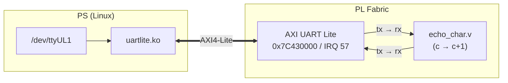

# PL TTY Device — Implementation Summary

## Overview

A bidirectional TTY character device exposed to Linux as `/dev/ttyUL1`, built from a Xilinx AXI UART Lite IP core with an `echo_char` PL module that performs UART loopback with byte+1 processing. Proves the PS↔PL↔PS data path works end-to-end.



## What was implemented

### 1. Kernel config
**File:** `linux/arch/arm/configs/zynq_ebaz4205_defconfig`
- `CONFIG_SERIAL_UARTLITE=y`
- `CONFIG_SERIAL_UARTLITE_NR_UARTS=2`
- `# CONFIG_SERIAL_UARTLITE_CONSOLE is not set`

Driver source: `drivers/tty/serial/uartlite.c` (in-tree). Compatible: `"xlnx,opb-uartlite-1.00.b"`.

### 2. PL module: `echo_char`
**Directory:** `hdl/library/echo_char/`

| File | Purpose |
|------|---------|
| `echo_char.v` | UART RX (8× oversampling) → byte+1 → UART TX (8N1) |
| `echo_char_ip.tcl` | Vivado IP packaging script |
| `Makefile` | Library build + simulation targets |
| `tb_echo_char.v` | Self-checking testbench (6 test suites) |
| `tb_echo_char_wave.tcl` | Waveform config for xsim GUI |

Parameters: `CLK_FREQ = 100 MHz`, `BAUD = 115200`.

### 3. Block design
**File:** `hdl/projects/ebaz4205/system_bd.tcl` — appended:

```tcl
ad_ip_instance axi_uartlite axi_uartlite_0
ad_ip_parameter axi_uartlite_0 CONFIG.C_BAUDRATE 115200
ad_ip_parameter axi_uartlite_0 CONFIG.C_DATA_BITS 8
ad_ip_parameter axi_uartlite_0 CONFIG.C_USE_PARITY 0
ad_ip_parameter axi_uartlite_0 CONFIG.C_ODD_PARITY 0
ad_cpu_interconnect 0x7C430000 axi_uartlite_0
ad_cpu_interrupt ps-13 mb-13 axi_uartlite_0/interrupt

ad_ip_instance echo_char echo_char_0
ad_connect sys_cpu_clk echo_char_0/clk
ad_connect sys_cpu_reset echo_char_0/reset
ad_connect axi_uartlite_0/tx echo_char_0/uart_tx_i
ad_connect axi_uartlite_0/rx echo_char_0/uart_rx_o
```

**File:** `hdl/projects/ebaz4205/Makefile` — added `LIB_DEPS += echo_char` for auto-IP-packaging before Vivado build.

### 4. Device tree overlay
**File:** `u-boot-xlnx/arch/arm/dts/pl-ebaz4205.dtso` — node inside `&amba`:

```dts
axi_uartlite_0: serial@7C430000 {
    compatible = "xlnx,opb-uartlite-1.00.b";
    reg = <0x7C430000 0x10000>;
    interrupt-parent = <&intc>;
    interrupts = <0 57 IRQ_TYPE_LEVEL_HIGH>;
    port-number = <1>;
    current-speed = <115200>;
};
```

Address chosen as DMAC base (0x7C42_0000) + 64 KB — the next clean slot in the 0x7C4x_xxxx region. Interrupt follows the DMAC pattern (ps-12 → In12 → SPI 56) → ps-13 → In13 → SPI 57.

### 5. Hardware test — passed

Tested on the EBAZ4205 board via `pyserial`:

```python
ser = serial.Serial('/dev/ttyUL1', 115200, timeout=2)
for c in [b'A', b'z', b'0', b'!', b'\n']:
    ser.write(c)
    assert ser.read(1) == bytes([(c[0] + 1) & 0xFF])
```

**Full sweep of all 256 byte values (0x00–0xFF): 261/261 checks passed.** Shell tools also confirmed: `echo -n "A" > /dev/ttyUL1` produces `B` via `cat /dev/ttyUL1`.

## Bugs found and fixed

Three RTL bugs in `echo_char.v` were discovered via simulation.

### Bug 1: TX baud counter not reset on new transmission
**Symptom:** Corrupted output bytes — first few bits of the start bit would be arbitrarily short depending on the free-running baud counter phase, causing the receiver to mis-sample all subsequent bits.

**Root cause:** `baud_div_cnt` free-ran continuously. When `tx_start` asserted, the TX FSM immediately transitioned to `TX_START` and output the start bit — but the baud counter might assert `baud_tx_en` within a cycle or two, truncating that bit.

**Fix:** Reset `baud_div_cnt` to 0 on `tx_start` so every transmission begins with a full-duration start bit. Required forward-declaring `tx_start` in the baud generator.

### Bug 2: RX shift register not cleared between receptions
**Symptom:** Subsequent bytes received with stale bits from the previous byte, producing pattern-dependent corruption.

**Root cause:** `rx_shift_reg` retained its value from the last reception. The new byte shifted in on top of old data if the stop bit was sampled late or the next start bit arrived quickly.

**Fix:** Set `rx_shift_reg <= 0` in `RX_IDLE` state.

### Same-cycle guard in TX FSM

The TX FSM uses a `tx_baud_done` flag (latched from `baud_tx_en`, cleared on state change) to prevent same-cycle state transitions — ensuring each bit (start, data, stop) lasts exactly one full baud period regardless of when `baud_tx_en` fires relative to the state entry.

### Bug 3: No buffering between RX and TX (back-to-back byte loss)
**Symptom:** Every other character lost when sending bursts (e.g. `"Ala ma kota"` → `"Bbn!ps"` instead of `"Bmb!nb!lpub"`).

**Root cause:** The single `tx_byte` register could only hold one pending result. When bytes arrived back-to-back, the RX finished receiving byte N+1 while the TX was still serializing byte N's result → `rx_data_valid` fired while `tx_busy` was high → byte N+1 was silently dropped. At 115200 baud, TX and RX take the same time (~87 µs per byte), so they race at the stop-bit boundary.

**Fix:** Added a 16-entry synchronous FIFO between RX and TX. The FIFO absorbs bytes during TX serialization latency. The pop logic starts a new transmission whenever `!tx_busy && !fifo_empty`. FIFO depth matches the AXI UART Lite's 16-byte FIFOs.

## Simulation test suite

**File:** `hdl/library/echo_char/tb_echo_char.v` — self-checking Verilog testbench with:

| Test | Description | Checks |
|------|-------------|--------|
| 1 | Known values (hardware corruption candidates) | 6 |
| 2 | Wraparound (0xFF→0x00, 0x00→0x01) | 2 |
| 3 | Back-to-back bytes | 4 |
| 4 | Byte after long idle (10K cycles) | 1 |
| 5 | Exhaustive sweep 0x00–0xFF | 256 |
| 6 | Repeated 0x41 × 100 (drift stress) | 100 |
| 7 | Burst 8 back-to-back (FIFO exercise) | 8 |
| 8 | Burst 32 send-then-read-all | 32 |
| 9 | Burst 64 send-then-read-all | 64 |
| 10 | Burst 17 (FIFO depth + 1) | 17 |

**Result: 490/490 passed.**

Run with:
```bash
make -C hdl/library/echo_char sim     # run simulation
make -C hdl/library/echo_char wave    # open waveforms in Vivado
make -C hdl/library/echo_char sim-clean  # remove artifacts
```

## Files changed

| File | Change | Part of |
|------|--------|---------|
| `linux/arch/arm/configs/zynq_ebaz4205_defconfig` | Edit | Kernel config |
| `hdl/library/echo_char/echo_char.v` | Create | PL module |
| `hdl/library/echo_char/echo_char_ip.tcl` | Create | IP packaging |
| `hdl/library/echo_char/Makefile` | Create | Build + sim |
| `hdl/library/echo_char/tb_echo_char.v` | Create | Testbench |
| `hdl/library/echo_char/tb_echo_char_wave.tcl` | Create | Waveform config |
| `hdl/projects/ebaz4205/system_bd.tcl` | Edit | Block design |
| `hdl/projects/ebaz4205/Makefile` | Edit | `LIB_DEPS += echo_char` |
| `u-boot-xlnx/arch/arm/dts/pl-ebaz4205.dtso` | Edit | Device tree |

## Future: softcore integration

When a softcore CPU is added to the PL:

1. Remove `echo_char_0` from the block design
2. Expose `axi_uartlite_0/tx` and `axi_uartlite_0/rx` as top-level ports
3. Wire them to the softcore's UART peripheral
4. No changes needed on the PS side — `/dev/ttyUL1` works identically

## Reference

- **AXI UART Lite registers:** RX (0x00), TX (0x04), STATUS (0x08), CONTROL (0x0C)
- **UART wire format:** 8N1 (start low, 8 data bits LSB-first, stop high), 115200 baud
- **Flow control:** AXI UART Lite 16-byte TX/RX FIFOs provide natural backpressure via `TSTATUS.TXFULL`/`STATUS.RXFULL` — no RTS/CTS wires needed