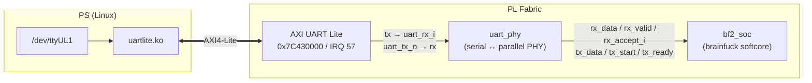

# PL TTY Device — Implementation Summary

## Overview

A bidirectional TTY character device exposed to Linux as `/dev/ttyUL1`, built
from a Xilinx AXI UART Lite IP core. The PS side is a stock Linux serial
driver; the PL side is the `uart_phy` PHY feeding the `bf2_soc` softcore CPU
over its parallel byte-stream interface — i.e. Linux talks to the softcore's
UART **as if it were an external UART on a wire**.

The path was verified in two stages:

1. **echo_char loopback** (original verification vehicle): a PL module
   composing two `uart_phy` instances around a `+1` transform proved the
   PS↔PL↔PS data path end-to-end.
2. **bf2_soc** (current): `echo_char` was removed from the block design and the
   uartlite `tx`/`rx` wires were connected to `uart_phy`, which hands bytes to
   `bf2_soc` over its parallel interface — the "softcore integration" step
   foreseen at the bottom of the original implementation.


```mermaid
graph LR
    subgraph ps["PS (Linux)"]
        tty["/dev/ttyUL1"]
        drv["uartlite.ko"]
        tty --> drv
    end
    subgraph pl["PL Fabric"]
        ulite["AXI UART Lite<br/>0x7C430000 / IRQ 57"]
        phy["uart_phy<br/>(serial ↔ parallel PHY)"]
        soc["bf2_soc<br/>(brainfuck softcore)"]
        ulite -- "tx → uart_rx_i<br/>uart_tx_o → rx" --> phy
        phy -- "rx_data / rx_valid / rx_accept_i<br/>tx_data / tx_start / tx_ready" --> soc
    end
    drv <== "AXI4-Lite" ==> ulite
```

> **Backpressure caveat (PS → PL RX direction):** there is **no end-to-end
> flow control** on this path — a fast PS sender can silently lose bytes when
> `bf2_soc` is busy. See
> [Backpressure and flow control](#backpressure-and-flow-control-ps--pl-rx-direction).

## PS side: kernel configuration

**File:** `linux/arch/arm/configs/zynq_ebaz4205_defconfig`

- `CONFIG_SERIAL_UARTLITE=m`  # loadable module, not the console (`ttyPS0` stays built-in)
- `CONFIG_SERIAL_UARTLITE_NR_UARTS=2`
- `# CONFIG_SERIAL_UARTLITE_CONSOLE is not set`

Driver source: `drivers/tty/serial/uartlite.c` (in-tree). Compatible:
`"xlnx,opb-uartlite-1.00.b"`. The DT sets `port-number = <1>` → `/dev/ttyUL1`.

`uartlite.ko` is built by `make sdimg` (linux-modules target runs `make modules`)
and installed into the rootfs by `buildroot/board/ebaz4205/post-build.sh`
(`modules_install` + depmod) under `/lib/modules/$(uname -r)/`. It auto-loads
via the OF modalias `of:N*T*Cxlnx,opb-uartlite-1.00.b` when the DT node
`serial@7C430000` appears — same mechanism as `axis_fifo` (see
`doc/AXIS_FIFO_BRIDGE.md`). `/dev/ttyUL1` appears after the module loads;
nothing in the boot flow depends on it being built-in.

## Block design (current)

**File:** `hdl/projects/ebaz4205/system_bd.tcl`

```tcl
ad_ip_instance axi_uartlite axi_uartlite_0
ad_ip_parameter axi_uartlite_0 CONFIG.C_BAUDRATE 115200
ad_ip_parameter axi_uartlite_0 CONFIG.C_DATA_BITS 8
ad_ip_parameter axi_uartlite_0 CONFIG.C_USE_PARITY 0
ad_ip_parameter axi_uartlite_0 CONFIG.C_ODD_PARITY 0
ad_cpu_interconnect 0x7C430000 axi_uartlite_0
ad_cpu_interrupt ps-13 mb-13 axi_uartlite_0/interrupt

# ── UART PHY ──
ad_ip_instance uart_phy uart_phy_0
ad_connect sys_cpu_clk uart_phy_0/clk
ad_connect sys_cpu_reset uart_phy_0/reset
ad_connect axi_uartlite_0/tx uart_phy_0/uart_rx_i
ad_connect axi_uartlite_0/rx uart_phy_0/uart_tx_o

# ── bf2_soc ──
ad_ip_instance bf2_soc bf2_soc_0
ad_connect sys_cpu_clk bf2_soc_0/clk_i
ad_connect sys_cpu_resetn bf2_soc_0/resetq
ad_connect uart_phy_0/rx_data   bf2_soc_0/io_rx_data
ad_connect uart_phy_0/rx_valid  bf2_soc_0/io_rx_valid
ad_connect bf2_soc_0/io_rx_ready  uart_phy_0/rx_accept_i
ad_connect bf2_soc_0/io_tx_data   uart_phy_0/tx_data
ad_connect bf2_soc_0/io_tx_valid  uart_phy_0/tx_start
ad_connect uart_phy_0/tx_ready    bf2_soc_0/io_tx_ready
```

Notes:

- `uart_phy` is packaged as an ADI-style IP (`hdl/library/uart_phy/uart_phy_ip.tcl`,
  auto-built via `LIB_DEPS += uart_phy` in `hdl/projects/ebaz4205/Makefile`);
  `bf2_soc` is packaged via `hdl/library/bf2_soc/bf2_soc_ip.tcl`. The parallel
  interface contract is documented in `doc/UART_PHY.md`.
- `bf2_ctrl` (axi_gpreg @ 0x7C440000) provides run/step/reset control and
  status for `bf2_soc` from the PS.
- `echo_char` is **no longer instantiated** in the block design; the module and
  its testbench remain in `hdl/library/echo_char/` as a library/sim component.

## Device tree overlay

**File:** `u-boot-xlnx/arch/arm/dts/pl-ebaz4205.dtso` — node inside `&amba`
(unchanged from the original implementation):

```dts
axi_uartlite_0: serial@7C430000 {
    compatible = "xlnx,opb-uartlite-1.00.b";
    reg = <0x7C430000 0x10000>;
    interrupt-parent = <&intc>;
    interrupts = <0 57 IRQ_TYPE_LEVEL_HIGH>;
    port-number = <1>;
    current-speed = <115200>;
};
```

Address chosen as DMAC base (0x7C42_0000) + 64 KB — the next clean slot in the
0x7C4x_xxxx region. Interrupt follows the DMAC pattern (ps-12 → In12 → SPI 56)
→ ps-13 → In13 → SPI 57.

## Backpressure and flow control (PS → PL RX direction)

The PS→PL direction is the one where a fast sender can outrun the consumer, so
it is worth being precise about where blocking happens and where it doesn't:

1. **Linux `write()` blocks on the AXI UART Lite's local TX FIFO.** The
   uartlite driver stops refilling when `TSTATUS.TXFULL` sets and waits for the
   TX interrupt; the tty layer queues the rest, so e.g. `cat bigfile >
   /dev/ttyUL1` blocks as soon as the port buffer is full.
2. **But that FIFO always drains at the wire baud rate (115200 ≈ 11.5 KB/s)**
   regardless of what `uart_phy`/`bf2_soc` are doing — it only caps throughput
   at the wire rate.
3. **The wire carries no flow control.** AXI UART Lite (PG142) has no modem
   pins (no RTS/CTS), so there is no signal by which `uart_phy` could tell the
   uartlite to stop.
4. **`uart_phy` drops bytes silently.** Its RX FIFO is 16 entries
   (≈ 1.4 ms @ 115200); once full, incoming frames are discarded with no
   indication (`doc/UART_PHY.md` §7). `rx_ready` (= `!fifo_full`) is the only
   warning, and it is a PL-side parallel output the PS cannot see — no status
   register, no IRQ path.
5. **`bf2_soc` drains only while executing `,`.** `io_rx_ready =
   io_rd_pending && !halted && !cpu_reset`, i.e. high only during a read
   instruction. Compute-bound stretches leave the FIFO undrained.

**Consequence:** streaming a large file from the PS while `bf2_soc` is busy
loses bytes silently. The FIFO buys ~1.4 ms of slack once it fills, then every
byte arriving during the busy stretch is dropped.

**What would fix it:**

- *Wire-level flow control:* replace `axi_uartlite` with `axi_uart16550` (has
  `ctsn`/`rtsn` modem pins, 16550-register compatible, driven by the standard
  8250 driver), drive its `ctsn` from `uart_phy`'s `rx_ready` (inverted,
  active-low), and enable `crtscts` on the port. Then uart_phy's FIFO-full
  state propagates end-to-end: FIFO full → CTS deasserted → 16550 stops
  transmitting → its TX FIFO fills → `write()` blocks. No RTL change to
  `uart_phy` is needed (`rx_ready` already exists).
- *Parallel-side bridge:* expose uart_phy's parallel interface to the PS over
  AXI (e.g. status bits on `bf2_ctrl` + a small driver) and block on
  `rx_ready`/`tx_ready` directly.

Neither is implemented today. The reverse (PL→PS TX) direction is fine:
`bf2_soc` stalls on `!io_tx_ready` (`io_stall` in `bf2_soc.sv`), and the
uartlite RX FIFO + IRQ cover the PS side.

## History: echo_char loopback (original verification vehicle)

### What it was

`echo_char.v` — a PL module composing two `uart_phy` instances around a `+1`
transform: RX (8× oversampling) → byte+1 → TX (8N1). It proved the
PS↔PL↔PS data path end-to-end and served as the smoke test for the current
`bf2_soc` wiring, which uses an identical uartlite ↔ wire ↔ PHY structure.

### Hardware test — passed

Tested on the EBAZ4205 board via `pyserial`:

```python
ser = serial.Serial('/dev/ttyUL1', 115200, timeout=2)
for c in [b'A', b'z', b'0', b'!', b'\n']:
    ser.write(c)
    assert ser.read(1) == bytes([(c[0] + 1) & 0xFF])
```

**Full sweep of all 256 byte values (0x00–0xFF): 261/261 checks passed.** Shell
tools also confirmed: `echo -n "A" > /dev/ttyUL1` produces `B` via
`cat /dev/ttyUL1`.

### Bugs found and fixed (echo_char RTL)

Three RTL bugs in `echo_char.v` were discovered via simulation. All three
lessons are baked into `uart_phy` itself today.

**Bug 1: TX baud counter not reset on new transmission** — corrupted output
bytes because the free-running baud counter phase could truncate the start bit.
*Fix:* reset the counter on `tx_start` so every transmission begins with a
full-duration start bit (today: `uart_tx.sv` phase-resets its divider on
`tx_start`).

**Bug 2: RX shift register not cleared between receptions** — stale bits from
the previous byte corrupted the next one. *Fix:* clear the shift register in
the idle state (today: `uart_rx.sv`).

**Bug 3: No buffering between RX and TX (back-to-back byte loss)** — the single
`tx_byte` register dropped bytes that arrived while the TX was still
serializing. *Fix:* a 16-entry synchronous FIFO between RX and TX (today:
`uart_phy`'s `fifo_sync`, depth 16 matching the AXI UART Lite's own FIFOs).

### Simulation test suite

**File:** `hdl/library/echo_char/tb_echo_char.v` — self-checking Verilog
testbench (10 tests: known values, wraparound, back-to-back, idle, exhaustive
0x00–0xFF sweep, timing drift ×100, FIFO bursts 8/32/64/17). **490/490
passed.** The same suite structure now lives in `tb_uart_phy.sv`
(`hdl/library/uart_phy/`).

```bash
make -C hdl/library/echo_char sim     # run simulation
make -C hdl/library/echo_char wave    # open waveforms in Vivado
make -C hdl/library/echo_char sim-clean  # remove artifacts
```

## Files changed

| File | Change | Part of |
|------|--------|---------|
| `linux/arch/arm/configs/zynq_ebaz4205_defconfig` | Edit | Kernel config (uartlite driver) |
| `hdl/library/echo_char/*` | Create | Original loopback vehicle (still in library) |
| `hdl/library/uart_phy/*` | Create/refactor | PHY IP — see `doc/UART_PHY.md` |
| `hdl/library/bf2_soc/*` | Create | Softcore CPU IP |
| `hdl/projects/ebaz4205/system_bd.tcl` | Edit | Block design wiring (uartlite ↔ uart_phy ↔ bf2_soc) |
| `hdl/projects/ebaz4205/Makefile` | Edit | `LIB_DEPS` (auto-IP-packaging) |
| `u-boot-xlnx/arch/arm/dts/pl-ebaz4205.dtso` | Edit | Device tree |

## Next steps

1. Decide on PS→PL backpressure (see
   [Backpressure and flow control](#backpressure-and-flow-control-ps--pl-rx-direction)) —
   the RTS/CTS (AXI UART16550) route is the smallest change and needs no
   `uart_phy` RTL work.
2. Keep `doc/UART_PHY.md` §9 and `doc/ARCHITECTURE.md` (peripherals table) in
   sync with the block design; both now reference this document.

## Reference

- **AXI UART Lite registers:** RX (0x00), TX (0x04), STATUS (0x08), CONTROL
  (0x0C)
- **UART wire format:** 8N1 (start low, 8 data bits LSB-first, stop high),
  115200 baud
- **Flow control (corrected):** the AXI UART Lite's 16-byte TX/RX FIFOs provide
  **local** backpressure only — `TSTATUS.TXFULL` blocks the PS `write()`,
  `STATUS.RXFULL` + IRQ pace the PS `read()`. There are **no modem pins**, so
  no wire-level flow control exists between the uartlite and `uart_phy`; an
  overflow of `uart_phy`'s RX FIFO is silent from the PS's point of view.
