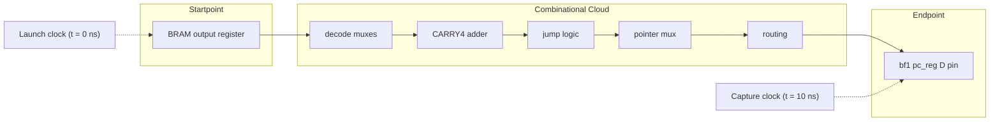
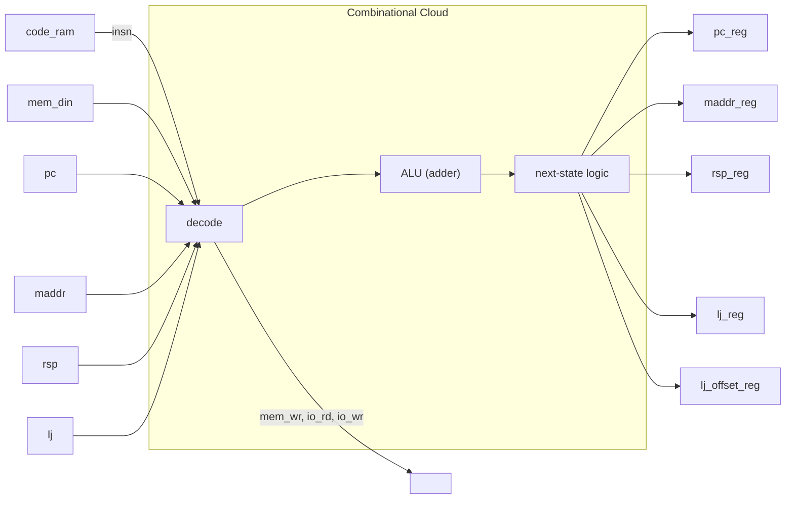
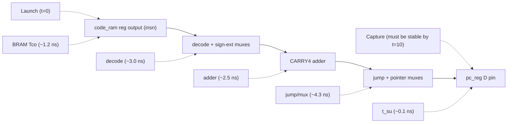

# Timing Closure Case Study: bf1 Brainfuck CPU on Zynq-7010

## How a Half-Speed CPU Core Was Made to Meet 100 MHz Timing Without Changing a Single Line of RTL

---

## Table of Contents

1. [The Problem](#1-the-problem)
2. [Timing Analysis: What Vivado Actually Checks](#2-timing-analysis-what-vivado-actually-checks)
   - [2.1 The Two Rules Every Digital Circuit Must Obey](#21-the-two-rules-every-digital-circuit-must-obey)
   - [2.2 Slack: The "Breathing Room" Metric](#22-slack-the-breathing-room-metric)
   - [2.3 How Vivado Computes a Timing Path](#23-how-vivado-computes-a-timing-path)
3. [Types of Timing Constraints — A Practical Taxonomy](#3-types-of-timing-constraints--a-practical-taxonomy)
   - [3.1 Clock Definitions (create_clock / create_generated_clock)](#31-clock-definitions)
   - [3.2 I/O Timing (set_input_delay / set_output_delay)](#32-io-timing)
   - [3.3 Path Exceptions](#33-path-exceptions)
   - [3.4 Constraint Precedence](#34-constraint-precedence)
4. [Our Hardware: The bf1 CPU Core](#4-our-hardware-the-bf1-cpu-core)
   - [4.1 Architecture Overview](#41-architecture-overview)
   - [4.2 The Half-Speed Clock Enable](#42-the-half-speed-clock-enable)
   - [4.3 The Critical Path, Dissected](#43-the-critical-path-dissected)
5. [The Solution: Multicycle Path Constraints](#5-the-solution-multicycle-path-constraints)
   - [5.1 What Is `set_multicycle_path`?](#51-what-is-set_multicycle_path)
   - [5.2 The Constraint File, Line by Line](#52-the-constraint-file-line-by-line)
   - [5.3 The Hold-Time Companion Constraint](#53-the-hold-time-companion-constraint)
   - [5.4 Pin-Based vs. Cell-Based Matching](#54-pin-based-vs-cell-based-matching)
6. [Why This Is Safe](#6-why-this-is-safe)
   - [6.1 The Constraint Describes Reality, It Doesn't Change It](#61-the-constraint-describes-reality-it-doesnt-change-it)
   - [6.2 What We Excluded (and Why)](#62-what-we-excluded-and-why)
   - [6.3 The "Overconstraining Is Safe" Principle](#63-the-overconstraining-is-safe-principle)
7. [Results](#7-results)
8. [Verification Methodology](#8-verification-methodology)
9. [Lessons Learned](#9-lessons-learned)

---

## 1. The Problem

After synthesizing and placing the `bf1_soc` — a Brainfuck CPU system built from a
custom RTL core, dual-port block RAMs, and an AXI control interface — Vivado
reported **302 timing violations** on the 100 MHz `fpga_0_clk` domain:

```
Worst Negative Slack (WNS):  –2.373 ns
Failing endpoints:           302
Clock period:                10.000 ns
```

Every other clock domain — the 25 MHz HDMI pixel clock, the 25 MHz GMII clocks,
the 50 MHz external clock — met timing with comfortable margins. The problem was
exclusive to the 100 MHz domain, and exclusively in paths that passed through the
bf1 CPU core's combinational ALU.

The naive fix would be to slow the clock down to ~74 MHz (where the longest path
would fit). But the Zynq PS7's `FCLK_CLK0` is fixed at 100 MHz for this design,
and introducing a second clock domain for the CPU alone would require CDC
(clock-domain crossing) synchronizers on every control, data, and debug signal —
a significant verification burden.

The design had a deliberate architectural feature that made a much simpler fix
possible: **the CPU core already runs at half speed** (one instruction every 2
clock cycles), gated by a `cpu_active` clock enable. The tool simply didn't know
about it.

---

## 2. Timing Analysis: What Vivado Actually Checks

### 2.1 The Two Rules Every Digital Circuit Must Obey

Every synchronous digital circuit built from flip-flops must satisfy two timing
rules. Think of them as a contract between the clock and the data:

#### Setup Time (t<sub>su</sub>) — "Data Must Arrive Before the Clock Captures It"

```
          ┌──────┐     ┌──────┐
  clock   │      │     │      │
  ────────┘      └─────┘      └──
          │<─ period ─>│
          
  data    ──────────────┬──────
                        │
          data must be stable here
          for t_su before the edge
```

When a flip-flop captures data on a rising clock edge, the data must have been
**stable for some minimum time before that edge** (the setup time, typically
~0.1–0.5 ns for Xilinx 7-series). If data arrives too late, the flip-flop may
enter a metastable state — its output oscillates or settles to an unpredictable
value.

**The rule:** `data_arrival_time ≤ clock_arrival_time − t_su`

#### Hold Time (t<sub>h</sub>) — "Data Must Stay Put After the Clock Captures It"

```
          ┌──────┐
  clock   │      │
  ────────┘      └──────
          
  data    ───────┬──────────
                 │
          data must stay stable
          for t_h after the edge
```

After the capturing edge, the data must **remain stable for a minimum time**
(hold time, also ~0.05–0.3 ns). If data changes too soon, the flip-flop's
internal feedback loop doesn't have time to latch the value, and the output
becomes unpredictable.

**The rule:** `data_change_time ≥ clock_arrival_time + t_h`

If both rules are satisfied at every flip-flop in the design, the circuit is
"timing-closed" and will work reliably at the specified clock frequency.

### 2.2 Slack: The "Breathing Room" Metric

**Slack** is the margin between what the design requires and what the timing
analysis computes:

| Slack Value | Meaning |
|-------------|---------|
| **Positive** (+0.500 ns) | The path meets timing with 0.5 ns to spare |
| **Zero** (0.000 ns) | The path exactly meets timing — no margin |
| **Negative** (–2.373 ns) | The path **fails** — data arrives 2.373 ns too late |

**Worst Negative Slack (WNS)** is the most-negative slack across all paths
in a clock domain. It tells you how much you need to improve the worst path to
close timing.

**Total Negative Slack (TNS)** is the sum of all negative slacks — a measure
of how much rework is needed overall (lots of small violations vs. one big one).

For bf1, the initial WNS was –2.373 ns, meaning the slowest path needed to
be 2.373 ns faster — or given 2.373 ns more time.

### 2.3 How Vivado Computes a Timing Path

Vivado traces every possible path from a **startpoint** (a clock pin on a
sequential element — flip-flop, BRAM output register, or DSP output register)
to an **endpoint** (a data input pin on a sequential element):



The total **data path delay** is the sum of:

1. **Clock-to-Q** (T<sub>cko</sub>): Time from the clock edge until the
   startpoint's output changes (~1.2 ns for a BRAM on 7-series)
2. **Logic delay**: Time through all LUTs, carry chains, and muxes
3. **Net delay**: Time for signals to travel across the FPGA fabric
4. **Setup time** (t<sub>su</sub>): The endpoint's required data stability
   before its capture clock edge

If `data_path_delay + t_su > clock_period`, you have a setup violation.

For bf1's critical path, the total was ~12.4 ns:

```
BRAM Tcko:             ~1.2 ns
Decode + sign-extend:  ~3.0 ns
CARRY4 adder (8 bits): ~2.5 ns  (fast carry chain, but deep)
Jump/packet routing:   ~2.5 ns
Net delays:            ~2.5 ns
Register t_su:         ~0.1 ns
────────────────────────────────
Total:                 ~11.8 ns   (> 10 ns → violation)
```

(Exact numbers vary by corner; the routed netlist showed 11.489 ns on the worst path.)

---

## 3. Types of Timing Constraints — A Practical Taxonomy

Timing constraints are instructions you give the place-and-route tool. They don't
change your logic — they tell the tool what the timing *requirements* are, and
the tool arranges (and sometimes rearranges) the logic to meet those requirements.

Here are all the constraint types you'll encounter, from most fundamental to most
specialized:

### 3.1 Clock Definitions

#### `create_clock` — "Here is a clock signal"

```tcl
create_clock -name fpga_0_clk -period 10.000 [get_pins {PS7/FCLKCLK[0]}]
```

This is the most fundamental constraint. It tells the tool:
- A clock named `fpga_0_clk` exists at the specified pin
- Its period is 10 ns (100 MHz)
- All flip-flops driven by this clock must meet setup/hold at this period

**Without this, the tool has no timing target** and all paths are unconstrained
(which means the tool won't try to make them fast).

#### `create_generated_clock` — "This clock is derived from another clock"

```tcl
create_generated_clock -name pixel_clk \
    [get_pins {mmcm_adv_inst/CLKOUT0}]
```

Used for clocks produced by PLLs, MMCMs, or clock dividers. The tool traces the
relationship back to the source clock and accounts for the phase/frequency
relationship.

#### `set_input_jitter` — "This clock isn't perfect"

```tcl
set_input_jitter fpga_0_clk 0.3
```

Adds uncertainty margin to the clock (0.3 ns in this case) to account for PLL
jitter and clock-tree skew. The tool subtracts this from the usable period.

### 3.2 I/O Timing

#### `set_input_delay` — "Data arrives at this pin N ns after its clock"

```tcl
set_input_delay -clock [get_clocks GMII_rx_clk] -max 1.0 \
    [get_ports {GMII_rxd*}]
```

Tells the tool about the *external* world. The GMII RX data arrives at the FPGA
pins up to 1.0 ns after the GMII RX clock edge (from the PHY). The tool must
ensure the FPGA's internal capture flip-flops can grab that data given this
external delay plus the internal routing delay.

#### `set_output_delay` — "Data must be valid at this pin N ns before the external clock"

```tcl
set_output_delay -clock [get_clocks GMII_tx_clk] -max 1.0 \
    [get_ports {GMII_txd*}]
```

The reverse: the external PHY expects data to be stable 1.0 ns before its clock
edge. The tool must get data from the FPGA's internal registers out to the pads
fast enough.

### 3.3 Path Exceptions

These are the interesting ones. They override the default single-cycle
requirement for specific paths.

#### `set_false_path` — "Don't check this path at all"

```tcl
set_false_path -to [get_ports {hdmi_clk_p}]
```

Used for paths that are *structurally impossible* to violate (asynchronous
crossings handled by synchronizers, static configuration signals, test-only
paths, etc.). The tool ignores these paths entirely — no setup check, no
hold check.

**Common uses:** CDC synchronizers, JTAG chains, reset distribution (when
handled by async-assert/sync-deassert), unused debug mux branches.

**Danger:** Overuse. A `set_false_path` on a path that actually toggles
synchronously means the tool won't make any effort to meet timing. If that
path is functionally exercised, the circuit will fail intermittently.

#### `set_multicycle_path` — "This path gets N cycles instead of 1"

```tcl
set_multicycle_path -setup 2 -from [get_pins {...}] -to [get_pins {...}]
```

The star of this case study. It tells the tool:

> "Data launched from these start points takes 2 clock cycles to reach those
> end points. Don't penalize us for the 1-cycle default."

This is the constraint you use when your RTL deliberately pipelines a
computation across multiple cycles — through a state machine, a clock enable,
or an explicit pipeline register.

**Critical detail:** When you use `-setup N` (N > 1), you almost always want
a companion `-hold N-1` constraint. See §5.3 for why.

#### `set_clock_groups` — "These clocks are totally independent"

```tcl
set_clock_groups -asynchronous -group {clk_a clk_b} -group {clk_c}
```

Equivalent to putting `set_false_path` between every pair of paths in different
groups. Use when clocks come from independent oscillators (no known phase
relationship). The tool won't check any cross-clock paths.

**More precise alternative:** `set_max_delay -datapath_only` for CDC paths.

### 3.4 Constraint Precedence

When multiple constraints cover the same path, Vivado uses this ordering
(from strongest to weakest):

1. **`set_false_path`** — wins over everything (path is ignored)
2. **`set_clock_groups`** — internally translates to false paths
3. **`set_multicycle_path`** — overrides the default period-based check
4. **`set_max_delay` / `set_min_delay`** — explicit delay bounds
5. **Default single-cycle analysis** — the fallback when no exception applies

So `set_multicycle_path` sits in the middle: it modifies the default but
doesn't eliminate the check entirely like `set_false_path` does.

---

## 4. Our Hardware: The bf1 CPU Core

### 4.1 Architecture Overview

The bf1 CPU processes Brainfuck bytecode in a single combinational blitz:



All `*N` signals (pcN, maddrN, rspN, …) are computed purely combinationally
from the current state plus the instruction from code RAM. There are **no
pipeline registers** in the ALU — everything is `always @(*)` blocks.

The sequential block captures all results on a single clock edge:

```verilog
always @(posedge clk or negedge resetq) begin
    if (!resetq) begin
        {pc, rsp, maddr, lj, lj_offset} <= 0;
    end else if (cpu_active) begin              // ← gate
        {pc, rsp, maddr, lj, lj_offset}
        <= {pcN, rspN, maddrN, ljN, lj_offsetN};
    end
end
```

### 4.2 The Half-Speed Clock Enable

The `cpu_active` signal is gated by a `bf1_ce` register that toggles every
clock cycle:

```verilog
reg bf1_ce;
always @(posedge clk_i or negedge resetq) begin
    if (!resetq)
        bf1_ce <= 1'b0;
    else
        bf1_ce <= ~bf1_ce;     // toggle: 0→1→0→1→…
end

assign cpu_active = cpu_active_raw && !prefetch && bf1_ce;
```

The result:

```
Cycle:    0     1     2     3     4     5     6
clk_i:   _┌┐_┌┐_┌┐_┌┐_┌┐_┌┐_┌┐_┌┐_
bf1_ce:  ──────┐         ┌─────────┐         ┌──
               └─────────┘         └─────────┘

cpu_active: ───┐         ┌─────────┐
               └─────────┘         └─────────

Registers   ...hold... capture  ...hold... capture
capture:    (inactive) (active) (inactive) (active)
```

The registers update once every **20 ns** (every 2 cycles of the 100 MHz clock),
not every 10 ns. The combinational ALU has a full 20 ns between captures to
settle. This was a deliberate architectural choice — the bf1 core was designed
for an older FPGA and was known to need more than 10 ns of ALU delay.

But Vivado doesn't automatically know about this. It sees `cpu_active` as just
another logic signal, and it assumes (by default) that every clock edge captures
new data. So it tries to make the ALU fit in 10 ns — and fails.

### 4.3 The Critical Path, Dissected

The longest path in the design is from a **code RAM output register** through
the entire ALU to a **bf1 core register D pin**:



**Why it's so long:**

1. **BRAM Tco** (~1.2 ns): The BRAM's internal output register takes ~1.2 ns
   from clock edge to valid output. This is a fixed silicon characteristic
   of the 7-series RAMB36E1 primitive.

2. **Instruction decode** (~3.0 ns): The bf1 instruction format uses the top
   3 bits of the bytecode to select the operation, with run-length counts in
   the low 5 bits. The decode block includes muxes that sign-extend and
   route `insn[5:0]` to various widths (6→13 bits for PC offsets,
   6→15 bits for data pointer offsets).

3. **CARRY4 adder** (~2.5 ns): The 15-bit adder itself is fast (dedicated
   carry-chain hardware), but it sits behind the decode muxes and in front of
   the jump/mux logic, so its intrinsic speed is only part of the story.

4. **Jump/pointer muxing** (~4.3 ns): The "after ALU" block decides whether
   to use the adder result as `pcN`, `maddrN`, or compare it for `[`/`]`
   jumps. For `[`, it also checks `mem_din != 0` (the current data cell)
   and conditionally selects between `rst0` (return stack top), `alu_c`
   (jump target), or `pc+1` (fall-through). This is the densest
   combinational logic in the design.

5. **Net/routing delay** (~0.5 ns): Distributed across the fabric, the
   signals between these blocks incur wire delay that adds up.

---

## 5. The Solution: Multicycle Path Constraints

### 5.1 What Is `set_multicycle_path`?

`set_multicycle_path` tells Vivado:

> "I know the default is one clock period, but THIS particular path has
> N clock periods to complete. Check it at N periods, not 1."

The syntax:

```tcl
set_multicycle_path -setup <N> -from <start_pins> -to <end_pins>
```

Where:
- **`-setup N`** means "the setup check should use N clock periods"
- **`-from`** specifies launch-point pins (clock pins of sequential cells)
- **`-to`** specifies capture-point pins (data input pins of sequential cells)

Without this constraint, every path is checked as a **single-cycle path**:
data must travel from launch to capture in ≤ 10 ns (for 100 MHz).

With `-setup 2`, the tool checks the same path with a 20 ns window — which
is exactly what our hardware provides thanks to the `bf1_ce` clock enable.

### 5.2 The Constraint File, Line by Line

The complete constraint file is at `hdl/projects/ebaz4205/bf1_timing.xdc`.
Here's a breakdown:

```tcl
# ── Start points: BRAM clock pins ──
set bf1_bram_clk [get_pins -hier -filter \
  {NAME =~ *bf1_soc_0/inst/*ram_reg*/CLK*CLK && DIRECTION == IN}]
```

**What this does:** Finds every BRAM clock pin inside the bf1_soc hierarchy.
The pattern `*ram_reg*/CLK*CLK` matches both `CLKARDCLK` (Port A clock) and
`CLKBWRCLK` (Port B clock) on all `code_ram_reg_*` and `data_ram_reg_*` cells.
The `DIRECTION == IN` filter ensures we get clock *input* pins, not output pins.

**Why BRAM clock pins as launch points:** The BRAM output registers are the
source of `code_ra_dout` (the instruction word) and `data_ra_dout` (the
current data cell). These feed directly into the ALU.

```tcl
# ── Start points: bf1_inst flip-flop clock pins ──
set bf1_reg_clk [get_pins -hier -filter \
  {NAME =~ *bf1_soc_0/inst/bf1_inst/*_reg*/C && DIRECTION == IN}]
```

**What this does:** Finds the clock pins of every register inside the bf1
core instance: `pc_reg[*]/C`, `maddr_reg[*]/C`, `rsp_reg[*]/C`, `lj_reg/C`,
`lj_offset_reg[*]/C`.

**Why register clock pins as launch points too:** The bf1 core registers also
feed into the ALU (e.g., `pc` is used to compute `pcN = pc + 1`). These paths
also benefit from the 2-cycle window.

```tcl
# ── End points: bf1_inst flip-flop D pins ──
set bf1_reg_d [get_pins -hier -filter \
  {NAME =~ *bf1_soc_0/inst/bf1_inst/*_reg*/D && DIRECTION == IN}]
```

**What this does:** Gets the data input pins of the same bf1 core registers.
These are where the ALU results land.

```tcl
# ── End points: BRAM input pins ──
set bf1_bram_addr [get_pins -hier -filter \
  {NAME =~ *bf1_soc_0/inst/*ram_reg*/ADDR* && DIRECTION == IN}]
set bf1_bram_data [get_pins -hier -filter \
  {NAME =~ *bf1_soc_0/inst/*ram_reg*/DI* && DIRECTION == IN}]
set bf1_bram_we [get_pins -hier -filter \
  {NAME =~ *bf1_soc_0/inst/*ram_reg*/WE* && DIRECTION == IN}]
```

**What this does:** Captures the address, data-in, and write-enable input
pins of every BRAM cell. The `code_addr` (= pcN) drives BRAM Port A address
lines, and `mem_wr`/`mem_dout` drive Port A data/WE lines.

**Why BRAM pins as capture points:** The BRAM address changes every instruction
(`code_addr` is driven by the ALU's pcN output), so the address path is also
a critical timing arc.

```tcl
# ── End points: Distributed RAM pins (rstack) ──
set bf1_dist_adr [get_pins -hier -filter \
  {NAME =~ *bf1_soc_0/inst/bf1_inst/*/*ADR* && DIRECTION == IN}]
set bf1_dist_i [get_pins -hier -filter \
  {NAME =~ *bf1_soc_0/inst/bf1_inst/*/*/I && DIRECTION == IN}]
set bf1_dist_di [get_pins -hier -filter \
  {NAME =~ *bf1_soc_0/inst/bf1_inst/*/*/DI* && DIRECTION == IN}]
set bf1_dist_we [get_pins -hier -filter \
  {NAME =~ *bf1_soc_0/inst/bf1_inst/*/*/WE && DIRECTION == IN}]
```

**What this does:** Captures pins on the distributed-RAM primitives that
implement the return-address stack (`stack.v`). The rstack is addressed by
`rsp` and `rspN` from the core registers and ALU.

```tcl
# ── Combine and apply ──
set bf1_start_pins [concat $bf1_bram_clk $bf1_reg_clk]
set bf1_end_pins [concat $bf1_reg_d $bf1_bram_addr $bf1_bram_data \
  $bf1_bram_we $bf1_dist_adr $bf1_dist_i $bf1_dist_di $bf1_dist_we]

set_multicycle_path -setup 2 -quiet -from $bf1_start_pins -to $bf1_end_pins
set_multicycle_path -hold 1 -quiet -from $bf1_start_pins -to $bf1_end_pins
```

**The final count:** 58 start points (20 BRAM clock pins + 38 register clock
pins) matched against 1,536 end points (register D pins, BRAM address/data/WE
pins, distributed RAM pins).

### 5.3 The Hold-Time Companion Constraint

This is the most commonly misunderstood part of `set_multicycle_path`.

When you write `set_multicycle_path -setup 2`, Vivado automatically adjusts
the **hold** check as well. By default, the hold check moves to one period
*before* the setup capture edge:

```
Without MCP:                    With -setup 2:
                                
  launch  setup  hold            launch      setup
    │       │      │               │           │
    ▼       ▼      ▼               ▼           ▼
    ┌──┬──┬──┬──┬──┐               ┌──┬──┬──┬──┬──┬──┐
    │  │  │  │  │  │               │  │  │  │  │  │  │
    └──┴──┴──┴──┴──┘               └──┴──┴──┴──┴──┴──┘
    t=0  t=10           (ns)      t=0         t=20
                                         │
                                    hold ▼
                                   (t=10, default)
```

The default hold check is at **t = setup_capture − 1 period = 20 − 10 = 10 ns**.
This asks: "does data from launch at t=0 stay stable until t=10 ns, so it
doesn't corrupt any capture at t=10?"

In our design, **nothing captures at t=10 ns** — all bf1 registers are gated
by `cpu_active` which is low at t=10. So the t=10 hold check is harmless
(and trivially met — the minimum ALU path is several nanoseconds).

The explicit `-hold 1` makes this the declared intent:

```tcl
set_multicycle_path -hold 1 -from $bf1_start_pins -to $bf1_end_pins
```

This tells Vivado: "the hold check edge is 1 period before the setup capture
edge." Since setup capture is at t=20 ns, hold is at t=10 ns — same as the
default. Including it explicitly documents that we've considered hold timing
and confirmed it's safe.

**Why not `-hold 0`?** Some guides suggest `-hold 0` for MCP, which would
check hold at the launch edge itself (t=0). This is the *most permissive*
hold check and is appropriate when you're certain no capture happens at any
intermediate edge. Our design happens to tolerate either (t=0 or t=10), but
staying with the default `-hold 1` is more conservative and avoids
introducing potential hold issues if the design changes later.

### 5.4 Pin-Based vs. Cell-Based Matching

A critical detail: **we use `get_pins`, not `get_cells`.**

```tcl
# WRONG — Vivado rejects non-sequential cells:
get_cells -hier *bf1_soc_0/inst/*reg*

# RIGHT — matches only actual sequential pins:
get_pins -hier -filter {NAME =~ *bf1_soc_0/inst/bf1_inst/*_reg*/C}
```

`set_multicycle_path` requires its `-from` and `-to` arguments to be **pins
on sequential elements** (flip-flops, latches, BRAM registers, DSP registers).
If you pass a non-sequential cell (like a LUT), Vivado rejects it with a
cryptic warning.

The problem with `get_cells *reg*` is that it matches cells named things
like `code_ram_reg_0_i_1` — which are LUTs in the BRAM's address decoding
logic, not flip-flops. These get silently rejected, and the constraint
doesn't cover the paths you intended.

Using `get_pins` with explicit pin-name patterns (`/C`, `/D`, `/CLK*CLK`,
`/ADDR*`, `/DI*`, `/WE`) ensures we match only actual sequential-element
pins. The `DIRECTION == IN` filter further narrows to input pins, which
is what `-from` and `-to` expect.

---

## 6. Why This Is Safe

### 6.1 The Constraint Describes Reality, It Doesn't Change It

This is the most important point in the entire case study:

> **The multicycle path constraint does not change how the hardware
> behaves. It only tells Vivado what the hardware already does.**

The hardware already gives the ALU 20 ns between captures because:
- `bf1_ce` toggles every cycle → `cpu_active` is high every other cycle
- The bf1 sequential block is gated by `cpu_active`
- Therefore, registers update at 50 MHz effective rate, not 100 MHz

The constraint simply informs Vivado of this fact so it doesn't waste effort
trying to make the ALU fit in 10 ns — and more importantly, so it doesn't
report false violations.

Think of it this way: if Vivado *did* somehow understand the effect of
`cpu_active` automatically (it doesn't — `cpu_active` is just another logic
signal to the tool), it would compute the exact same 20 ns requirement
internally. The MCP constraint is just a way to bridge the gap between
hardware intent and tool understanding.

### 6.2 What We Excluded (and Why)

The constraints deliberately exclude paths that are **not** slowed down by
the half-speed enable:

**PS control registers (ctrl_gp*_in/out):** These are driven directly by
the AXI GPIO peripheral and are accessed by the PS at full 100 MHz speed
through AXI4-Lite. They are **not** gated by `cpu_active`. The endpoint
pin patterns scoped to `*bf1_soc_0/inst/*` automatically exclude them
because the ctrl_gp registers live at the bf1_soc top level, outside the
`/inst` hierarchy.

**BRAM Port B (PS access):** The PS reads and writes data/code RAM through
Port B. These paths start from the PS register that drives `ctrl_gp*_out`,
which is outside the `-from` scope. So paths from the PS into the BRAM
Port B are not multi-cycled — they remain at the standard 1-cycle check,
which is correct because PS accesses need to complete in one AXI clock cycle.

**UART paths (io_rx_data, io_tx_data):** The UART PHY operates at 115200
baud (~87 µs per byte) — these signals change on a completely different
time scale and easily meet single-cycle timing.

### 6.3 The "Overconstraining Is Safe" Principle

An important principle in FPGA timing: **giving the tool more time than
necessary cannot cause a functional failure.**

If we accidentally included a path that doesn't actually need 2 cycles
(e.g., a register-to-register path that naturally completes in 3 ns),
giving it a 20 ns budget doesn't change anything. The tool still meets
the path at whatever speed it naturally achieves.

The only danger with multicycle constraints is **underconstraining** —
telling the tool a path has 20 ns when it actually needs to complete in
10 ns. That could cause the tool to place registers far apart, creating
a real violation. But with MCP, you're *relaxing* the constraint, not
*removing* it. The tool still checks that the path meets 20 ns.

Our constraints err on the side of inclusion: all BRAM clock pins and all
bf1 register clock pins are start points, and all sequential pins in the
bf1 hierarchy are end points. This is slightly broader than strictly
necessary but guarantees no path is missed.

---

## 7. Results

Applied to the existing routed design checkpoint (DCP):

| Metric | Before MCP | After MCP |
|--------|-----------|-----------|
| **Worst Negative Slack (fpga_0_clk, setup)** | **–2.373 ns** | **+1.953 ns** |
| **Failing endpoints** | **302** | **0** |
| **Worst Hold Slack (fpga_0_clk)** | +0.024 ns | +0.024 ns (unchanged) |
| **fpga_1_clk (25 MHz)** | ✓ met | ✓ met (unchanged) |
| **pixel_clk (25 MHz)** | ✓ met | ✓ met (unchanged) |
| **GMII_rx_clk (25 MHz)** | ✓ met | ✓ met (unchanged) |
| **GMII_tx_clk (25 MHz)** | ✓ met | ✓ met (unchanged) |

All 302 violations eliminated with zero RTL changes and zero impact on other
clock domains. The constraint file is 60 lines including comments.

**What the +1.953 ns WNS means:** The tightest path now has ~2 ns of margin
within its 20 ns budget. This margin absorbs PVT (process/voltage/temperature)
variation across different chips and operating conditions.

**What happens to effective CPU speed:** The bf1 core still executes at 50
million instructions per second (100 MHz ÷ 2). The MCP constraints don't
change this — the CPU was always running at half speed due to `bf1_ce`. The
constraints only made the tool aware of it.

---

## 8. Verification Methodology

### Applied to Existing DCP (Incremental)

The constraints were first verified by loading the already-routed design
checkpoint and applying them interactively:

```bash
cd hdl/projects/ebaz4205
vivado -mode batch -source check_timing.tcl
```

The `check_timing.tcl` script:
1. Opens the routed DCP (`system_top_routed.dcp`)
2. Applies the MCP constraints using the same pin patterns as the XDC file
3. Runs `report_timing_summary` for both setup and hold on `fpga_0_clk`
4. Prints WNS, violations count, and details of any remaining violations

A separate `check_timing_hold.tcl` script verifies both setup and hold in
one run to confirm no hold violations are introduced.

### Clean Rebuild (Pending)

The constraint file is registered in `system_project.tcl` alongside the
existing constraints, so it will be applied during synthesis + implementation
on the next clean build:

```bash
make -C hdl/projects/ebaz4205 clean && make -C hdl/projects/ebaz4205
```

A clean rebuild with constraints baked in is the final validation step before
sign-off.

### Hardware Test Plan

1. Build bitstream with MCP constraints integrated
2. Load onto EBAZ4205
3. Run a Brainfuck echo program (`, [ . , ]`) via UART
4. Send/receive all 256 byte values — verify no corruption
5. Run the CPU at maximum throughput (back-to-back instructions with no I/O
   stalls) — verify no PL lockups or AXI hangs
6. Thermal cycle: run for 1+ hour at room temperature, verify continued
   correct operation

---

## 9. Lessons Learned

### 1. Clock Enables Don't Communicate Intent to the Timing Engine

Vivado treats `cpu_active` as just another logic signal in the data path.
It has no built-in understanding that a clock enable gates register updates
to every-other-cycle. If your design uses clock enables to create effective
multi-cycle paths, you **must** express this to the tool via MCP constraints.

### 2. Start from the Routed DCP, Not Synthesis

When debugging timing violations, work with the **routed design checkpoint**
(`*_routed.dcp`), not the post-synthesis checkpoint. Only the routed design
has actual net delays; synthesis estimates are optimistic and can hide
routing-dominated violations.

### 3. Use `get_pins`, Not `get_cells`, for MCP Start/End Points

`set_multicycle_path` strictly requires sequential-element pins. Using
`get_cells` with wildcards inevitably catches LUTs and other combinatorial
cells, which Vivado silently rejects. This can result in constraints that
appear to apply but actually cover nothing. Pin-based matching with explicit
pin-name patterns (`/C`, `/D`, `/CLK*CLK`) is the only reliable approach.

### 4. Always Include the `-hold` Companion Constraint

When you write `-setup N`, the default hold check moves to N−1 periods
before capture. For `-setup 2`, that's 1 period before — which is usually
fine, but you should verify it explicitly. Writing `-hold 1` documents that
you've considered hold timing and confirms the chosen edge is deliberate.

### 5. Scoping Matters

Scope MCP constraints as tightly as possible to the affected hierarchy.
Our patterns use `*bf1_soc_0/inst/*` and `*bf1_soc_0/inst/bf1_inst/*` to
ensure only internal CPU paths are relaxed, not PS-facing control paths.
Broad patterns like `*_reg*/C` would catch registers everywhere in the
design, potentially over-constraining paths that don't need it.

### 6. The Tool Tells You What's Wrong If You Ask

Vivado's `report_timing_summary` with `-max_paths` and `-nworst` is
indispensable for understanding violations. Each path report shows the
exact cells, nets, delays, and logic levels. The critical path is almost
always worth reading in detail — it tells you not just "what's slow" but
"why it's slow."

### 7. Constraints Are Part of the Design, Not an Afterthought

The MCP constraint file should live alongside the RTL sources, be committed
to version control, and be included in the project build flow. `bf1_timing.xdc`
is registered in `system_project.tcl` just like the I/O constraints and clock
definitions. Timing constraints are as important to correct operation as the
HDL itself.

---

## References

- **Constraint file:** `hdl/projects/ebaz4205/bf1_timing.xdc`
- **Verification script (setup):** `hdl/projects/ebaz4205/check_timing.tcl`
- **Verification script (setup + hold):** `hdl/projects/ebaz4205/check_timing_hold.tcl`
- **CPU source:** `hdl/projects/ebaz4205/ebaz4205.gen/sources_1/bd/system/ipshared/40de/bf1.v`
- **SoC wrapper:** `hdl/projects/ebaz4205/ebaz4205.gen/sources_1/bd/system/ipshared/40de/bf1_soc.v`
- **Implementation plan:** `doc/BF1_IMPLEMENTATION_PLAN.md` (especially §2.2 and §A.8)
- **System constraints:** `hdl/projects/ebaz4205/system_constr.xdc`
- **Implementation constraints:** `hdl/projects/ebaz4205/system_constr_impl.xdc`
- **Vivado UG903:** *Vivado Design Suite User Guide: Using Constraints*
