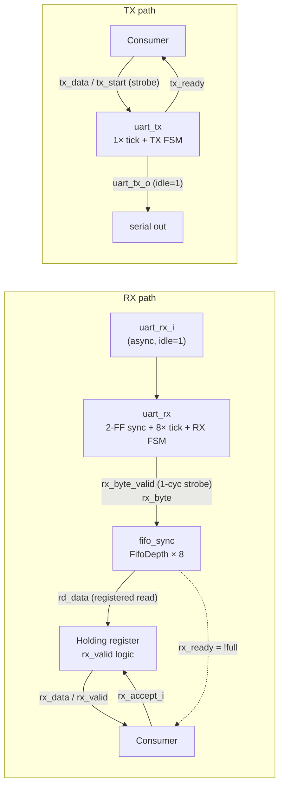
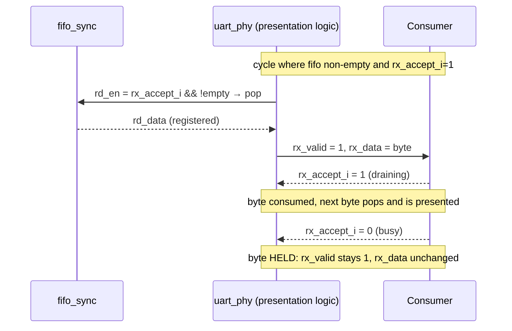
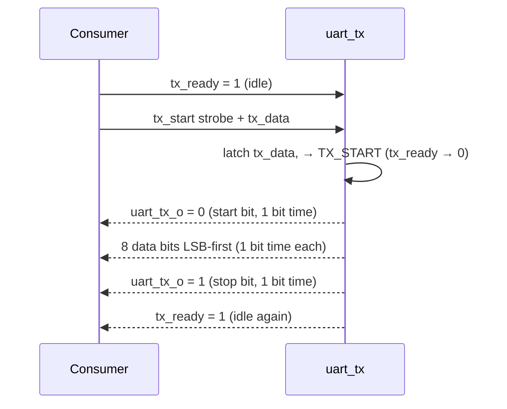

# uart_phy — UART PHY with Parallel Byte-Stream Interface

**Location:** `hdl/library/uart_phy/` (source: `uart_phy.sv`, `uart_rx.sv`, `uart_tx.sv`, `fifo_sync.sv`)

`uart_phy` converts between an asynchronous UART serial line and a synchronous
parallel byte interface. It is pure transport — **no data transformation**
(compare `echo_char`, which composes two instances of `uart_phy` around a
`+1` transform).

```text
RX path:  uart_rx_i  →  uart_rx (8× oversampling)  →  fifo_sync  →  rx_data / rx_valid
TX path:  tx_data + tx_start                        →  uart_tx    →  uart_tx_o
```

The interface is designed around a **holding-register presentation model**:
received bytes are buffered in an RX FIFO and presented one at a time on
`rx_data`, where they wait (held, `rx_valid` high) until the consumer accepts
them via `rx_accept_i`. See [The parallel interface contract](#the-parallel-interface-contract).

---

## 1. Parameters

| Parameter  | Type  | Default      | Meaning                                  | Constraint              |
|------------|-------|--------------|------------------------------------------|-------------------------|
| `ClkFreq`  | `int` | `100000000`  | System clock frequency (Hz)              | `ClkFreq >= 8 × Baud`   |
| `Baud`     | `int` | `115200`     | UART baud rate (bits/s)                  | `ClkFreq >= Baud`       |
| `FifoDepth`| `int` | `16`         | RX FIFO depth (entries)                  | power of 2, `>= 1`      |

Parameterized connections must be by name (`.ClkFreq(...)`, `.Baud(...)`,
`.FifoDepth(...)`) when the value differs from the default — e.g. the Vivado IP
packaging (`uart_phy_ip.tcl`) exposes these as the IP's CONFIG parameters.

---

## 2. Ports

All signals are synchronous to `clk`. `reset` is **synchronous, active-high**.

| Port          | Dir  | Width | Type | Meaning                                                                |
|---------------|------|-------|------|------------------------------------------------------------------------|
| `clk`         | in   | 1     | wire | System clock                                                           |
| `reset`       | in   | 1     | wire | Synchronous active-high reset                                          |
| `uart_rx_i`   | in   | 1     | wire | Serial RX line (**idle = high**, asynchronous)                         |
| `uart_tx_o`   | out  | 1     | wire | Serial TX line (**idle = high**)                                       |
| `rx_data`     | out  | 8     | wire | Presented received byte (valid when `rx_valid`)                        |
| `rx_valid`    | out  | 1     | reg  | **Presentation valid:** `rx_data` holds a byte, and stays high while held |
| `rx_ready`    | out  | 1     | wire | **Capacity flag:** RX FIFO has free space (`!full`)                    |
| `rx_accept_i` | in   | 1     | wire | **Consumer drain level:** high ⇒ pop one byte per cycle                |
| `tx_data`     | in   | 8     | wire | Byte to transmit (sampled at the `tx_start` edge)                      |
| `tx_start`    | in   | 1     | wire | **Single-cycle strobe:** transmit `tx_data`; assert only while `tx_ready` |
| `tx_ready`    | out  | 1     | wire | **TX idle:** high when the transmitter can accept a byte               |

> **Naming note:** `rx_ready` and `rx_accept_i` are *not* the two halves of a
> classic AXI valid/ready handshake. `rx_ready` is about **ingress capacity**
> (FIFO space), while `rx_accept_i` is the consumer's **egress flow control**.
> The RX handshake is `rx_valid` + `rx_accept_i`; see §5.

---

## 3. Serial framing (8N1)

Both ends implement the standard 8N1 frame, **LSB first**, **no parity**,
**idle = high**:

```text
     start       8 data bits (LSB first)  stop
     ┌─────────┬──┬──┬──┬──┬──┬──┬──┬──┬───────┐
line │  0      │b0│b1│b2│b3│b4│b5│b6│b7│  1    │
     └─────────┴──┴──┴──┴──┴──┴──┴──┴──┴───────┘
     ├─ 1 bit ─┤                       ├ 1 bit ┤
     └────── 10 bit times = 1 byte ────────────┘
```

- **RX** samples the line with **8× oversampling**; each bit is sampled near
  its center (sample 4 of 8). The start bit is double-checked (glitch filter):
  if the line is no longer low at its center sample, the reception is aborted
  back to idle.
- **Stop-bit check:** if the stop bit is sampled low (framing error), the byte
  is **silently discarded** — no error flag is exposed at the top level.
- **Back-to-back frames** are supported: after the stop bit the receiver
  returns to idle and can detect the next start bit immediately.

---

## 4. Architecture



Internal handshake:

| Edge           | From → To   | Meaning                                                      |
|----------------|-------------|--------------------------------------------------------------|
| `rx_byte_valid`| `uart_rx` → `fifo_sync` | A complete, framing-valid byte has been received (1-cycle strobe). Written to the FIFO unless it is full. |
| `fifo_rd_en`   | top logic   | `rx_accept_i && !empty` — pop the next byte.                 |
| `tx_start`     | consumer → `uart_tx` | Load `tx_data` and begin serializing (only acted on in `TX_IDLE`). |

---

## 5. The parallel interface contract

### 5.1 RX: `rx_valid`, `rx_ready`, `rx_accept_i`

This is the heart of the interface and the most important part to get right.

#### The three signals

| Signal         | Direction | What it really means                                                                                          |
|----------------|-----------|---------------------------------------------------------------------------------------------------------------|
| `rx_valid`     | out       | "A byte is **being presented** on `rx_data`." Stays high as long as the same byte is held; drops the cycle after the last byte is accepted. |
| `rx_data`      | out       | Valid while `rx_valid`; **changes only on a FIFO pop** (not on accept).                                        |
| `rx_accept_i`  | in        | "I can **drain bytes** right now." A **level**, not a per-byte strobe. While high, exactly one byte is consumed per clock cycle (as long as data is available). |
| `rx_ready`     | out       | "The RX FIFO has **free space**" (`!full`). Informational capacity flag: when low, incoming serial bytes are **dropped** (§7). Not part of the valid/accept handshake. |

#### Handshake rules (each clock edge)

1. **Pop:** the FIFO pops on `rx_accept_i && !empty` (combinational `fifo_rd_en`).
   The popped byte is registered onto `rx_data` at the next posedge.
2. **Present:** a cycle after a pop, `rx_valid = 1` and `rx_data` shows the byte.
   If the FIFO empties at that pop, `rx_valid` drops on the following cycle
   (assuming the consumer keeps accepting); otherwise the next byte is popped
   and presented — one byte per accepted cycle.
3. **Hold:** while `rx_valid` is high and `rx_accept_i` is low, the byte **stays
   put**: `rx_valid` stays 1 and `rx_data` does not change. The consumer may
   take arbitrarily long (the FIFO absorbs arrivals meanwhile, up to `FifoDepth`).
4. **Consume:** a presented byte is consumed on every edge where
   `rx_valid && rx_accept_i`; the next byte (if any) is presented the cycle after.



#### Timing walkthrough (FIFO holds [A, B, C])

| Cycle | `rx_accept_i` | FIFO (after edge) | `rx_valid` (shown at start of cycle) | `rx_data` | Event |
|-------|---------------|-------------------|--------------------------------------|-----------|-------|
| 1     | 1             | [A, B, C]         | 0                                    | —         | pop A |
| 2     | 1             | [B, C]            | 1                                    | A         | A accepted, pop B |
| 3     | 1             | [C]               | 1                                    | B         | B accepted, pop C |
| 4     | 0             | []                | 1                                    | C         | C presented, **held** (FIFO now empty) |
| 5     | 1             | []                | 1                                    | C         | C accepted; FIFO empty ⇒ no pop |
| 6     | 1             | []                | 0                                    | (stale)   | `rx_valid` deasserted |

> **Key subtlety:** because `fifo_rd_en = rx_accept_i && !empty`, the pop is
> gated by the **consumer's** level, not by `rx_valid`. A consumer that samples
> `rx_data` on only *some* edges (e.g. gated clock enables) must deassert
> `rx_accept_i` on the cycles it will not capture — otherwise it skips bytes
> (one is consumed per cycle regardless of sampling). See §9 for the `bf1_soc`
> example, where this exact bug class is exercised by the integration testbench.

### 5.2 TX: `tx_ready`, `tx_start`, `tx_data`

1. Wait for `tx_ready = 1` (transmitter idle).
2. Drive `tx_data` stable and assert `tx_start` for **exactly one clock cycle**.
3. The byte is latched at that edge; `tx_ready` drops and stays low while the
   frame serializes (start + 8 data + stop = 10 bit times).
4. When the frame completes, `tx_ready` returns high and the next byte may be
   started immediately (back-to-back frames).



**What if `tx_start` is asserted while busy?** The strobe is only acted on in
`TX_IDLE`; however, it *also* resets the baud divider in any state, so holding
`tx_start` high during a frame stretches the current bit indefinitely. Keep it
a single-cycle pulse.

---

## 6. Timing, latency and throughput

Default configuration: `ClkFreq = 100 MHz`, `Baud = 115200`.

| Quantity              | Value (100 MHz / 115200)       | Formula                          |
|-----------------------|--------------------------------|----------------------------------|
| TX bit time           | 868 cycles ≈ 8.68 µs           | `ClkFreq / Baud`                 |
| RX oversample period  | 108 cycles ≈ 1.08 µs           | `ClkFreq / (Baud × 8)`           |
| Frame (byte) time     | 8680 cycles ≈ 86.8 µs          | 10 × bit time                    |
| Max sustained rate    | 11 520 bytes/s                 | `Baud / 10`                      |
| RX→`rx_valid` latency | ≈ 10 bit times (≈ 87 µs) after start-bit edge | serialization + FIFO pop |
| TX latency            | 1 cycle (strobe edge) → start bit begins      | —                               |

**Baud-rate quantization:** integer division of the counters introduces a
~0.46% mismatch between the RX oversample-derived bit time (864 cycles) and the
TX bit time (868 cycles). This is absorbed by RX center-sampling with a ±½-bit
margin; both the DUT and the testbench models derive their counters from the
same `ClkFreq`/`Baud` parameters.

---

## 7. FIFO, flow control and loss behavior

- `fifo_sync` is a synchronous power-of-2 FIFO with a **registered read output**
  (the presented `rx_data`). Full ⇒ writes dropped **silently**; empty ⇒ reads
  no-op. `full`/`empty` use an extra pointer MSB (no wasted entry).
- A serial byte that completes (stop bit sampled high) while the FIFO is full is
  **dropped with no indication** — `rx_ready` is the only warning, and it
  deasserts only at exactly-full. At 115200 baud, the consumer has one full
  frame time (~87 µs) of slack once the FIFO fills before the next drop risk.
- Practical flow-control patterns used in this repo:
  - **echo_char:** `rx_accept = tx_ready` — never drain the RX FIFO while the
    TX is still serializing, so bytes can't be lost to an overrun of the
    loopback path.
  - **bf1_soc:** the CPU drives `rx_accept` (`io_rx_ready`) itself, holding it
    high only on cycles it captures `io_rx_data`.

**FIFO sizing guidance:** `FifoDepth` should cover the largest burst of
incoming bytes the consumer will tolerate buffering while busy (default 16 ≈
1.4 ms of serial data at 115200). Overflow is silent, so a design that cannot
drop bytes must guarantee `drain rate ≥ arrival rate` on average.

**PS-side (Linux) consumer:** when the serial line is driven by a PS UART
(e.g. AXI UART Lite, §9), the wire has **no flow control**, so the sender
cannot learn about FIFO overflow — this is the canonical silent-drop
scenario. See [PS side (Linux) — full board path](#ps-side-linux--full-board-path).

---

## 8. Constraints and pitfalls

1. `FifoDepth` **must be a power of two** (pointer encoding and full detection).
2. `ClkFreq` must be **≥ 8 × Baud** for RX oversampling to make sense (integer
   tick ≥ 1); `ClkFreq ≥ Baud` for TX.
3. `tx_start` is a **single-cycle strobe**, only valid while `tx_ready = 1`;
   holding it high stretches the frame.
4. `rx_accept_i` consumes **one byte per cycle** while high — gate it on your
   sampling rate (see §5.1 subtlety).
5. Framing errors are silently discarded; **no error/parity/break flags** exist.
6. The module is full-duplex capable (independent RX/TX paths); any
   half-duplex policy (e.g. echo_char's `rx_accept = tx_ready`) is the
   consumer's choice.
7. `reset` must be held at least one cycle; it returns the serial lines to idle
   (high), clears the FIFO, and deasserts `rx_valid`.

---

## 9. Integration examples

### echo_char — loopback with transform

```systemverilog
wire rx_accept = tx_ready;      // drain RX FIFO only while TX is free

uart_phy #(.ClkFreq(CLK_FREQ), .Baud(BAUD)) u_phy (
    .clk(clk), .reset(reset),
    .uart_rx_i(uart_tx_i), .uart_tx_o(uart_rx_o),
    .rx_data(rx_data), .rx_valid(rx_valid),
    .rx_ready(),                    // unused: capacity not critical here
    .rx_accept_i(rx_accept),
    .tx_data(tx_data), .tx_start(tx_start), .tx_ready(tx_ready)
);
```

### bf1_soc — CPU UART I/O mapping

| `uart_phy` port | `bf1_soc` port  | Note |
|-----------------|-----------------|------|
| `rx_data`       | `io_rx_data`    |      |
| `rx_valid`      | `io_rx_valid`   | CPU samples only on `bf1_ce`-active edges — must gate acceptance |
| `rx_accept_i`   | `io_rx_ready`   | CPU-driven drain level |
| `tx_data`       | `io_tx_data`    |      |
| `tx_start`      | `io_tx_valid`   | must never fire while `tx_ready` low (back-to-back writes) |
| `tx_ready`      | `io_tx_ready`   |      |

### PS side (Linux) — full board path

`system_bd.tcl` connects a Xilinx **AXI UART Lite** (0x7C430000, IRQ 57,
`/dev/ttyUL1` via the `uartlite` driver) to `uart_phy`'s serial line, and the
`bf2_soc` softcore to its parallel side — Linux drives the softcore's UART
"as if it were an external UART".

| `uart_phy` port  | Connection                  | Note |
|------------------|-----------------------------|------|
| `uart_rx_i`      | `axi_uartlite_0/tx`         | PS→PL: Linux `write()` serializes through the uartlite |
| `uart_tx_o`      | `axi_uartlite_0/rx`         | PL→PS: bytes appear in Linux `read()` |
| `rx_data`/`rx_valid`/`rx_accept_i` | `bf2_soc_0/io_rx_*` | Softcore drains while executing `,` (`io_rx_ready = io_rd_pending && !halted`) |
| `tx_data`/`tx_start`/`tx_ready`    | `bf2_soc_0/io_tx_*` | Softcore stalls on `!tx_ready` (`io_stall`) |

**Backpressure (PS→PL): none end-to-end.** The uartlite driver blocks
`write()` only when the AXI UART Lite's own 16-byte TX FIFO is full — i.e. only
at the wire baud rate (115200 ≈ 11.5 KB/s). The wire has no RTS/CTS (AXI UART
Lite, PG142, has no modem pins), and FIFO overflow here is **silent** (§7):
`rx_ready` is invisible to the PS. A long PS→PL stream while `bf2_soc` is not
executing `,` therefore drops bytes. Options for real backpressure: AXI
UART16550 + RTS/CTS wired to `rx_ready` (no `uart_phy` RTL change), or an
AXI-visible parallel-side bridge. See `doc/PL_TTY_DEVICE.md`.

---

## 10. Verification

| Check | Result |
|-------|--------|
| `make sim` (uart_phy) | 490 checks pass (10 tests: known values, wraparound, back-to-back, idle, 0x00–0xFF sweep, timing-drift ×100, FIFO bursts 8/32/64/17) |
| `make sim` (echo_char) | 490 checks pass |
| `make sim-uart` (bf1_soc) | 8 passed, 0 failed (exercises the full `rx_accept_i`/`rx_valid` holding-register handshake, `bf1_ce` gated sampling, TX strobe path) |
| `verible-verilog-lint` | clean (all four source files) |
| `verilator --lint-only -Wall` | clean (0 warnings) |

The integration testbench (`tb_bf1_soc_uart.sv`) deliberately targets the
contract's failure classes: RX deadlock (presentation gated by `rx_accept_i`),
RX byte-drop (accept gated by CPU sampling), and TX byte-drop (strobe during
busy).

---

## 11. Change log

- **2026-08:** Refactored from monolithic `uart_phy.v` into `uart_rx.sv` +
  `uart_tx.sv` + `fifo_sync.sv` + top-level presentation logic. Bit-exact
  behavior; external interface unchanged. Parameters renamed to PascalCase
  (`ClkFreq`, `Baud`, `FifoDepth`). Verible/Verilator lint clean.
- **2026-08 (docs):** documented the PS-side integration (AXI UART Lite ↔
  `uart_phy` ↔ `bf2_soc` in `system_bd.tcl`) in §9, including the absence of
  end-to-end backpressure on the PS→PL path.
