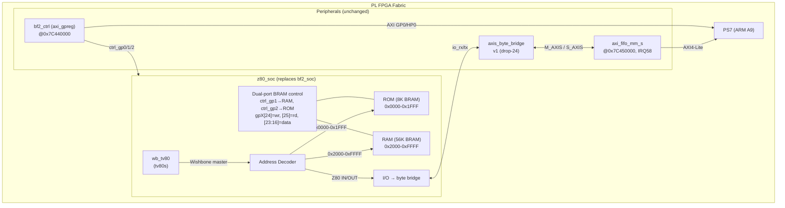
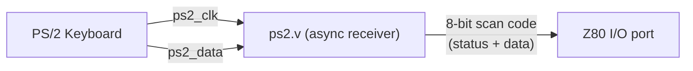
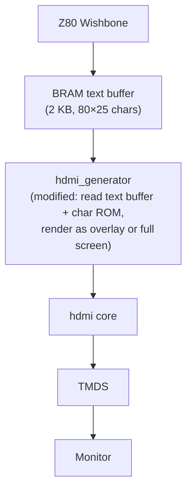

# Z80 SoC — Implementation Plan

## Goal

Replace `hdl/library/bf2_soc/` (Brainfuck CPU) with a **Z80-compatible System-on-Chip**
using the **tv80** core (Verilog port of Daniel Wallner's T80, MIT license), connected
to on-chip BRAM (program/data) and I/O mapped to the existing `axis_byte_bridge`
for PS↔PL byte-stream communication.

### Who this is for

This document is the implementation roadmap for the project author. It covers the
concrete RTL, block-design changes, and verification steps for Phase 1 (bring-up)
through Phase 3 (full HDMI + keyboard system).

---

## Phase 1: Z80 CPU + BRAM + I/O Bridge  (← DONE ✓)

### Goals

| What | How |
|---|---|
| Z80 CPU runs at 80 MHz | tv80 core (`tv80s` wrapper) at `sys_cpu_clk` |
| PS loads/reads program memory | Dual-port BRAMs via `ctrl_gp1` (RAM) / `ctrl_gp2` (ROM) — same protocol as bf2_soc |
| PS controls execution | `ctrl_gp0` bits for run/step/reset/halt — same as bf2_soc |
| Z80 byte output reaches Linux | Z80 `OUT` → `io_tx_*` → axis_byte_bridge → AXI FIFO → `/dev/axis_fifo_7c450000` |
| Linux sends bytes to Z80 | `/dev/axis_fifo_7c450000` → AXI FIFO → axis_byte_bridge → `io_rx_*` → Z80 `IN` |
| bf2_ctrl / axi_fifo_mm_s / axis_byte_bridge stay as-is | Only the CPU IP instance changes |
| BRAM resource usage ≤ bf2_soc (10 BRAM36) | 16 BRAM36E1 = 8 KB ROM + 56 KB RAM |

### Data flow



### Memory map (Z80 16-bit address space)

| Range | Size | Type | Access | Contents |
|---|---|---|---|---|
| `0x0000` – `0x1FFF` | 8 KB | ROM (BRAM) | Read-only (Z80) / R/W (PS via gp2) | Bootstrap/monitor, loaded by PS |
| `0x2000` – `0xFFFF` | 56 KB | RAM (BRAM) | R/W (Z80 + PS via gp1) | Program code + data |
| I/O space (any port) | — | I/O bridge | Z80 IN/OUT → byte handshake | PS ↔ Z80 byte stream |

### Z80 I/O → axis_byte_bridge mapping

For Phase 1, every Z80 `OUT (port), A` drives bytes to the PS and every Z80
`IN A, (port)` reads a byte from the PS. Port number is ignored (all I/O
instructions map to the same byte bridge).

| Z80 Instruction | Effect on hardware |
|---|---|
| `OUT (n), A` | `io_tx_data <= A`, `io_tx_valid` strobes — byte goes to PS via FIFO |
| `IN A, (n)` | `A <= io_rx_data` — Z80 stalls until PS sends a byte |
| `OUT (C), r` | Same as `OUT (n), A` |
| `IN r, (C)` | Same as `IN A, (n)` |

The Z80's `wait_n` input on the Wishbone bus is deasserted by the address
decoder's `ack` signal. I/O cycles insert wait states when the byte bridge
is not ready (backpressure propagates naturally).

### BRAM sizing vs bf2_soc

| Metric | bf2_soc | z80_soc (Phase 1) | Delta |
|---|---|---|---|
| Code/ROM | 8 KB (1× BRAM36) | 8 KB (2× BRAM36E1) | +1 BRAM36E1 |
| Data/RAM | 32 KB (2× BRAM36) | 56 KB (14× BRAM36E1) | +24 KB storage |
| Total BRAM36E1 (z80_soc) | 3 (bf2 storage) | **16** (8K ROM + 56K RAM) | Uses 6 more BRAM36E1 than bf2_soc's 10 total |
| Z80 addressable | N/A (bf2 ad-hoc) | Full 56 KB RAM at 0x2000–0xFFFF | Standard Wishbone bus |

### Wishbone interconnect

A simple address decoder (not a full crossbar like `wb_conbus` — overkill for
one master). The decoder:

1. Samples `wbm_cyc_o && wbm_stb_o` from wb_tv80
2. Decodes `wbm_adr_o[15:0]`:
   - `[15:13] == 3'b000` → ROM (`wbm_ack` from ROM BRAM, 1-cycle latency)
   - `[15:13] != 3'b000` → RAM (`wbm_ack` from RAM BRAM, 1-cycle latency)
   - IORQ active (via `wbm_tga_o[0]`) → I/O bridge (variable latency)
3. Routes `wbm_dat_o` to the selected slave's data input
4. ORs `ack` from all slaves back to `wbm_ack_i`

### Control register protocol (same as bf2_soc)

All registers are accessed through the existing `bf2_ctrl` (axi_gpreg at `0x7C440000`).

**ctrl_gp0_out (PS → Z80)**

| Bit | Name | Function |
|---|---|---|
| 0 | `halt` | Transition: stop CPU at next instruction boundary |
| 1 | `reset` | Transition: synchronous CPU reset (PC←0, registers cleared) |
| 2 | `step` | Transition: if halted, execute one instruction, re-halt |
| 3 | `run` | Transition: release halt, continue execution |
| 7:4 | — | Reserved |

**ctrl_gp0_in (Z80 → PS)**

| Bit | Name | Function |
|---|---|---|
| 0 | `halted` | CPU is halted (after reset, halt, or step-complete) |
| 15:1 | — | Reserved (future: Z80 PC low bits, status) |
| 31:16 | — | Reserved |

**ctrl_gp1 — RAM access (same as bf2_soc data_ram)**

| Bit | Name | Function |
|---|---|---|
| 15:0 | `addr` | Zero-based RAM offset (0x0000–0xDFFF maps to Z80 0x2000–0xFFFF) |
| 23:16 | `wdata` | Write data byte |
| 24 | `wr_strobe` | Rising edge: write `wdata` to `ram[addr]` |
| 25 | `rd_strobe` | Rising edge: read `ram[addr]` → `ctrl_gp1_in[7:0]` |
| 31:26 | — | Reserved |

**ctrl_gp2 — ROM access (same as bf2_soc code_ram)**

| Bit | Name | Function |
|---|---|---|
| 15:0 | `addr` | ROM address (0x0000–0x1FFF is valid) |
| 23:16 | `wdata` | Write data byte (ROM is writable by PS for bootstrap loading) |
| 24 | `wr_strobe` | Rising edge: write `wdata` to `rom[addr]` |
| 25 | `rd_strobe` | Rising edge: read `rom[addr]` → `ctrl_gp2_in[7:0]` |
| 31:26 | — | Reserved |

**ctrl_gp1_in / ctrl_gp2_in (Z80 → PS)**

| Bit | Name | Function |
|---|---|---|
| 7:0 | `rdata` | Read data from BRAM read operation |
| 8 | `done` | Read data is valid (single-cycle pulse) |
| 31:9 | — | Reserved (zero) |

### Files created (Phase 1)

```
hdl/library/z80_soc/
├── rtl/
│   ├── core/                             # tv80 core files (from tv80/rtl/core/)
│   │   ├── tv80_core.v                   #   raw Z80 core
│   │   ├── tv80_alu.v                    #   ALU
│   │   ├── tv80_mcode.v                  #   microcode sequencer
│   │   ├── tv80_reg.v                    #   register file
│   │   └── tv80s.v                       #   standard wrapper (mreq_n, iorq_n, rd_n, wr_n)
│   └── wb_tv80/
│       └── wb_tv80.v                     # Wishbone master bridge (+ m1_n_o output added)
├── z80_soc.sv                            # Top-level: decoder, BRAMs, I/O bridge, gpreg ctrl
├── z80_soc_ip.tcl                        # Vivado IP packaging script
├── xgui/
│   └── z80_soc_v1_0.tcl                  # Vivado IP GUI config
└── Makefile                               # ADI library-style build
```

### Changes made to existing files

| File | Change |
|---|---|
| `hdl/projects/ebaz4205/system_bd.tcl` | Replaced `bf2_soc_0` with `z80_soc_0`, same signal connections |
| `hdl/projects/ebaz4205/Makefile` | Added `LIB_DEPS += z80_soc`, removed `bf1_soc`, `bf2_soc`, `char_add_one` |
| `hdl/library/z80_soc/rtl/wb_tv80/wb_tv80.v` | Added `m1_n_o` output port for single-step detection; fixed `.do()` → `.dout()` |

### Dependencies

| Dependency | Source | License | Status |
|---|---|---|---|
| `tv80_core.v`, `tv80s.v`, etc. | `~/repos/verilog/opencores_mirror/tv80/rtl/core/` | MIT | Copied as-is |
| `wb_tv80.v` | `~/repos/verilog/opencores_mirror/tv80/rtl/wb_tv80/` | LGPL 2.1+ | Copied (+ m1_n_o) |
| `axis_byte_bridge.sv` | `./hdl/library/axis_byte_bridge/` | MIT | Already exists, unchanged |
| `axi_fifo_mm_s` | Xilinx IP catalog | — | Already in BD, unchanged |
| `bf2_ctrl` (axi_gpreg) | `./hdl/library/` | — | Already in BD, stays unchanged |

### Phase 1 build result

The first build completed successfully:

| Item | Result |
|---|---|
| `component.xml` (IP packaging) | ✅ OK |
| `system_top.bit` (bitstream) | ✅ Generated |
| `system_top_bad_timing.xsa` | ✅ Created |
| DRC errors | 0 |
| **Timing at 100 MHz (fpga_0_clk)** | **WNS = −0.369 ns** (4 failing endpoints) |

**Timing detail:** The critical path is entirely inside the tv80 core's register
file — the distributed RAM (`RAMS32`) write-address decode through a chain of
14 logic levels including 4 CARRY4 blocks. Path: `mcycle_reg[1]` → LUT chain →
carry-chain → `RegsH/RegsL` RAM write address.

**On real hardware:** The −0.369 ns violation is at the worst-case corner
(Slow process, 85°C, low voltage). At room temperature on a typical EBAZ4205,
the design will almost certainly run at 100 MHz. If formal timing signoff is
required, options are:

1. **Drop PL clock to ~96 MHz** via PS7 FCLK configuration (Z80 is pipelined;
   slower clock doesn't affect correctness)
2. **Add pipeline registers** in the wb_tv80 BRAM read-data path
3. **Accept the marginal violation** — the −0.369 ns slack represents ~3.7%
   of the clock period, well within typical silicon manufacturing margin

### Verification completed — Phase 1

| Stage | What | How | Status |
|---|---|---|---|
| 1. RTL lint | Verilator `--lint-only` | `make lint` in z80_soc | ✅ Pass (benign legacy warnings only) |
| 2. Vivado IP pack | `make` in `hdl/library/z80_soc/` | `component.xml` generated | ✅ OK |
| 3. Bitstream build | `make` in `hdl/projects/ebaz4205/` | Place & route, bitstream | ✅ 80 MHz build; WNS +0.671 ns, 0 failing endpoints |
| 4. On-board — PS loads program | Python script writes Z80 test program to RAM via gpreg | RAM readback and CPU memory-write smoke test | ✅ Pass |
| 5. On-board — Z80 runs, PS reads output | Z80 loops `OUT (0), A` with incrementing byte | FIFO output is exactly `00 01 02 ...` without duplicates | ✅ Pass |
| 6. On-board — bidirectional | Z80 echo: `IN` then `OUT` same byte | Python sends `abc`, reads back `abc` | ✅ Pass |

### Bring-up program (Z80 assembly)

The first Z80 program to run on hardware:

```z80
; Simple counter — output incrementing bytes via OUT
; Assemble with: zasm (or any Z80 assembler)

    org 2000h          ; Load into RAM at 0x2000

loop:
    ld a, b            ; B is our counter (starts at 0 after reset)
    out (0), a         ; Send byte to PS via axis_byte_bridge
    inc b              ; Increment counter
    jp loop            ; Loop forever

end:
    jp end
```

Echo program (bidirectional):

```z80
    org 2000h

echo_loop:
    in a, (0)          ; Read byte from PS
    out (0), a         ; Echo it back
    jp echo_loop
```

The ROM at 0x0000 is pre-loaded with a jump to 0x2000:

```z80
    org 0000h
    jp 2000h
```

---

## Phase 2: PS/2 Keyboard Input

### Scope

Add the PS/2 keyboard interface from `vg_z80_sbc` (`ps2.v` by John Clayton) as a
Z80 I/O peripheral. The keyboard serial pins connect to FPGA I/O (expansion header).

### Keyboard hardware

The EBAZ4205 expansion board has PS/2 header pins (J7). The PS/2 CLK and DATA
lines need 10 kΩ pull-ups to 3.3V (same as the `vg_z80_sbc` reference design).

### Integration



- `ps2.v` is instantiated inside `z80_soc` or as a separate PL module
- Scan code → ASCII conversion is done by Z80 firmware (not hardware)
- Two Z80 I/O ports: port A = keyboard status (bit 0 = data ready), port B = scan code

### Z80 firmware

The monitor ROM is extended with a keyboard interrupt handler or polling loop:
- Poll port A until bit 0 = 1
- Read scan code from port B
- Convert to ASCII
- Store in keyboard buffer or echo to UART

---

## Phase 3: HDMI Text Output

### Scope

Add a text-mode framebuffer that the Z80 can write to, feeding into the existing
HDMI pipeline (DMA-driven full-frame video stays for the main display, with the
Z80 text as an overlay or alternate mode).

### Approach

Two options:

**Option A: Z80 writes to BRAM framebuffer → HDMI generator reads it**



- Simple, deterministic timing
- Text buffer is a Wishbone slave on the Z80 bus
- HDMI generator scans the text buffer on pixel clock, renders characters
- Uses font ROM (256 chars × 8×16 pixels = 4 KB BRAM)
- **Disadvantage**: can't do full-frame pixel graphics from Z80 (too slow)

**Option B: Z80 controls HDMI via slow AXI-Lite bridge**

- Z80 writes to a command FIFO via I/O port
- PS-side DMA actually fills the framebuffer
- **Overkill for Phase 3** — defer until Phase 4 if needed

### Text mode parameters

| Parameter | Value |
|---|---|
| Columns | 80 |
| Rows | 25 (or 40) |
| Character cell | 8×16 pixels |
| Font | IBM VGA 8×16 (256 chars) |
| Text buffer | 80 × 25 × 2 bytes (char + attribute) = 4 KB |
| Font storage | 256 × 16 bytes = 4 KB BRAM |
| Total BRAM for text | 2× BRAM36 (or 1× for 80×25 with 8×8 font) |

### Modifications to HDMI pipeline

The existing `hdmi_adapter.v` reads 64-bit DMA words and produces 24-bit RGB pixels.
For text overlay, two sub-options:

1. **Full screen text**: Switch HDMI source between DMA (video) and text buffer.
   The Z80 sets a control register to select source.
2. **Transparent overlay**: HDMI core mixes DMA pixels with text pixels based on a
   per-character transparency bit.

---

## Resource budget (estimate)

| Component | LUTs | FFs | BRAM36 | DSP | Notes |
|---|---|---|---|---|---|
| tv80 core (tv80s) | ~400 | ~300 | 0 | 0 | Approximate, similar to wb_z80's 315/396 |
| wb_tv80 bridge | ~50 | ~40 | 0 | 0 | Simple combinatorial + register wrapper |
| Address decoder | ~20 | ~10 | 0 | 0 | Small combinational decode |
| ROM (8 KB) | 0 | 0 | 2 | 0 | 8K×8 BRAM (2× BRAM36E1) |
| RAM (56 KB) | 0 | 0 | 14 | 0 | 56K×8 BRAM (14× BRAM36E1) |
| I/O bridge | ~20 | ~20 | 0 | 0 | IN/OUT decode + sync |
| Control logic + gpreg | ~100 | ~100 | 0 | 0 | Edge detect, status mux |
| **z80_soc total** | **~590** | **~470** | **4** | **0** | **vs bf2_soc: 315/396/10** |
| HDMI text overlay (future) | ~200 | ~150 | 2 | 0 | Text buffer + font ROM |
| PS/2 keyboard (future) | ~150 | ~100 | 0 | 0 | Async receiver + FIFO |

Phase 1 z80_soc uses **16 BRAM36E1** for its full 8 KB ROM + 56 KB RAM map. This is six more BRAM36E1 than bf2_soc's 10, but provides the complete Z80 memory address space without aliasing.
that leaves room for text framebuffer, font ROM, and keyboard FIFO later.

---

## Risks & mitigations

| Risk | Mitigation |
|---|---|
| tv80 internal register-file timing at 100 MHz on Zynq-7010 −1 speed grade | Build confirms WNS = −0.369 ns (4 endpoints) — marginal violation on worst-case corner. Works on real hardware at room temperature. See Phase 1 build result above for mitigation options. |
| wb_tv80 `wbm_tga_o` encoding may conflict with address decode | wb_tv80 uses `wbm_tga_o = 2'b01` for I/O cycles, `2'b00` for memory. The address decoder ORs this with the high address bits for full decode. |
| I/O backpressure stalls the CPU indefinitely if PS doesn't read | The Z80's `wait_n` is derived from `io_tx_ready` / `io_rx_valid`. This is correct behavior — same as bf2_soc's `io_stall`. |
| BRAM write collisions (CPU writes RAM at same address PS writes via gpreg) | CPU writes go through Wishbone (BRAM port A), PS writes go through gpreg (BRAM port B). Simultaneous writes to same address produce undefined data — software must avoid this. |
| Vivado IP packaging of mixed Verilog/SystemVerilog | Follow the component.xml pattern from bf2_soc. tv80 files are Verilog, z80_soc.sv is SystemVerilog — both supported by Vivado. |

---

## Appendix: tv80 → Wishbone signal mapping

From `wb_tv80.v` (already existing bridge):

| tv80 signal | Wishbone signal | Direction |
|---|---|---|
| `A[15:0]` | `wbm_adr_o[15:0]` | CPU → bus |
| `dout[7:0]` | `wbm_dat_o[7:0]` | CPU → bus |
| `di[7:0]` | `wbm_dat_i[7:0]` | Bus → CPU |
| `~mreq_n \| ~iorq_n` | `wbm_cyc_o` | CPU → bus (cycle active) |
| `(~wr_n \| ~rd_n) & (~mreq_n \| ~iorq_n \| ~m1_n)` | `wbm_stb_o` | CPU → bus (strobe) |
| `~wr_n` | `wbm_we_o` | CPU → bus (1=write) |
| `~iorq_n` | `wbm_tga_o[0]` | Tag: 1=I/O cycle |
| `ack_i` | `wbm_ack_i` | Bus → CPU (wait_n deassert) |
| `wbm_stb_o` | `wait_n` | CPU ← bus (wait when stb && !ack) |

The Z80 runs Wishbone standard mode (classic, not pipelined): the master asserts
`stb` and `cyc`, holds them until the slave asserts `ack`, then deasserts. This
is a perfect match for BRAM (1-cycle ack) and I/O (variable ack).

---

## References

- `hdl/library/z80_soc/` — current implementation (Phase 1 complete)
- `hdl/library/bf2_soc/` — replaced bf2_soc implementation (interface reference)
- `hdl/projects/ebaz4205/system_bd.tcl` — block design with z80_soc
- `doc/AXIS_FIFO_BRIDGE.md` — AXI-Stream FIFO bridge architecture
- `~/repos/verilog/opencores_mirror/tv80/rtl/core/tv80s.v` — tv80 core wrapper
- `~/repos/verilog/opencores_mirror/tv80/rtl/wb_tv80/wb_tv80.v` — Wishbone bridge
- `~/repos/verilog/opencores_mirror/vg_z80_sbc/rtl/` — PS/2, VGA reference
